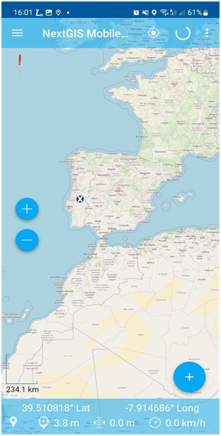

Подключение внешнего источника координат
=============================================

Как использовать стороннее приложение в качестве источника текущего местоположения устройства.

Установите приложение, которое умеет подменять координаты. Например, `такое <https://lockito-app.com/>`_.

Включите режим разработчика на своем смартфоне.
Для этого нажмите **7** раз на **номер сборки** (Раздел Об устройстве).

.. figure:: _static/ngm_enter_developer_mode_en.png
   :name: ngm_enter_developer_mode_pic
   :align: center
   :width: 6cm
   
   Включение режима разработчика

В настройках Режима разработчика выберите приложение для подмены координат, установленное в пункте 1.

.. figure:: _static/ngm_developer_options_en.png
   :name: ngm_developer_options_pic
   :align: center
   :width: 6cm
   
   Открытие настроек режима разработчика

.. figure:: _static/ngm_select_mock_location_app_en.png
   :name: ngm_select_mock_location_app_pic
   :align: center
   :width: 6cm
   
   Выбор внешнего приложения-источника координат

Включите приложение для подмены координат.
Создайте первую подмену, назовите ее.

   
   Создание подмены координат

Выберите точку на карте (или воспользуйтесь текущим), нажмите иконку Play.

.. figure:: _static/ngm_select_point_play_en.png
   :name: ngm_select_point_play_pic
   :align: center
   :width: 6cm
   
   Выбор точки на карте

   
   Симуляция запущена

С этого момента ваш смартфон принимает координаты вашего текущего местоположения от запущенного приложения. Запустите NextGIS Mobile, чтобы в этом убедиться.

   
   Координаты из внешнего источника в NextGIS Mobile
