.. sectionauthor::  Natalia Baryshnikova <Nshelekhova@gmail.com>

.. _ngmobile_integration:

Integration with NextGIS Web
============================

.. versionadded:: 2.2

.. only:: html
   
   You can learn more about main features of Web GIS in :ref:`Web GIS <ngcom_description>`.

.. only:: latex

   You can learn more about main features of Web GIS in `Web GIS: Description and Main Features :ref:`Web GIS <ngcom_description>`.

.. _ngmobile_create_a_connection_to_webgis:

New Web GIS creation
--------------------

There are two ways to create a new Web GIS. The **first way** is the following:

1. Open Layers tree panel (item 1 in :numref:`ngmobile_main_activity_pic_1`).
2. Then tap on "Add geodata" button (item 4 in :numref:`ngmobile_layer_tree_pic`).
3. Select “Add from Web GIS” (:numref:`ngmobile_the_menu_button_Add_data_pic`) 

.. figure:: _static/ngmobile_the_menu_button_Add_data.png
   :name: ngmobile_the_menu_button_Add_data_pic
   :align: center
   :height: 10cm
  
   Add geodata dialogue.

4. In opened dialogue select “Add Web GIS” (:numref:`ngmobile_add_entry1_pic`).

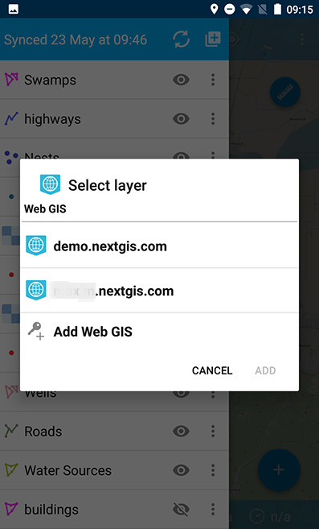

   Web GIS dialogue.
   
5. Then fill up your Web GIS domain’s name and password for Web GIS in the form for Web GIS adding and tap “Sign in” button (:numref:`ngmobile_create_webgis_layer_pic`).

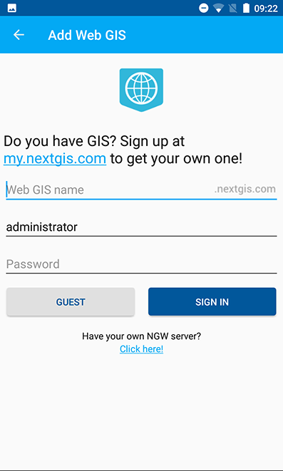
   
   Web GIS adding dialog.
   
The **second way** is the following:

1. Tap contextual menu icon (item 5 in :numref:`ngmobile_main_activity_pic_1`). 
   
2. Select "Settings" (:numref:`ngmobile_settings2_pic`).

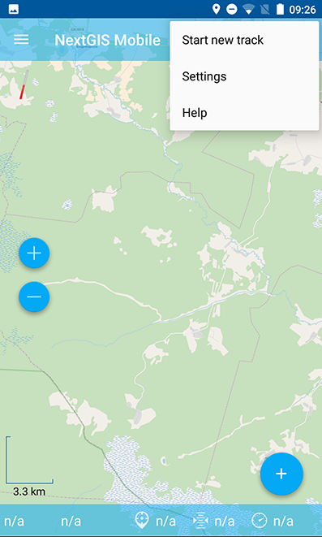

   Contextual menu.

3. Select "Web GIS" (:numref:`ngmobile_settings_ngw_pic`).  

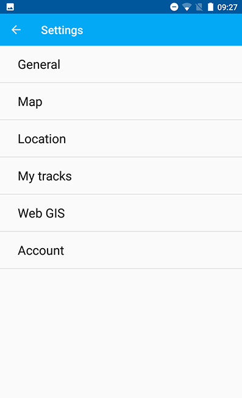
   
   Setting dialogue.
  
4. In opened dialogue select “Add Web GIS” (:numref:`ngmobile_add_entry2_pic`).  
   
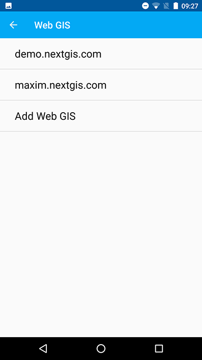

   Web GIS dialogue.

5. Then fill up your Web GIS domain’s name and password for Web GIS in the form for Web GIS adding and tap “Sign in” button (:numref:`ngmobile_create_webgis_layer_pic`).

.. _ngmobile_create_a_connection:

Connection to Web GIS
---------------------

To create a connection to an existing Web GIS account:

1. Open Layers tree panel (item 1 in :numref:`ngmobile_main_activity_pic_1`).
2. Then tap on "Add geodata" button (item 4 in :numref:`ngmobile_layer_tree_pic`).
3. Select “Add from Web GIS” (:numref:`ngmobile_the_menu_button_Add_data_pic`) 
4. In opened dialogue select Web GIS (:numref:`ngmobile_add_entry1_pic`).
5. The dialog of layer selection for importing geodata from your Web GIS to NextGIS Mobile will open. If you have only one Web GIS, the dialog of layer selection for importing geodata from your Web GIS to NextGIS Mobile will open immediately after tapping  “Add from Web GIS” button.

.. _ngmobile_create_a_connection_to_nextgis_web:

Connection to NextGIS Web
-------------------------

.. only:: html
   
   You can learn more about main features of NextGIS Web in :ref:`ngw_keyfeatures`.

.. only:: latex

   You can learn more about main features of NextGIS Web in `Key features of NextGIS Web <http://docs.nextgis.com/docs_ngweb/source/general.html#ngweb-keyfeatures>`_.
   
If you want to keep your data on your own NextGIS Web server, tap "Add Web GIS" using either of the ways to create a new Web GIS (see above), follow the link at the bottom of the screen (see :numref:`ngmobile_new_webgis_nextgis_pic`) and use your account.

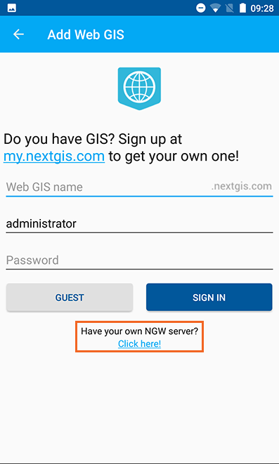

   Add Web GIS dialogue.

In opened dialogue fill up NextGIS Web :term:`URL`, login and password in the form and tap “Sign in” button (see :numref:`ngmobile_ngw_connection_settings_pic`).

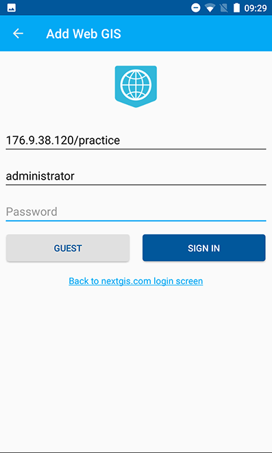

   NextGIS Web adding dialogue.
      
.. note::
   Login and password for NextGIS Web adding should be fiiled up without spaces!
   Many gadgets add a space at the end of the text during autosubstitution or pasting the text from the clipboard to the login/password, and NextGIS Web identifies this as another login or password and cancel the connection.
   

.. _ngmobile_change_account:

Editing of Web GIS account
-------------------------------------

To edit Web GIS account:

1. Tap contextual menu icon (item 5 in :numref:`ngmobile_main_activity_pic_1`). 
2. Select "Settings" (:numref:`ngmobile_settings2_pic`).
3. Select "Web GIS" (:numref:`ngmobile_settings_ngw_pic`).  
4. Select Web GIS account (:numref:`ngmobile_add_entry2_pic`).  
5. In opened window select "Edit account" (see :numref:`ngmobile_remove_account_pic`).

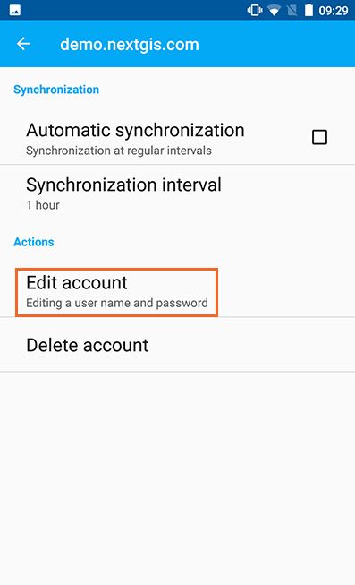
    
   Settings dialogue.  

6. Here you can edit the following fields (see :numref:`ngmobile_edit_account_pic`):

1. Login.
2. Password.

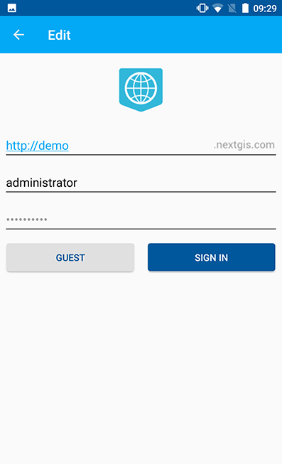

   Editing of Web GIS account.
   
.. _ngmobile_delete_account:

Deleting of Web GIS account
---------------------------

You can delete Web GIS account in a several ways. The **first way** is the following:

1. Tap contextual menu icon (item 5 in :numref:`ngmobile_main_activity_pic_1`). 
2. Select "Settings" (:numref:`ngmobile_settings2_pic`).
3. Select "Web GIS" (:numref:`ngmobile_settings_ngw_pic`).  
4. Select Web GIS account (:numref:`ngmobile_add_entry2_pic`).  
5. In opened window select "Delete account" (see :numref:`ngmobile_remove_account1_pic`).

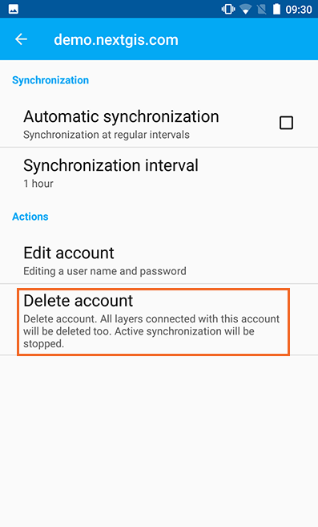
    
   Settings dialogue.  
   
6. Delete selected Web GIS account.
7. In the case of successful deleting, the window with Web GIS selection will be opened without deleted Web GIS account.

The **second way** to delete Web GIS account is the following:

1. Open OS settings of the gadget.
2. Select "Accounts" in settings (see :numref:`ngmobile_settings_in_os_pic`).

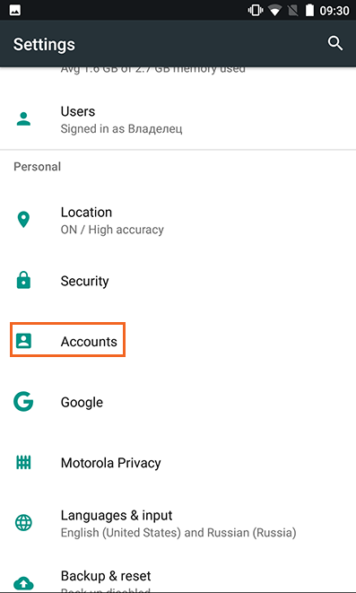
   
   Accounts selecting in OS settings.
   
3. Select the "NextGIS" account from the list(see :numref:`ngmobile_accounts_in_os_pic`).

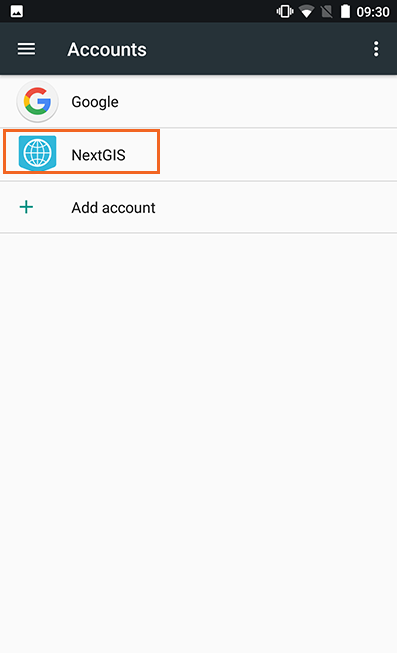
   
   NextGIS account in OS settings. 

4. In opened window select Web GIS account (see :numref:`ngmobile_remove_account_in_os_pic`).

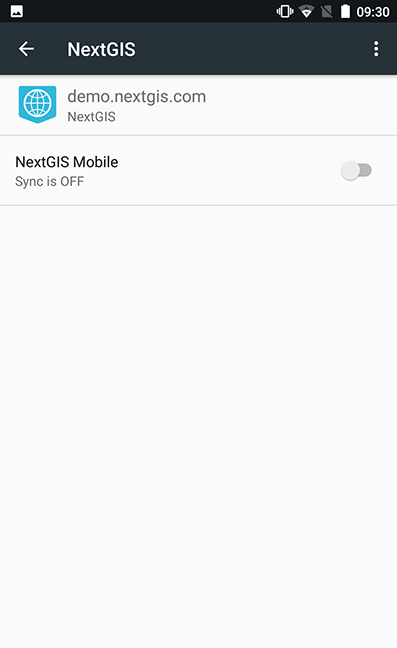
   
   Web GIS account selecting in OS settings. 

5. In opened "Sync" window tap contextual menu icon in the right upeper corner of the screen and select "Remove account" (see :numref:`ngmobile_remove_account1_in_os_pic`).

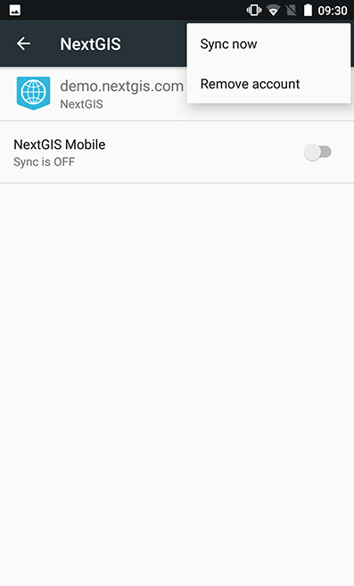
   
   Web GIS account deleting through the OS settings.
