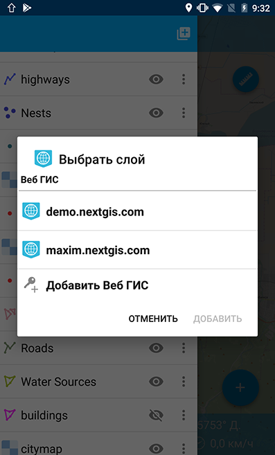
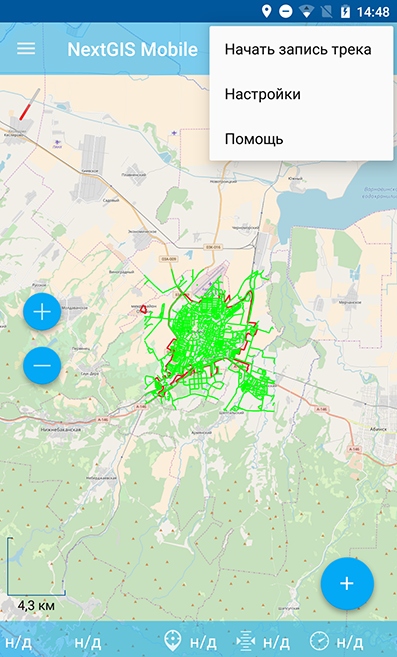
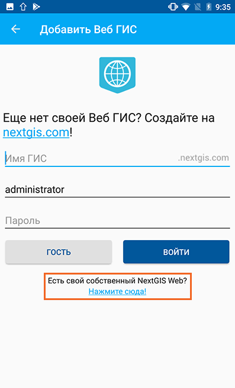
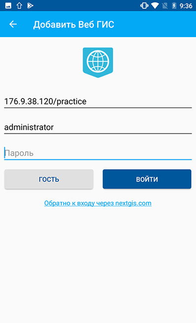
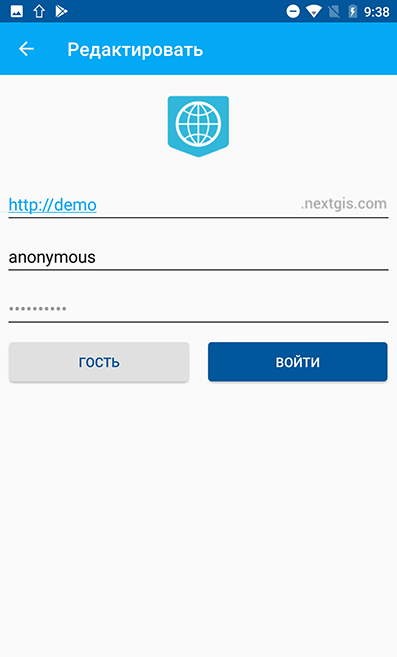
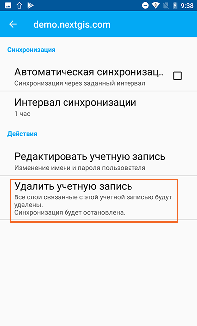
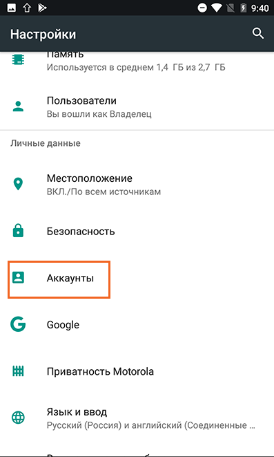
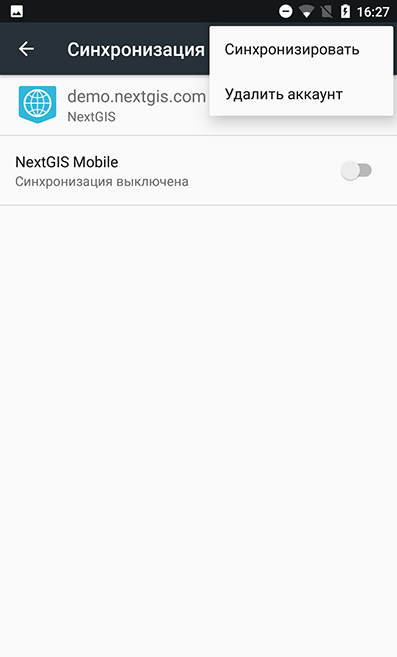
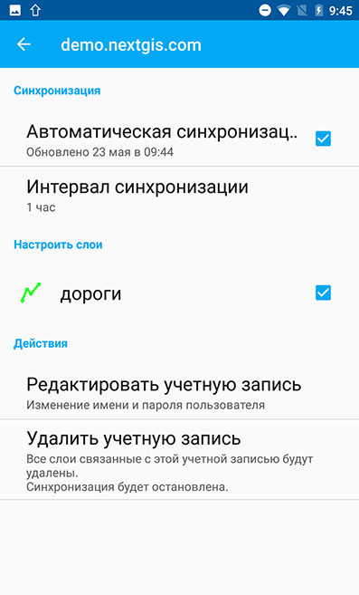

.. sectionauthor::  Наталья Барышникова <Nshelekhova@gmail.com>

.. _ngmobile_integration:

Интеграция с nextgis.com 
========================

.. versionadded:: 2.2

.. only:: html
   
   С основными возможностями программного обеспечения ВебГИС можно ознакомиться 
   в разделе :ref:`Веб ГИС <ngcom_description>`.

.. only:: latex

   С основными возможностями программного обеспечения ВебГИС можно ознакомиться 
   в разделе `Веб ГИС: описание и возможности :ref:`Веб ГИС <ngcom_description>`.

.. _ngmobile_create_a_connection_to_webgis:

Создание новой Веб ГИС
----------------------

Создание новой учетной записи Веб ГИС возможно двумя способами. Для осуществления **первого способа** необходимо выполнить следующую последовательность действий:

1. Открыть дерево слоев (см. :numref:`ngmobile_main_activity_pic` п. 1). 
2. Нажать кнопку "Добавить геоданные" (см. :numref:`ngmobile_layer_tree_pic`, п. 4).
3. В открывшемся меню выбрать пункт "Добавить из Веб ГИС" (см. :numref:`ngmobile_the_menu_button_Add_data_pic`) 

.. figure:: _static/ngmobile_the_menu_button_Add_data.png
   :name: ngmobile_the_menu_button_Add_data_pic
   :align: center
   :height: 10cm
  
   Меню кнопки "Добавить геоданные".

4. В открывшемся окне необходимо нажать на кнопку "Добавить Веб ГИС" (см. :numref:`ngmobile_select_layer_webgis_pic`).

   Меню "Добавить слой Веб ГИС".
   
5. В открывшемся окне ввести имя ГИС, имя пользователя и пароль и нажать кнопку "Войти" (см. :numref:`ngmobile_create_webgis_layer_pic`).

   
   Создание новой учетной записи Веб ГИС.
   
Создать новую учетную запись Веб ГИС **вторым способом** можно, выполнив следующую последовательность шагов:

1. Вызвать контекстное меню (см. :numref:`ngmobile_main_activity_pic` п. 5). 
   
2. Далее необходимо выбрать пункт "Настройки" (см. :numref:`ngmobile_settings2_pic`).

   Контекстное меню.

3. Выбрать пункт "Веб ГИС" (см. :numref:`ngmobile_settings_ngw_pic`).  

.. figure:: _static/settings_NGW.png
   :name: ngmobile_settings_ngw_pic
   :align: center
   :height: 10cm
   
   Меню "Настройки".
  
4. В открывшемся меню следует нажать на кнопку "Добавить Веб ГИС" (см. :numref:`ngmobile_add_entry_pic`).  
   
.. figure:: _static/add_entry.png
   :name: ngmobile_add_entry_pic
   :align: center
   :height: 10cm

   Меню "Веб ГИС".

5. В открывшемся окне ввести имя ГИС, имя пользователя и пароль и нажать кнопку "Войти" (см. :numref:`ngmobile_create_webgis_layer_pic`).

.. _ngmobile_create_a_connection:

Создание подключения к Веб ГИС
------------------------------

Для подключения к уже существующей учетной записи Веб ГИС необходимо 
выполнить следующую последовательность шагов:

1. Открыть дерево слоев (см. :numref:`ngmobile_main_activity_pic` п. 1). 
2. Нажать кнопку "Добавить геоданные" (см. :numref:`ngmobile_layer_tree_pic`, п. 4).
3. В открывшемся меню выбрать пункт "Добавить из Веб ГИС" (см. :numref:`ngmobile_the_menu_button_Add_data_pic`) 

.. figure:: _static/ngmobile_the_menu_button_Add_data.png
   :name: ngmobile_the_menu_button_Add_data_pic
   :align: center
   :height: 10cm
  
   Меню кнопки "Добавить геоданные".

4. В открывшемся окне необходимо выбрать ранее созданную учетную запись Веб ГИС (см. :numref:`ngmobile_select_ngw_layer_pic`).

   
   Выбор учетной записи Веб ГИС.
   
5. В случае удачного подключения откроется окно со списком файлов Веб ГИС. Если у Вас только одна Веб ГИС, то вход в нее будет осуществлен автоматически при нажатии на кнопку "Добавить из Веб ГИС".

.. _ngmobile_create_a_connection_to_nextgis_web:

Создание подключения к NextGIS Web
----------------------------------

.. only:: html
   
   С основными возможностями программного обеспечения NextGIS Web можно ознакомиться 
   в разделе :ref:`ngw_keyfeatures`.

.. only:: latex

   С основными возможностями программного обеспечения NextGIS Web можно ознакомиться 
   в разделе `Основные возможности NextGIS Web <http://docs.nextgis.ru/docs_ngweb/source/general.html#ngweb-keyfeatures>`_.
   
Если Вы хотите хранить данные на собственном сервере NextGIS Web, можно войти в свою учетную запись, нажав на кнопку "Добавить Веб ГИС" при любом из описанных выше способов создания Веб ГИС и затем перейдя по ссылке внизу экрана (см. :numref:`ngmobile_new_webgis_nextgis_pic`).

   Меню "Добавить Веб ГИС".

В открывшемся окне следует ввести параметры подключения: NextGIS Web :term:`URL`, имя пользователя и пароль, нажать кнопку "Войти" 
   (см. :numref:`ngmobile_ngw_connection_settings_pic`).

   Окно ввода параметров подключения.
      
.. note::
   В диалогом окне для ввода параметров при создании подключения к NextGIS Web 
   Имя пользователя/логин и пароль следует вводить без пробелов!
   Mногие клавиатуры смартфонов и планшетов при автоподстановке текста, а также 
   при вставке копируемого текста из буфера обмена добавляют пробел в конце текста 
   в поле ввода (имя пользователя, пароль). Полученный текст с пробелом воспринимается 
   NextGIS Web как другое имя пользователя или другой пароль, что приводит к отказу 
   в создании подключения.

.. _ngmobile_change_account:

Редактирование учетной записи Веб ГИС
-------------------------------------

Для редактирования учетной записи Веб ГИС необходимо выполнить следующую 
последовательность шагов:

1. Вызвать контекстное меню (см. :numref:`ngmobile_main_activity_pic` п. 5). 
2. Далее выбрать пункт меню "Настройки" (см. :numref:`ngmobile_settings2_pic`).
3. В открывшемся меню необходимо выбрать пункт "Веб ГИС"
   (см. :numref:`ngmobile_settings_ngw_pic`). 
4. Далее в списке необходимо выбрать ранее созданную учетную запись 
   Веб ГИС (см. :numref:`ngmobile_select_ngw_layer_pic`). 
5. В открывшемся окне выбрать пункт меню "Редактировать учетную запись" (см. :numref:`ngmobile_remove_account_pic`).

.. figure:: _static/remove_account.png
   :name: ngmobile_remove_account_pic
   :align: center
   :height: 10cm
    
   Редактирование учетной записи Веб ГИС.  

6. В открывшемся окне в ранее созданную учетную запись при необходимости 
можно внести изменения в поля:

1. Имя пользователя.
2. Пароль.

   Внесение изменений в ранее созданную учетную запись. 

.. _ngmobile_delete_account:

Удаление учетной записи Веб ГИС
-------------------------------

Удаление учетной записи Веб ГИС может осуществляться несколькими способами. 
При использовании **первого способа** удаление учетной записи Веб ГИС, необходимо 
выполнить следующую последовательность шагов:

1. Вызвать контекстное меню (см. :numref:`ngmobile_main_activity_pic` п. 5). 
2. Далее выбрать пункт меню "Настройки" (см. :numref:`ngmobile_settings2_pic`).
3. В открывшемся меню опций необходимо выбрать пункт "Веб ГИС"
   (см. :numref:`ngmobile_settings_ngw_pic`). 

4. Далее следует выбрать ранее созданную учетную запись 
   Веб ГИС (см. :numref:`ngmobile_select_ngw_layer_pic`). 
   
5. Выбрать пункт меню "Удалить учетную запись" (см. :numref:`ngmobile_remove_account1_pic`).

    
   Удаление учетной записи Веб ГИС.  
   
6. Удалить выбранную учетную запись Веб ГИС.
7. В случае удачного удаления откроется окно программы, в котором будет отсутствовать 
   ранее созданная учетная запись Веб ГИС.

Для удаления учетной записи Веб ГИС **вторым способом** необходимо выполнить 
следующую последовательность шагов:

1. На устройстве (мобильном телефоне/планшете) вызвать "Настройки операционной системы".
2. Перейти к Аккаунтам/Учетным записям в настройках устройства (см. :numref:`ngmobile_settings_in_os_pic`).

   
   Выбор аккаунтов в настройках ОС.
   
3. Выбрать из списка учетную запись "NextGIS" (см. :numref:`ngmobile_accounts_in_os_pic`).

.. figure:: _static/accounts_in_os.png
   :name: ngmobile_accounts_in_os_pic
   :align: center
   :height: 10cm
   
   Выбор в настройках ОС аккаунт NextGIS. 

4. В открывшемся окне необходимо вырать ранее созданную учетную запись Веб ГИС (см. :numref:`ngmobile_remove_account_in_os_pic`).

.. figure:: _static/remove_account_in_os.png
   :name: ngmobile_remove_account_in_os_pic
   :align: center
   :height: 10cm
   
   Выбор учетной записи Веб ГИС через настройки ОС. 

5. В открывшемся окне "Синхронизация" нажать на кнопку контекстного меню в правом верхнем углу и выбрать в открывшемся списке "Удалить аккаунт" (см. :numref:`ngmobile_remove_account1_in_os_pic`).

   
   Удаление учетной записи Веб ГИС через настройки ОС.

.. _ngmobile_add_layer_webgis:

Добавление слоя (векторного или растрового) из Веб ГИС
------------------------------------------------------

Для добавления слоя (векторного или растрового) из Веб ГИС необходимо выполнить 
следующую последовательность шагов:

1. Вызвать контекстное меню (см. :numref:`ngmobile_main_activity_pic` п. 5). 
2. Нажать кнопку "Добавить геоданные" (см. :numref:`ngmobile_layer_tree_pic`, п. 4).
3. В открывшемся меню выбрать пункт "Добавить из Веб ГИС" (см. :numref:`ngmobile_the_menu_button_Add_data_pic`) 
4. Выбрать из списка учетную запись Веб ГИС (см. :numref:`ngmobile_select_ngw_layer_pic`).
   Подробнее о создании учетной записи Веб ГИС см. в разделе :ref:`ngmobile_сreate_a_connection_to_webgis`. 
5. В открывшемся окне находится список внутренних ресурсов и слоев Веб ГИС (векторных и растровых) выбранной учетной записи (см. :numref:`ngmobile_list_of_files_pic`).

.. figure:: _static/list_of_files.png
   :name: ngmobile_list_of_files_pic
   :align: center
   :height: 10cm
   
   Список ресурсов и слоев Веб ГИС.

6. Выбрать нужную группу ресурсов Веб ГИС, внутри которой следует отметить необходимый 
   слой (вектор и/или растр) путем проставления отметок и выбрать пункт 
   меню "Добавить" (см. :numref:`ngmobile_file_selection_pic`).
 
.. figure:: _static/file_selection.png
   :name: ngmobile_file_selection_pic
   :align: center
   :width: 10cm
   
   Выбор в группе ресурсов Веб ГИС необходимого слоя.  

.. note::
   Следует отметить, что в случае необходимости выбора нескольких слоев (вектор и/или растр)
   Веб ГИС в разных группах ресурсов одной учетной записи, поставленная отметка 
   выбора слоя сохраняется при переходе из одной группы ресурсов в другую.  

7. Открывшееся окно обработки выбранного слоя содержит диалоговое окно с пунктами меню 
   "Отмена" и "Скрыть" (см. :numref:`ngmobile_processing_layer_pic`).
    
.. figure:: _static/processing_layer.png
   :name: ngmobile_processing_layer_pic
   :align: center
   :height: 10cm

   Окно обработки слоя.

Если необходимо остановить процедуру обработки слоя Веб ГИС следует выбрать 
пункт меню "Отмена". 
Для предотвращения блокирования интерфейса программы и для дальнейшей работы с 
программой следует выбрать пункт меню "Скрыть". В результате такого выбора 
панель обработки слоя NextGIS Web перенесется в панель статуса 
(см. :numref:`ngmobile_download_status_pic`).

.. figure:: _static/download_status.png
   :name: ngmobile_download_status_pic
   :align: center
   :height: 10cm

   Панель статуса.
 
Если необходимо завершить процесс обработки слоя Веб ГИС, который перенесен 
в панель статуса, на панели обработки слоя следует сделать следующее: коснитесь экрана 
большим и указательным пальцами и разведите их в стороны, скользя пальцами по экрану. 
В результате этого действия индикатор процесса обработки слоя NextGIS Web будет перенесен 
в панель статуса, а также появится кнопка "Стоп", при нажатии на которую процесс обработки
слоя завершится.
В результате выполнения выше перечисленных действий на карту будут добавлены выбранные
слои (вектор и/или растр) Веб ГИС, которые появятся в дереве слоев сверху. 
Если на карте имелись ранее созданные точки и/или линии Веб ГИС, то данные о них не теряются, 
находятся в дереве слоев в определенном порядке.
После обработки и создания на карте новых слоев (растр и/или вектор) Веб ГИС, 
просмотр состава карты, управление видимостью и порядком слоев на карте можно настраить 
при помощи дерева слоев.  

.. _ngmobile_syncronization_layer_webgis:

Настройка синхронизации векторного слоя с Веб ГИС
-------------------------------------------------

Для осуществления процесса оперативного обмена правками геоданных и обеспечения 
идентичности выбранной информации между компьютером и мобильным устройством пользователя 
необходимо использовать синхронизацию. Для осуществления синхронизации векторного 
слоя с Веб ГИС необходимо выполнить следующую последовательность шагов:
 
1. Вызвать контекстное меню (см. :numref:`ngmobile_main_activity_pic` п. 5). 
2. Далее выбрать пункт меню "Настройки" (см. :numref:`ngmobile_settings2_pic`).
3. В открывшемся меню опций необходимо выбрать пункт "Веб ГИС"
   (см. :numref:`ngmobile_settings_ngw_pic`). 

4. Далее следует выбрать ранее созданную учетную запись Веб ГИС (см. :numref:`ngmobile_select_ngw_layer_pic`). 
   
5. В открывшемся меню имеются пункты (см. :numref:`ngmobile_connection_properties_window_pic`):
  
   - синхронизация/автоматическая синхронизация с возможностью постановки отметки; 
     о разрешении процесса синхронизации на мобильном устройстве; 
   - синхронизация конкретного слоя с Веб ГИС;
   - интервал синхронизации (можно изменить, может составлять от 5 минут до 2 часов).

 
   Окно свойств подключения.

После выбора слоя и проставления отметки о разрешении процесса синхронизации с 
Веб ГИС возле иконки слоя появляется иконка о начале процесса 
синхронизации в виде замкнутых стрелок. Такая же иконка появляется и в дереве слоев 
напротив слоя, участвующего в синхронизации (см. :numref:`ngmobile_layers_tree_int_pic`):

.. figure:: _static/layers_tree_int.png
   :name: ngmobile_layers_tree_int_pic
   :align: center
   :height: 10cm

   Дерево слоев.
