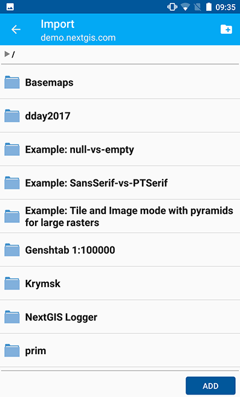
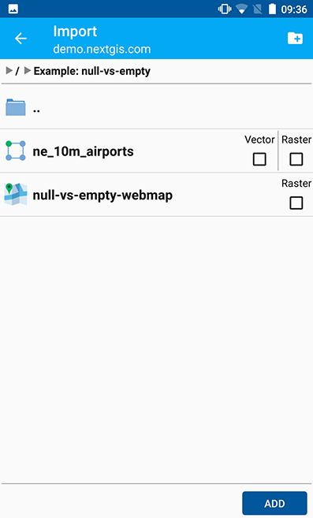
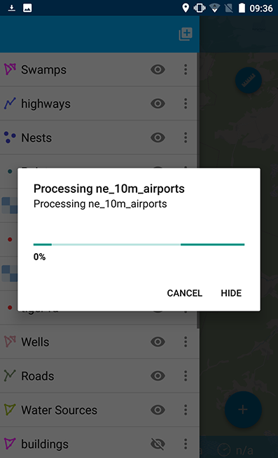
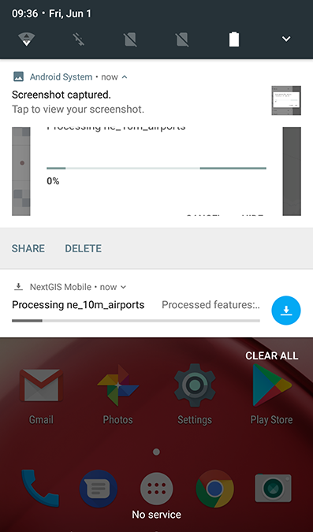
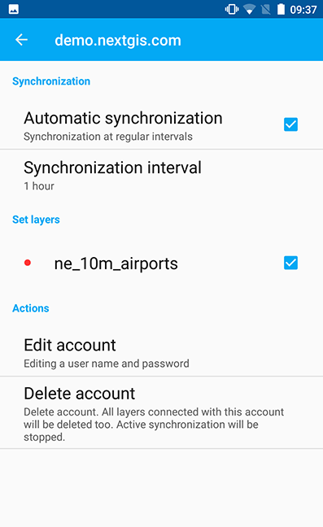
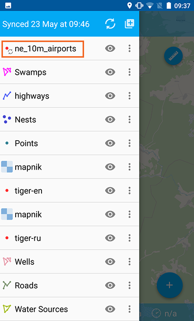

.. sectionauthor::  Natalia Baryshnikova <Nshelekhova@gmail.com>

.. _ngmobile_integration:

Integration with NextGIS Web
============================

.. only:: html
   
   You can learn more about main features of Web GIS in :ref:`Web GIS <ngcom_description>`.

.. only:: latex

   You can learn more about main features of Web GIS in `Web GIS: Description and Main Features :ref:`Web GIS <ngcom_description>`.

.. _ngmobile_create_a_connection_to_webgis:

New Web GIS creation
--------------------

There are two ways to create a new Web GIS. The **first way** is the following:

1. Open Layers tree panel (item 1 in :numref:`ngmobile_main_activity_pic_1`).
2. Then tap on "Add geodata" button (item 4 in :numref:`ngmobile_layer_tree_pic`).
3. Select “Add from Web GIS” (:numref:`ngmobile_the_menu_button_Add_data_pic`) 

.. figure:: _static/ngmobile_the_menu_button_Add_data.png
   :name: ngmobile_the_menu_button_Add_data_pic
   :align: center
   :height: 10cm
  
   Add geodata dialog

4. In the opened dialog select “Add Web GIS” (:numref:`ngmobile_add_entry1_pic`).

.. figure:: _static/add_entry_eng.png
   :name: ngmobile_add_entry1_pic
   :align: center
   :height: 10cm

   Web GIS dialog
   
5. Then fill up your Web GIS domain’s name and the credentials of your NextGIS ID and tap “Sign in” button (:numref:`ngmobile_create_webgis_layer_pic`).

.. figure:: _static/new_webgis_eng.png
   :name: ngmobile_create_webgis_layer_pic
   :align: center
   :height: 10cm
   
   Web GIS adding dialog
   
The **second way** is the following:

1. Tap contextual menu icon (item 5 in :numref:`ngmobile_main_activity_pic_1`). 
   
2. Select "Settings" (:numref:`ngmobile_settings2_pic`).

.. figure:: _static/settings_eng.png
   :name: ngmobile_settings2_pic
   :align: center
   :height: 10cm

   Contextual menu

3. Select "Web GIS" (:numref:`ngmobile_settings_ngw_pic`).  

.. figure:: _static/settings_NGW_eng.png
   :name: ngmobile_settings_ngw_pic
   :align: center
   :height: 10cm
   
   Setting dialog
  
4. In the opened dialog select “Add Web GIS” (:numref:`ngmobile_add_entry2_pic`).  
   
.. figure:: _static/add_entry2_eng.png
   :name: ngmobile_add_entry2_pic
   :align: center
   :height: 10cm

   Web GIS dialog

5. Then fill up your Web GIS domain’s name and the credentials of your NextGIS ID and tap “Sign in” button (:numref:`ngmobile_create_webgis_layer_pic`).

.. _ngmobile_create_a_connection:

Connection to Web GIS
---------------------

To create a connection to an existing Web GIS account:

1. Open Layers tree panel (item 1 in :numref:`ngmobile_main_activity_pic_1`).
2. Then tap on "Add geodata" button (item 4 in :numref:`ngmobile_layer_tree_pic`).
3. Select “Add from Web GIS” (:numref:`ngmobile_the_menu_button_Add_data_pic`) 
4. In the opened dialog select Web GIS (:numref:`ngmobile_add_entry1_pic`).
5. The list of files of your Web GIS will open. If you have only one Web GIS added to the app, this dialog will open immediately after tapping “Add from Web GIS” button.

.. _ngmobile_create_a_connection_to_nextgis_web:

Connection to NextGIS Web
-------------------------

.. only:: html
   
   You can learn more about main features of NextGIS Web in :ref:`ngw_keyfeatures`.

.. only:: latex

   You can learn more about main features of NextGIS Web in `Key features of NextGIS Web <http://docs.nextgis.com/docs_ngweb/source/general.html#ngweb-keyfeatures>`_.
   
If you want to keep your data on your own NextGIS Web server, tap "Add Web GIS" using either of the ways to create a new Web GIS (see above), follow the link at the bottom of the screen (see :numref:`ngmobile_new_webgis_nextgis_pic`) and use your account.

.. figure:: _static/new_webgis_nextgis_eng.png
   :name: ngmobile_new_webgis_nextgis_pic
   :align: center
   :height: 10cm

   Add Web GIS dialog

In the opened dialog fill up NextGIS Web :term:`URL`, login and password in the form and tap “Sign in” button (see :numref:`ngmobile_ngw_connection_settings_pic`).

.. figure:: _static/nextgis_web_eng.png
   :name: ngmobile_ngw_connection_settings_pic
   :align: center
   :height: 10cm

   NextGIS Web adding dialog
      
.. note::
   Login and password fields for NextGIS Web adding should be fiiled up without spaces!
   Many gadgets add a space at the end of the text during autosubstitution or pasting the text from the clipboard, and NextGIS Web identifies this as another login or password and cancels the connection.
   

.. _ngmobile_change_account:

Editing of Web GIS account
-------------------------------------

To edit Web GIS account:

1. Tap contextual menu icon (item 5 in :numref:`ngmobile_main_activity_pic_1`). 
2. Select "Settings" (:numref:`ngmobile_settings2_pic`).
3. Select "Web GIS" (:numref:`ngmobile_settings_ngw_pic`).  
4. Select Web GIS account (:numref:`ngmobile_add_entry2_pic`).  
5. In the opened window select "Edit account" (see :numref:`ngmobile_remove_account_pic`).

.. figure:: _static/remove_account_eng.png
   :name: ngmobile_remove_account_pic
   :align: center
   :height: 10cm
    
   Settings dialog

6. Here you can edit the following fields (see :numref:`ngmobile_edit_account_pic`):

1. Login
2. Password

.. figure:: _static/ng_mobile_edit_account_eng.png
   :name: ngmobile_edit_account_pic
   :align: center
   :height: 10cm

   Editing Web GIS account
   
.. _ngmobile_delete_account:

Deleting of Web GIS account
---------------------------

You can delete Web GIS account in several ways. The **first way** is the following:

1. Tap contextual menu icon (item 5 in :numref:`ngmobile_main_activity_pic_1`). 
2. Select "Settings" (:numref:`ngmobile_settings2_pic`).
3. Select "Web GIS" (:numref:`ngmobile_settings_ngw_pic`).  
4. Select Web GIS account (:numref:`ngmobile_add_entry2_pic`).  
5. In the opened window select "Delete account" (see :numref:`ngmobile_remove_account1_pic`).

.. figure:: _static/remove_account1_eng.png
   :name: ngmobile_remove_account1_pic
   :align: center
   :height: 10cm
    
   Settings dialog
   
6. Delete selected Web GIS account.
7. In the case of successful deleting, the window with Web GIS selection will be opened without deleted Web GIS account.

The **second way** to delete Web GIS account is the following:

1. Open OS settings of the gadget.
2. Select "Accounts" in settings (see :numref:`ngmobile_settings_in_os_pic`).

.. figure:: _static/settings_in_os_eng.png
   :name: ngmobile_settings_in_os_pic
   :align: center
   :height: 10cm
   
   Selecting accounts in OS settings
   
3. Select the "NextGIS" account from the list(see :numref:`ngmobile_accounts_in_os_pic`).

.. figure:: _static/accounts_in_os_eng.png
   :name: ngmobile_accounts_in_os_pic
   :align: center
   :height: 10cm
   
   NextGIS account in OS settings

4. In the opened window select Web GIS account (see :numref:`ngmobile_remove_account_in_os_pic`).

.. figure:: _static/remove_account_in_os_eng.png
   :name: ngmobile_remove_account_in_os_pic
   :align: center
   :height: 10cm
   
   Selecting Web GIS account in OS settings

5. In the opened "Sync" window tap contextual menu icon in the right upeper corner of the screen and select "Remove account" (see :numref:`ngmobile_remove_account1_in_os_pic`).

.. figure:: _static/remove_account1_in_os_eng.png
   :name: ngmobile_remove_account1_in_os_pic
   :align: center
   :height: 10cm
   
   Deleting Web GIS account through the OS settings

.. _ngmobile_add_layer_webgis:

Adding of a layer (vector/raster) from Web GIS
----------------------------------------------

To add a layer (vector/raste) from Web GIS:

1. Open Layers tree panel (item 1 in :numref:`ngmobile_main_activity_pic_1`).
2. Then tap on "Add geodata" button (item 4 in :numref:`ngmobile_layer_tree_pic`).
3. Select “Add from Web GIS” (:numref:`ngmobile_the_menu_button_Add_data_pic`) 
4. In the opened dialog select Web GIS (:numref:`ngmobile_add_entry1_pic`). You can learn more about creating of Web GIS account in :ref:`ngmobile_сreate_a_connection`.
5. In the opened window you can see the list of internal resources and layers (vector and raster) for the selected Web GIS account (see :numref:`ngmobile_list_of_files_pic`).

   
   The list of Web GIS internal resources and layers

6. Select a group of Web GIS resources and within it tick a layer (vector/raster) you want to add and tap "Add" (see :numref:`ngmobile_file_selection_pic`).
 

   
   Selecting a layer within a Web GIS resources group

.. note::
   If you need to select several layers in different groups of Web GIS account, the tick of the layer selection will keep while you switching over the groups.

7. Layer's processing dialog includes options "Cancel" and "Hide" (see :numref:`ngmobile_processing_layer_pic`).
    

   Layers's processing dialog

To stop Web GIS layer's processing tap "Cancel" button.
To avoid program's interface blocking and to continue working with NextGIS Mobile tap "Hide" button. As a result Web GIS layers's processing dialog will be transfered to status panel (see :numref:`ngmobile_download_status_pic`).

   Status panel
 
.. note::
   To stop the processing of Web GIS layer, which was transfered to status panel
   touch the screen on the layer's processing panel with thumb and forfinger and
   move them in different directions sliding along the screen. The indicator of
   the Web GIS layer's processing will be transfered to status panel and the "Stop"
   button will appear. Tap it to stop the processing of Web GIS layer. 

After you execute all above mentioned selected Web GIS layers (vector/raste) will 
be added to a map and will be shown up in the layers tree.

.. _ngmobile_synchronization_layer_webgis:

Synchronization settings for Web GIS vector layer
------------------------------------------------

Synchronization helps to interchange of geodata corrections quickly and to provide the identity of information interchanging between user's PC and mobile gadget. To syncronize Web GIS vector layer:
 
1. Tap contextual menu icon (item 5 in :numref:`ngmobile_main_activity_pic_1`). 
2. Select "Settings" (:numref:`ngmobile_settings2_pic`).
3. Select "Web GIS" (:numref:`ngmobile_settings_ngw_pic`). 
4. Select Web GIS account (:numref:`ngmobile_add_entry2_pic`).
5. A dialog with options will open (see :numref:`ngmobile_connection_properties_window_pic`):
  
   - automatic synchronization; 
   - synchronization interval (can be set to 5 minutes - 2 hours);
   - synchronization of the Web GIS layers.

 
   Settings of Web GIS account

After a Web GIS layer for synchronization is selected the icon of the synchronization beginning appears near the the icon of the selected layer and near the icon of that layer on the layers tree (see :numref:`ngmobile_layers_tree_int_pic`):

   Layers tree
