.. sectionauthor::  Наталья Барышникова <Nshelekhova@gmail.com>

.. _ngmobile_integration:

Интеграция с NextGIS Web
========================

.. versionadded:: 2.2

.. only:: html
   
   С основными возможностями программного обеспечения NextGIS Web можно ознакомиться 
   в подразделе :ref:`ngweb_keyfeatures`.

.. only:: latex

   С основными возможностями программного обеспечения NextGIS Web можно ознакомиться 
   в подразделе `Основные возможности NextGIS Web <http://docs.nextgis.ru/docs_ngweb/source/general.html#ngweb-keyfeatures>`_.

.. _ngmobile_сreate_a_connection:

Создание подключения к NextGIS Web
-----------------------------------

Подключение к программному обеспечению NextGIS Web может осуществляться несколькими 
способами. При использовании **первого способа** подключения к NextGIS Web, необходимо 
выполнить следующую последовательность шагов:

1. Вызвать меню опций (см. :numref:`ngmobile_main_activity_pic` п. 5). 
2. Далее выбрать пункт меню "Добавить слой".
3. В открывшемся меню опций необходимо выбрать пункт "NGW" (см. :numref:`ngmobile_add_ngw_layer_pic`) 

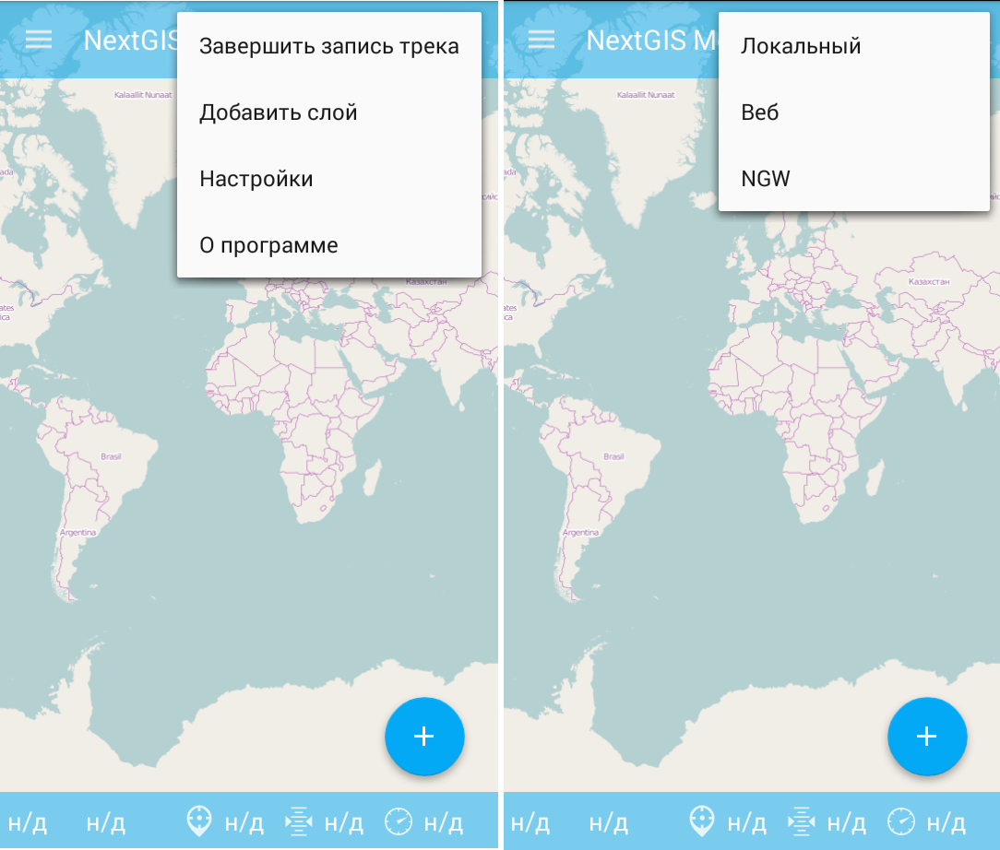
  
   Добавление слоя NextGIS Web

4. В открывшемся окне необходимо выбрать "Добавить учетную запись" (Добавить учетную запись NextGIS Web). 
   Нажать на эту кнопку (см. :numref:`ngmobile_select_ngw_layer_pic`).

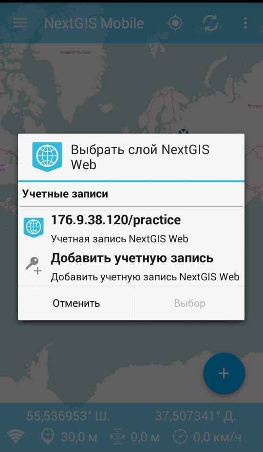
   
   Добавление учетной записи NextGIS Web

5. В открывшемся окне надо ввести параметры подключения: NextGIS Web :term:`URL`, 
   Имя пользователя/логин и пароль, нажать кнопку "Подключить" 
   (см. :numref:`ngmobile_ngw_connection_settings_pic`).

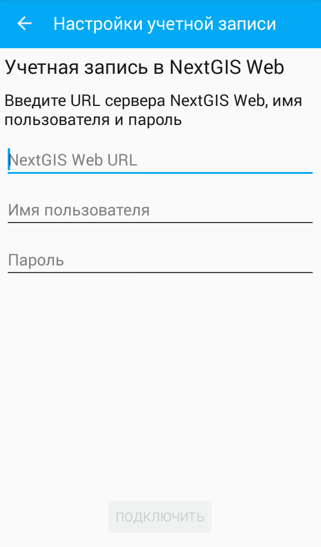

   Окно ввода параметров подключения
 
6. В случае удачного подключения откроется окно с созданной учетной записью NextGIS Web.

Для подключения к NextGIS Web **вторым способом** необходимо выполнить следующую последовательность шагов:

1. Вызвать меню опций (см. :numref:`ngmobile_main_activity_pic` п. 5). 
   В меню опций необходимо выбрать пункт "Настройки" (см. :numref:`ngmobile_settings2_pic`).

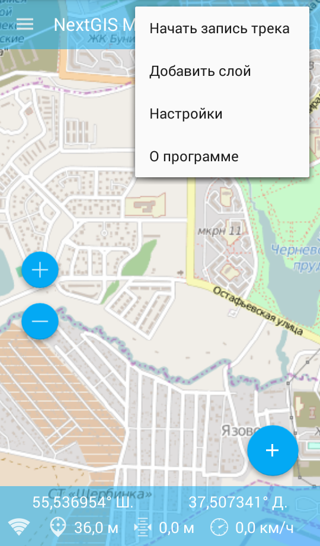

   Меню опций

2. Выбрать пункт :menuselection:`NextGIS Web --> Настройки NextGIS Web` (см. :numref:`ngmobile_settings_ngw_pic`).  

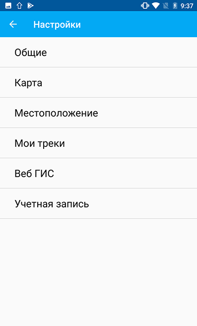
   
   Меню "Настройки"
  
3. В открывшемся меню выбрать пункт "Добавить учетную запись" (см. :numref:`ngmobile_add_entry_pic`).

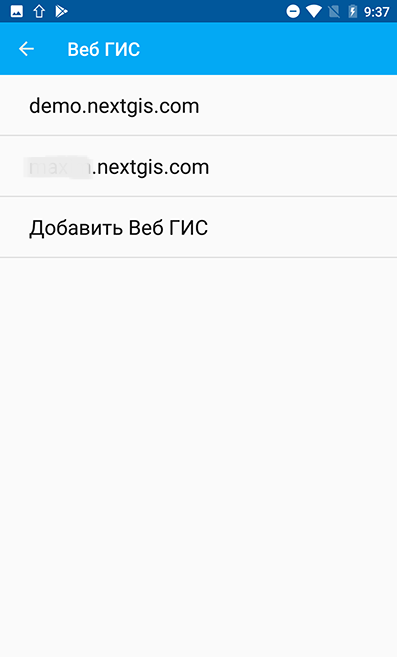

   Добавление учетной записи NextGIS Web

4. В открывшемся диалоговом окне надо ввести параметры подключения: NextGIS Web :term:`URL`,
   Имя пользователя/логин и пароль, нажать кнопку "Подключить" 
   (см. :numref:`ngmobile_ngw_connection_settings_pic`).

5. В случае удачного подключения откроется окно с созданной учетной записью NextGIS Web.

.. note::
   В диалогом окне для ввода параметров при создании подключения к NextGIS Web 
   Имя пользователя/логин и пароль вводить без пробелов!
   Mногие клавиатуры смартфонов и планшетов при автоподстановке текста, а также 
   при вставке копируемого текста из буфера обмена добавляют пробел в конце текста 
   в поле ввода (имя пользователя, пароль). Полученный текст с пробелом воспринимается 
   NextGIS Web как другое имя пользователя или другой пароль, что приводит к отказу 
   в создании подключения.

Удаление учетной записи NextGIS Web
-----------------------------------

Удаление учетной записи NextGIS Web может осуществляться несколькими способами. 
При использовании **первого способа** удаление учетной записи NextGIS Web, необходимо 
выполнить следующую последовательность шагов:

1. Вызвать меню опций (см. :numref:`ngmobile_main_activity_pic` п. 5). 
2. Далее выбрать пункт меню "Настройки" (см. :numref:`ngmobile_settings2_pic`).
3. В открывшемся меню опций необходимо выбрать пункт "NextGIS Web"
   (см. :numref:`ngmobile_settings_ngw_pic`). 

4. В открывшемся окне необходимо выбрать ранее созданную учетную запись 
   NextGIS Web (см. :numref:`ngmobile_select_ngw_layer_pic`). 
   
5. Выбрать пункт меню "Удалить учетную запись"(см. :numref:`ngmobile_remove_account_pic`).

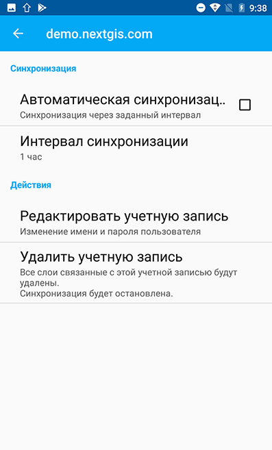
    
   Удаление учетной записи NextGIS Web 

6. Удалить выбранную учетную запись NextGIS Web.
7. В случае удачного удаления откроется окно программы, в котором будет отсутствовать 
   ранее созданная учетная запись NextGIS Web.

Для удаления учетной записи NextGIS Web **вторым способом** необходимо выполнить 
следующую последовательность шагов:

1. На устройстве (мобильном телефоне/планшете) вызвать "Настройки операционной системы".
2. Перейти к Аккаунтам/Учетным записям в настройках телефона.
3. Выбрать из списка учетную запись "NextGIS Web" (см. :numref:`ngmobile_accounts_in_os_pic`).

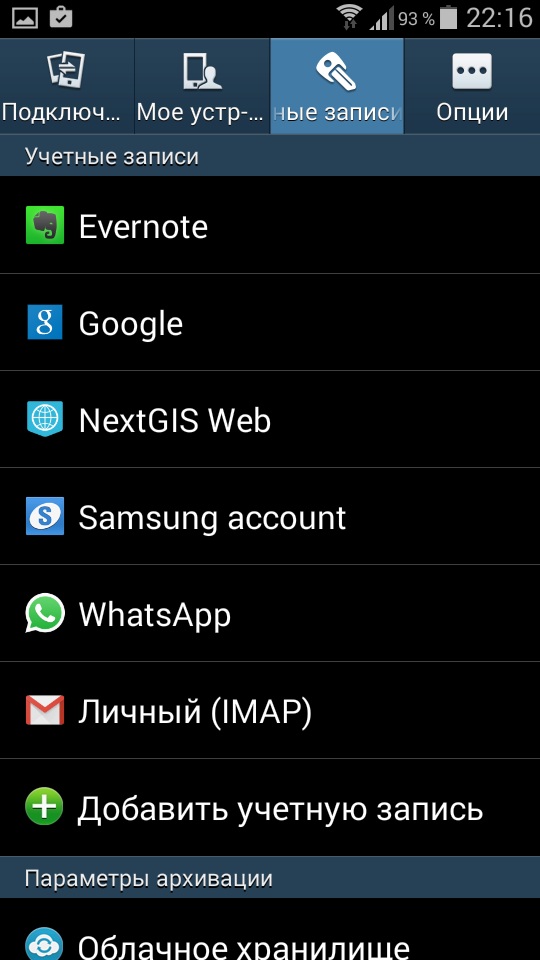
   
   Выбор в настройках ОС аккаунт NextGIS Web 

4. В открывшемся окне необходимо вырать ранее созданную учетную запись NextGIS Web,
   в нижнем правом углу экрана нажать на кнопку "Удалить уч.запись" 
   (см. :numref:`ngmobile_remove_account_in_os_pic`).

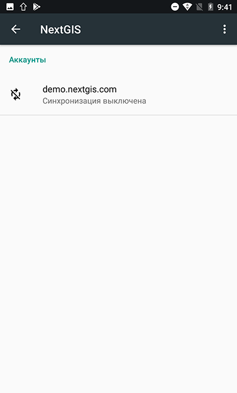
   
   Удаление учетной записи через настройки ОС 

5. Удалить выбранную учетную запись NextGIS Web.
6. В случае удачного удаления откроется окно программы, в котором будет отсутствовать 
   ранее созданная учетная запись NextGIS Web.

Добавление слоя (векторного или растрового) из NextGIS Web
----------------------------------------------------------
Для добавления слоя (векторного или растрового) из NextGIS Web необходимо выполнить 
следующую последовательность шагов:

1. Вызвать меню опций (см. :numref:`ngmobile_main_activity_pic` п. 5). 
2. Далее выбрать пункт меню "Добавить слой".
3. В открывшемся меню опций необходимо выбрать пункт "NGW" (см. :numref:`ngmobile_add_ngw_layer_pic`). 
4. Выбрать из списка учетную запись (см. :numref:`ngmobile_select_ngw_layer_pic`). 
   Подробнее о создании учетной записи NextGIS Web см. в разделе ":ref:`ngmobile_сreate_a_connection`". 

5. В открывшемся окне находится список внутренних ресурсов и слоев NextGIS Web 
   (векторных и растровых) выбранной учетной записи (см. :numref:`ngmobile_list_of_files_pic`).

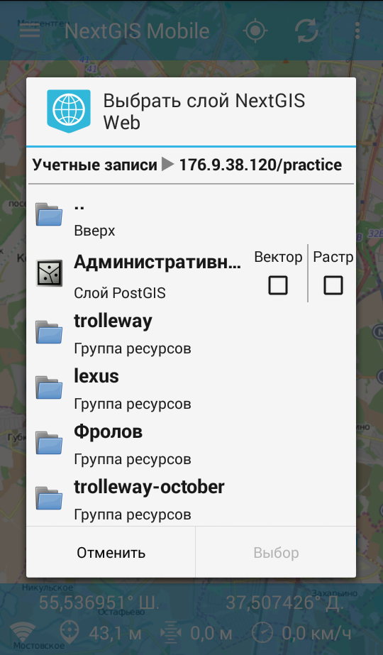
   
   Список ресурсов и слоев NextGIS Web

6. Выбрать нужную группу ресурсов NextGIS Web, внутри которой отметить необходимый 
   слой NextGIS Web (вектор и/или растр) путем проставления отметок и выбирать пункт 
   меню "Выбор" (см. :numref:`ngmobile_file_selection_pic`).
 
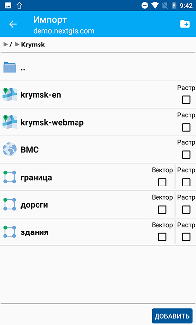
   
   Выбор в группе ресурсов NextGIS Web необходимого слоя  

.. note::
   Следует отметить, что в случае необходимости выбора нескольких слоев (вектор и/или растр)
   NextGIS Web в разных группах ресурсов одной учетной записи, поставленная отметка 
   выбора слоя сохраняется при переходе из одной группы ресурсов в другую.  

7. Открывшееся окно обработки выбранного слоя содержит диалоговое окно с пунктами меню 
   "Отмена" и "Скрыть" (см. :numref:`ngmobile_processing_layer_pic`).
    
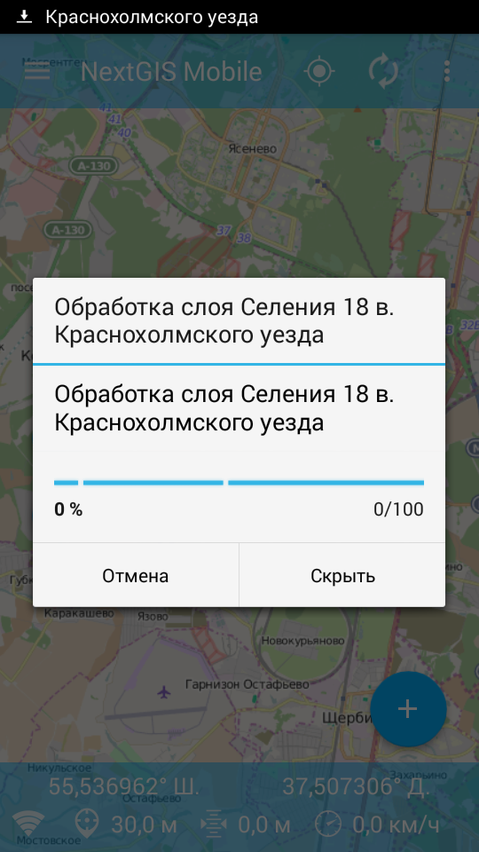

   Окно обработки слоя

Если необходимо остановить процедуру обработки слоя NextGIS Web следует выбрать 
пункт меню "Отмена". 
Для предотвращения блокирования интерфейса программы и для дальнейшей работы с 
программой следует выбрать пункт меню "Скрыть". В результате такого выбора 
панель обработки слоя NextGIS Web перенесется в панель статуса 
(см. :numref:`ngmobile_download_status_pic`).

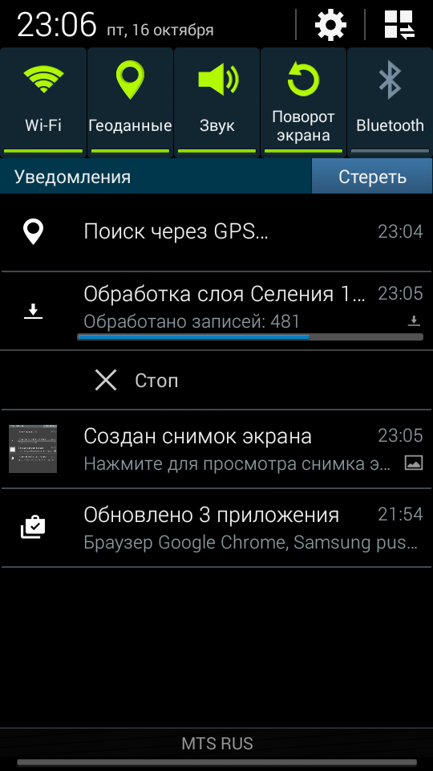

   Панель статуса
 
Если необходимо завершить процесс обработки слоя NextGIS Web, который перенесен 
в панель статуса, на панели обработки слоя следует сделать следующее: коснитесь экрана 
большим и указательным пальцами и разведите их в стороны, скользя пальцами по экрану. 
В результате этого действия индикатор процесса обработки слоя NextGIS Web будет перенесен 
в панель статуса, а также появится кнопка "Стоп", при нажатии на которую процесс обработки
слоя завершится.
В результате выполнения выше перечисленных действий на карту будут добавлены выбранные
слои (вектор и/или растр) NextGIS Web, которые появятся в дереве слоев сверху. 
Если на карте имелись ранее созданные точки и/или линии NextGIS Web, то данные о них не теряются, 
находятся в дереве слоев в определенном порядке.
После обработки и создания на карте новых слоев (растр и/или вектор) NextGIS Web, 
просмотр состава карты, управление видимостью и порядком слоев на карте можно настраить 
при помощи дерева слоев.  

Настройка синхронизации векторного слоя с NextGIS Web
------------------------------------------------------

Для осуществления процесса оперативного обмена правками геоданных и обеспечения 
идентичности выбранной информации между копьютером и мобильным устройством пользователя 
необходимо использовать синхронизацию. Для осуществления синхронизации векторного 
слоя с NextGIS Web необходимо выполнить следующую последовательность шагов (см. :numref:`ngmobile_vector_layer_menu_one_pic`):
 
1. Вызвать меню опций 
2. Выбрать пункт меню "Настройки"

.. figure:: _static/vector_layer_menu.png
   :name: ngmobile_vector_layer_menu_one_pic
   :align: center
   :height: 10cm

   Меню слоя

3. В меню "Настройки" выбрать пункт "NextGIS Web/ Настройки NextGIS Web"
(см. :numref:`ngmobile_settings_ngw_one_pic`).  

   
   Меню "Настройки"

4. Из имеющиего списка аккаунтов выбрать необходимый (см. :numref:`ngmobile_add_entry_one_pic`).

   
   Список аккаунтов

5. В открывшемся окне имеются пункты (см. :numref:`ngmobile_conntction_properties_window_pic`):
  
   - синхронизация/автоматическая синхронизация с возможностью постановки отметки 
     о разрешении процесса синхронизации на мобильном устройстве; 
   - синхронизация конкретного слоя с NextGIS Web;
   - интервал синхронизации (можно изменить, может составлять от 5 минут до 2 часов).

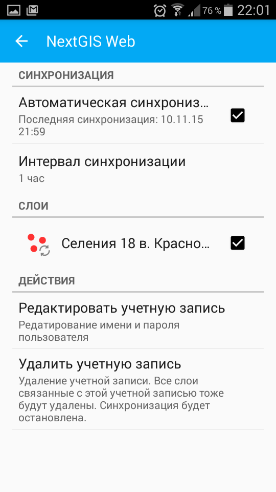
 
   Окно свойств подключения

После выбора слоя и проставления отметки о разрешении процесса синхронизации с 
NextGIS Web у картинки, обозначающей слой, появляется иконка о начале процесса 
синхронизации в виде замкнутых стрелок. Такая же иконка появляется и в дереве слоев 
напротив слоя, участвующего в синхронизации (см. :numref:`ngmobile_layers_tree_int_pic`):

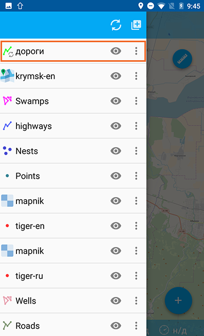

   Дерево слоев
