.. _ngmobile_integration:

Интеграция с nextgis.com 
========================

.. only:: html
   
   С основными возможностями программного обеспечения Веб ГИС можно ознакомиться 
   в разделе :ref:`Веб ГИС <ngcom_description>`.

.. only:: latex

   С основными возможностями программного обеспечения Веб ГИС можно ознакомиться 
   в разделе `Веб ГИС: описание и возможности <https://docs.nextgis.ru/docs_ngcom/source/description.html#ngcom-description>`_.

Приложение NextGIS Mobile может быть интегрировано с Веб ГИС, созданной на платформе NextGIS Web. Это позволяет обмениваться данными с Веб ГИС: отправлять в неё локальные слои, скачивать данные с сервера, редактировать данные и просматривать на веб-картах треки, записанные с помощью приложения.

Для того, чтобы подключиться к Веб ГИС, необходимо `авторизоваться <https://docs.nextgis.ru/docs_ngmobile/source/auth.html>`_.

Если из этого личного кабинета NextGIS ID уже была создана Веб ГИС, она будет автоматически добавлена в приложение. Также будут добавлены Веб ГИС, где этот пользователь участвует в `команде <https://docs.nextgis.ru/docs_ngcom/source/teams.html>`_.

Если у пользователя ещё нет Веб ГИС, её можно `создать <https://docs.nextgis.ru/docs_ngcom/source/create_webgis.html>`_ из личного кабинета.

Также можно дополнительно добавить подключения к другим `облачным Веб ГИС <https://docs.nextgis.ru/docs_ngmobile/source/ngw_integration.html#ngmobile-create-a-connection>`_ и `Веб ГИС, развёрнутым на своём сервере <https://docs.nextgis.ru/docs_ngmobile/source/ngw_integration.html#ngm-create-connection-onp>`_.

Созданное подключение к Веб ГИС можно `редактировать <https://docs.nextgis.ru/docs_ngmobile/source/ngw_integration.html#ngmobile-change-account>`_ или `удалить <https://docs.nextgis.ru/docs_ngmobile/source/ngw_integration.html#ngmobile-delete-account>`_.

.. _ngmobile_add_layer_webgis:

Добавление слоя (векторного или растрового) из Веб ГИС
------------------------------------------------------

1. Откройте дерево слоёв, нажав на три полоски в левом верхнем углу (см. :numref:`ngmobile_main_activity_pic` п. 1). 

2. Нажмите кнопку "Добавить геоданные".

3. В открывшемся меню выберите пункт "Добавить из Веб ГИС" (см. :numref:`ngmobile_the_menu_button_Add_data_pic`) 

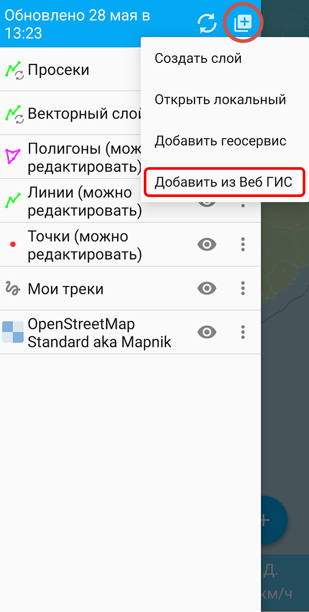

   Выбор способа добавления данных

4. Если подключено несколько Веб ГИС, выберите из списка нужную (см. :numref:`ngmobile_select_ngw_layer_pic`). 

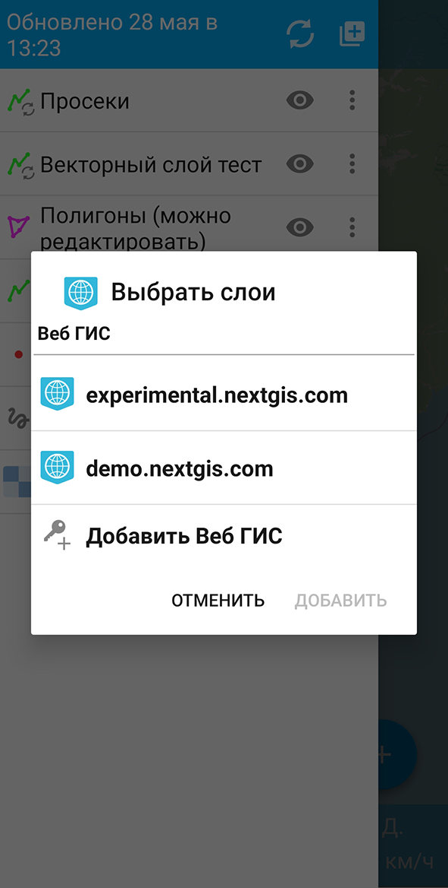

   Выбор Веб ГИС

.. note:: Как добавить подключение к Веб ГИС см. в разделе :ref:`ngmobile_create_a_connection_to_webgis`. 

5. В открывшемся окне находится список групп ресурсов и слоёв  (векторных и растровых) выбранной Веб ГИС. Выберите нужную группу ресурсов Веб ГИС, внутри неё отметьте галочкой необходимый слой, затем нажмите кнопку **Добавить**. Векторный слой можно добавить также в виде растра.
 
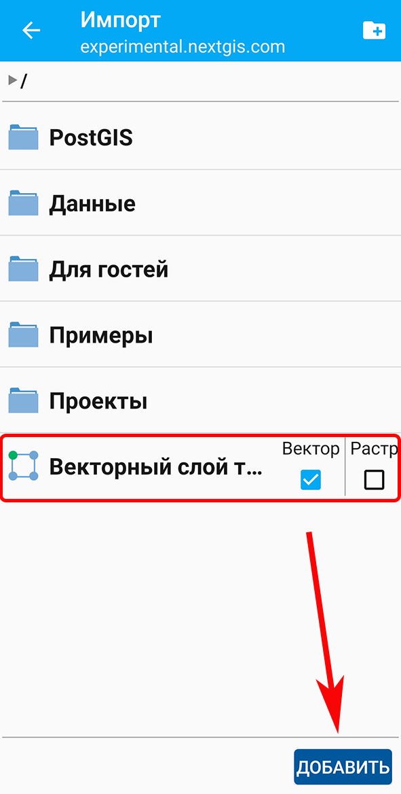
   
   Выбор в группе ресурсов Веб ГИС необходимого слоя

.. note::
   В случае необходимости выбора нескольких слоёв
   в разных группах ресурсов одной Веб ГИС, поставленная отметка 
   выбора слоя сохраняется при переходе из одной группы ресурсов в другую.  

6. Откроется окно обработки выбранного слоя.
    
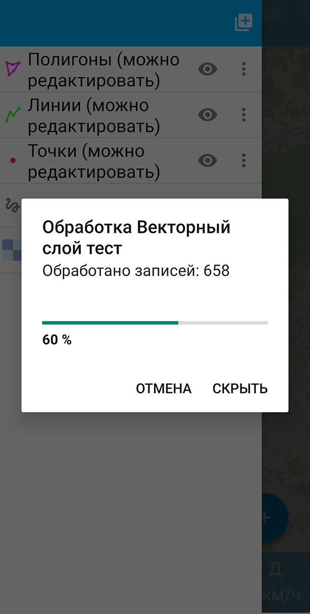

   Окно обработки слоя

Если необходимо остановить процедуру обработки слоя Веб ГИС, нажмите **Отмена**. 
Чтобы продолжить работу с программой, пока слой обрабатывается, нажмите **Скрыть**. Панель обработки слоя Веб ГИС перенесется в панель статуса 
(см. :numref:`ngmobile_download_status_pic`).

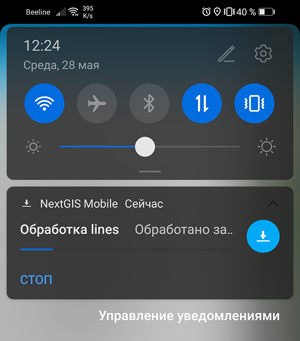

   Панель статуса
 

Если необходимо завершить процесс обработки слоя Веб ГИС, который перенесен 
в панель статуса, нажмите кнопку **Стоп** в уведомлении.

.. _ngmobile_synchronization_layer_webgis:

Настройка синхронизации векторного слоя с Веб ГИС
-------------------------------------------------

Приложение NextGIS Mobile может с заданной периодичностью обращаться к серверу, чтобы обмениваться правками и поддерживать соответствие слоёв на устройстве и в Веб ГИС.

Чтобы включить синхронизацию:
 
1. Откройте меню, нажав на три точки в правом верхнем углу (см. :numref:`ngmobile_main_activity_pic` п. 5). 
2. Выберите пункт меню "Настройки" (см. :numref:`ngmobile_settings2_pic`).
3. В открывшемся меню опций выберите пункт "Веб ГИС"
   (см. :numref:`ngmobile_settings_ngw_pic`). 

4. Из списка подключенных Веб ГИС выберите нужную. 

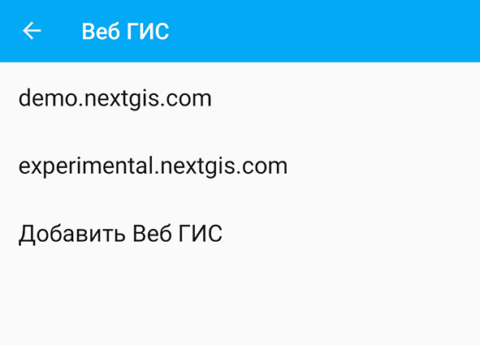

   Список подключённых Веб ГИС
   
5. На экране настроек Веб ГИС вы можете:
  
   - Включить автоматическую синхронизацию;
   - Задать интервал синхронизации (от 5 минут до 2 часов);
   - Включить/выключить синхронизацию конкретного слоя с Веб ГИС.

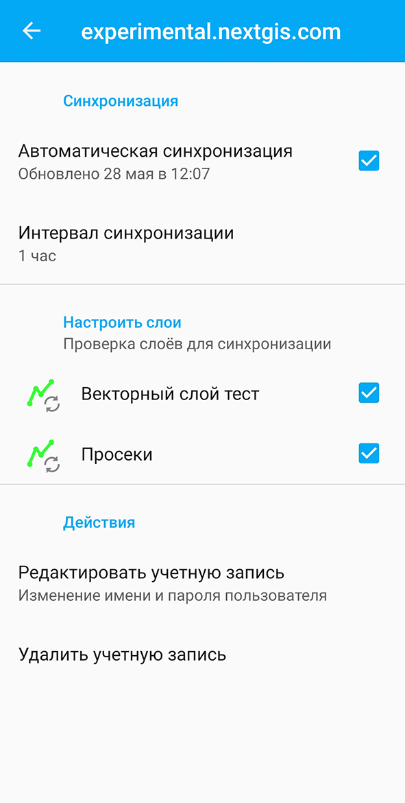
 
   Настройки учётной записи Веб ГИС

Синхронизируемые слои будут отмечены иконкой |icon_layer_sync|. Такая же иконка появляется и в дереве слоёв возле иконки слоя, участвующего в синхронизации.

.. |icon_layer_sync| image:: _static/icon_layer_sync.png
   :width: 6mm
   :alt: в виде замкнутых в круг стрелок

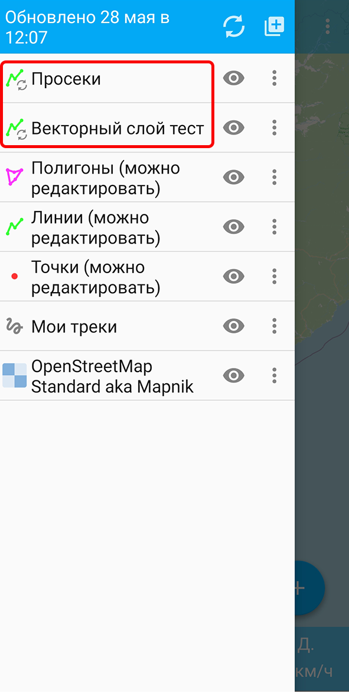

   Синхронизируемые слои в дереве слоёв

.. _ngmobile_create_a_connection_to_webgis:

Добавление Веб ГИС
----------------------

Добавить подключение к Веб ГИС в приложение возможно двумя способами. 

**Через дерево слоёв**

1. Откройте дерево слоёв (см. :numref:`ngmobile_main_activity_pic` п. 1). 
2. Нажмите кнопку "Добавить геоданные" (см. :numref:`ngmobile_layer_tree_pic`, п. 4).
3. В открывшемся меню выберите пункт "Добавить из Веб ГИС" 

  
   Меню кнопки "Добавить геоданные"

4. В открывшемся окне нажмите на кнопку "Добавить Веб ГИС".

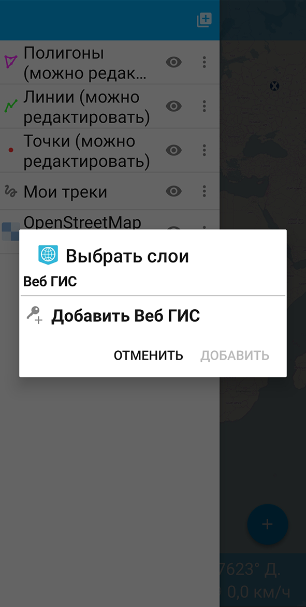
   
   Переход к добавлению учётной записи Веб ГИС
   
5. В открывшемся окне введите имя Веб ГИС, имя пользователя и пароль NextGIS ID и нажмите кнопку "Войти".

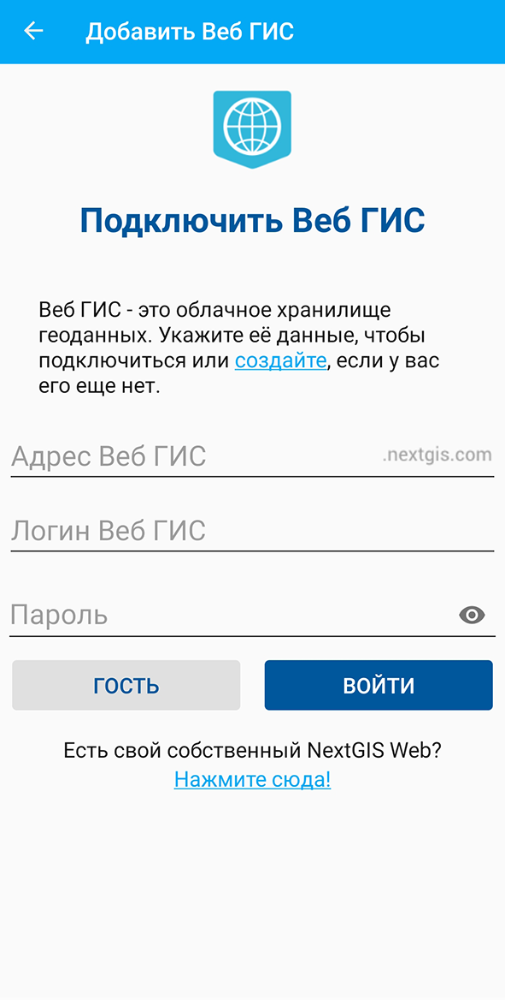
   
   Добавление новой учётной записи Веб ГИС
   
Если у вас ещё нет Веб ГИС, нажмите на этом экране **Создать**, вы будете перенаправлены в личный кабинет в браузере, где сможете `создать свою Веб ГИС <https://docs.nextgis.ru/docs_ngcom/source/create_webgis.html>`_.

**Через меню настроек**

1. Вызовите меню, нажав на три точки в правом верхнем углу (см. :numref:`ngmobile_main_activity_pic` п. 5). 
   
2. Далее выберите пункт "Настройки".

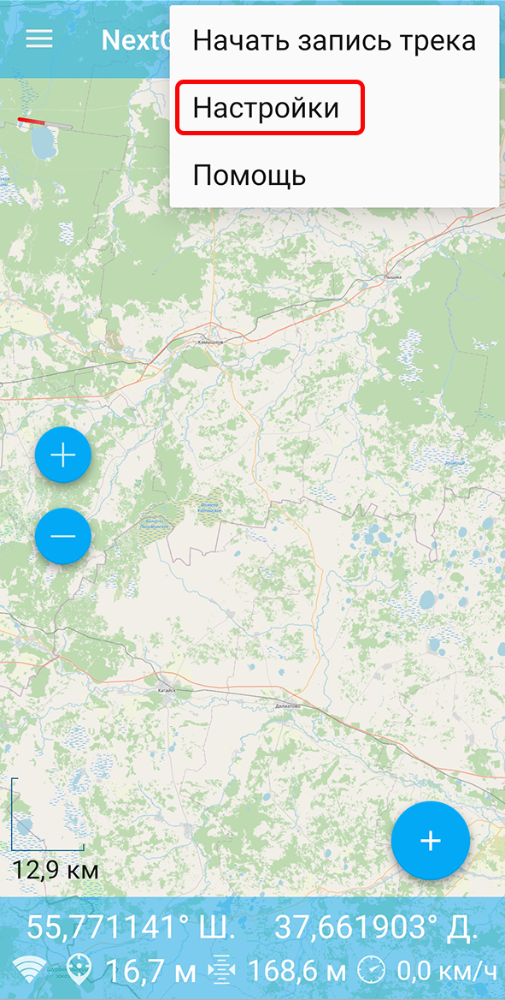

   Главное меню

3. Выберите пункт "Веб ГИС".  

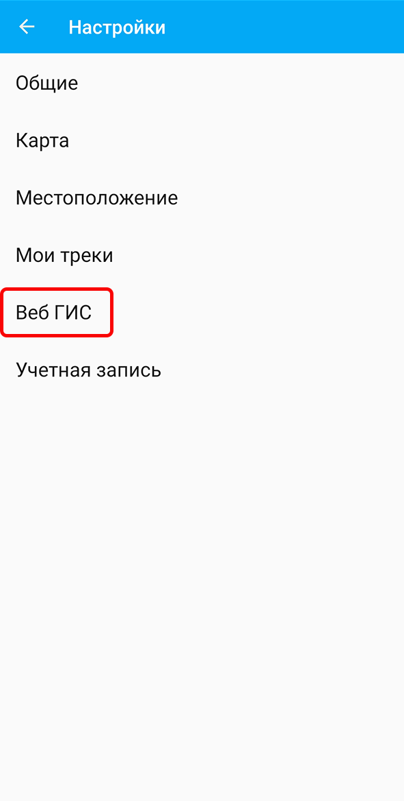
   
   Меню "Настройки"
  
4. В открывшемся меню нажмите **Добавить Веб ГИС**.  
   
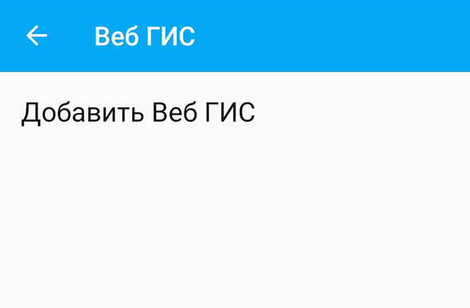

   Меню "Веб ГИС"

5. В открывшемся окне введите имя ГИС, имя пользователя и пароль NextGIS ID и нажмите кнопку **Войти** (см. :numref:`ngm_webgis_login_pic`).

.. _ngm_create_connection_onp:

Создание подключения к NextGIS Web на своём сервере
-----------------------------------------------------

.. only:: html
   
   С основными возможностями программного обеспечения NextGIS Web можно ознакомиться 
   в разделе :ref:`ngw_keyfeatures`.

.. only:: latex

   С основными возможностями программного обеспечения NextGIS Web можно ознакомиться 
   в разделе `Основные возможности NextGIS Web <http://docs.nextgis.ru/docs_ngweb/source/general.html#ngweb-keyfeatures>`_.
   
Если Вы хотите хранить данные на собственном сервере NextGIS Web, можно войти в свою учётную запись, нажав на кнопку "Добавить Веб ГИС" при любом из описанных выше способов `создания соединения с Веб ГИС <https://docs.nextgis.ru/docs_ngmobile/source/ngw_integration.html#ngmobile-create-a-connection-to-webgis>`_ и затем перейдя по ссылке внизу экрана.

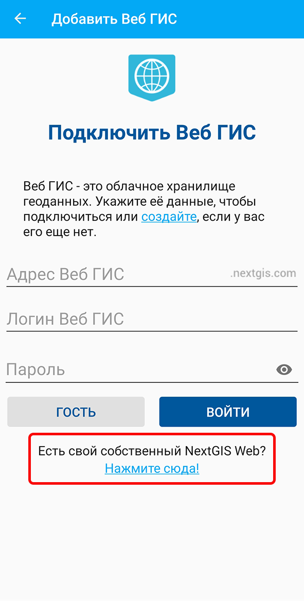

   Экран "Добавить Веб ГИС"

В открывшемся окне следует ввести параметры подключения: адрес Веб ГИС, имя пользователя и пароль, нажать кнопку **Войти**.

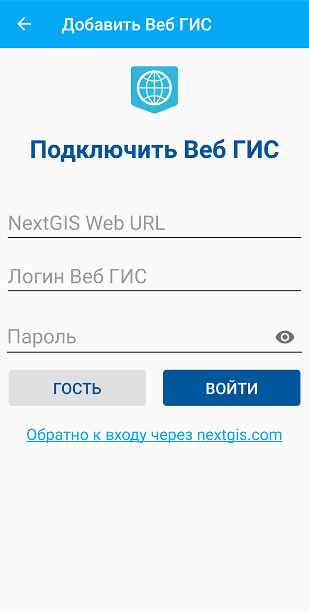

   Окно ввода параметров подключения
      
.. note::
   Mногие клавиатуры смартфонов и планшетов при автоподстановке текста, а также 
   при вставке копируемого текста из буфера обмена добавляют пробел в конце текста 
   в поле ввода (имя пользователя, пароль). В таком случае лишний пробел нужно удалить. Иначе полученный текст с пробелом воспринимается NextGIS Web как другое имя пользователя или другой пароль, что приводит к отказу в создании подключения.

.. _ngmobile_change_account:

Редактирование учётной записи Веб ГИС
-------------------------------------

1. Откройте меню, нажав на три точки в правом верхнем углу (см. :numref:`ngmobile_main_activity_pic` п. 5). 
2. Далее выберите пункт меню "Настройки" (см. :numref:`ngmobile_settings2_pic`).
3. В открывшемся меню выберите пункт "Веб ГИС"
   (см. :numref:`ngmobile_settings_ngw_pic`). 
4. Далее в списке выберите ранее созданную учётную запись 
   Веб ГИС (см. :numref:`ngm_webgis_list_pic`). 
5. В открывшемся окне выберите пункт меню "Редактирова учётную запись".

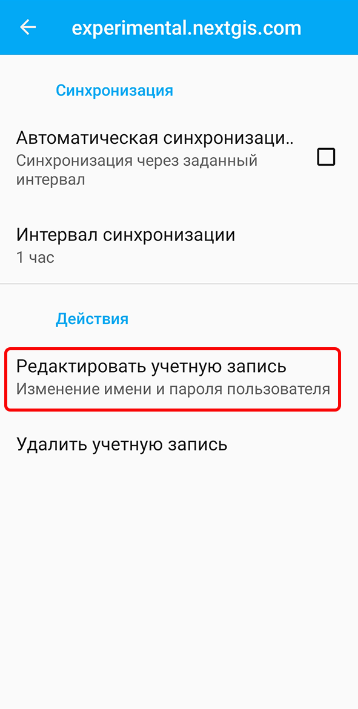
    
   Редактирование учётной записи Веб ГИС

6. В открывшемся окне в ранее созданную учётную запись при необходимости 
можно внести изменения в поля (см. :numref:`ngmobile_edit_account_pic`):

1. Имя пользователя.
2. Пароль.

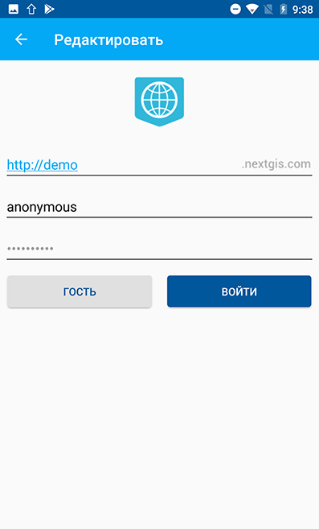

   Внесение изменений в ранее созданную учётную запись

.. _ngmobile_delete_account:

Удаление учётной записи Веб ГИС
-------------------------------

Удаление учётной записи Веб ГИС может осуществляться несколькими способами. 

Удалить подключение к Веб ГИС можно **в приложении** NextGIS Mobile.

1. Откройте меню, нажав на три точки в правом верхнем углу (см. :numref:`ngmobile_main_activity_pic` п. 5). 
2. Далее выберите пункт меню "Настройки" (см. :numref:`ngmobile_settings2_pic`).
3. В открывшемся меню опций выберите пункт "Веб ГИС"
   (см. :numref:`ngmobile_settings_ngw_pic`). 

4. Далее выберите ранее созданную учётную запись 
   Веб ГИС. 
   
5. Выберите пункт меню "Удалить учётную запись".

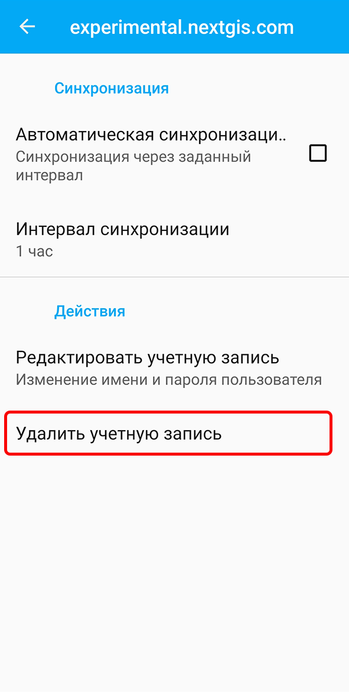
    
   Удаление подключения к Веб ГИС
   
6. Подтвердите удаление.

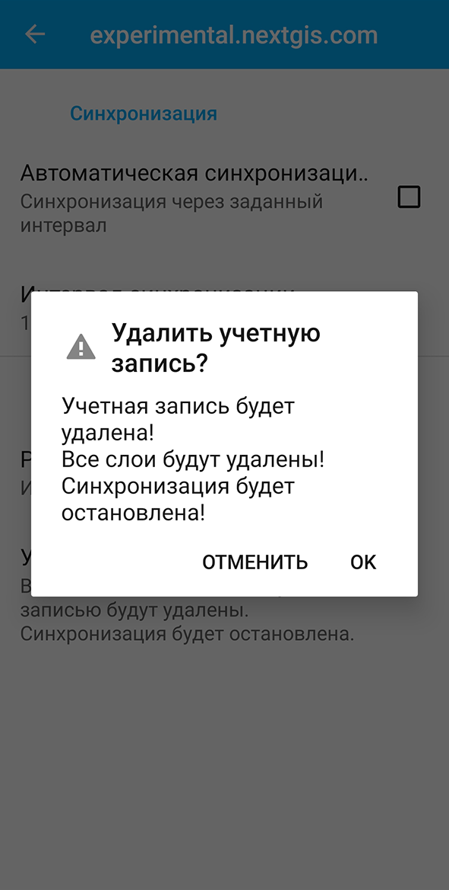
    
   Подтверждение удаления

Также подключение к Веб ГИС можно удалить **через настройки устройства**:

1. На устройстве (мобильном телефоне/планшете) зайдите в "Настройки".
2. Перейдите к Аккаунтам/учётным записям в настройках устройства.

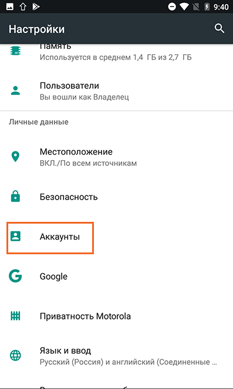
   
   Выбор аккаунтов в настройках ОС
   
3. Выберите из списка "NextGIS".

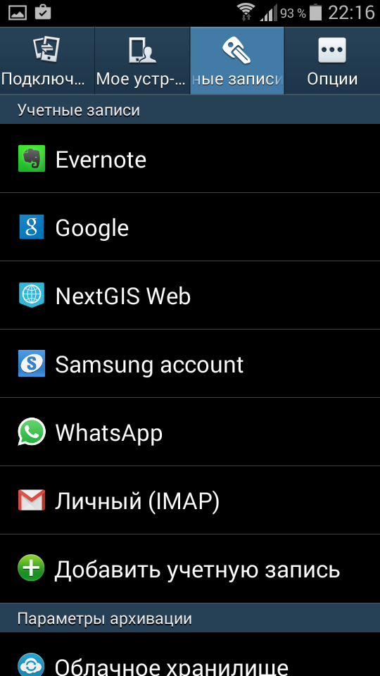
   
   Выбор в настройках аккаунт NextGIS

4. В открывшемся окне выберите ранее созданную учётную запись Веб ГИС.

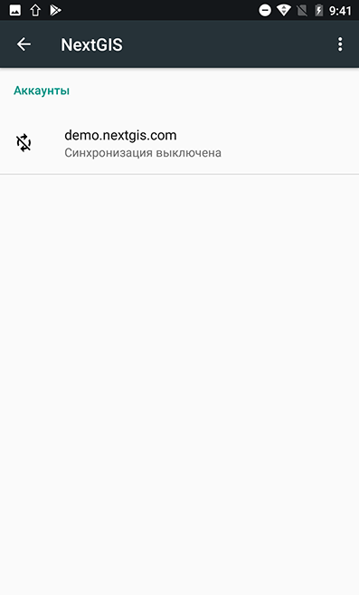
   
   Выбор учётной записи Веб ГИС через настройки ОС

5. В контекстном меню или на странице учётной записи нажмите **Удалить**.

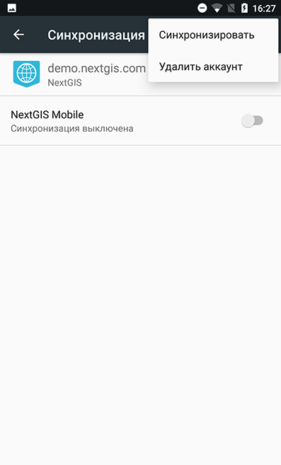
   
   Удаление учётной записи Веб ГИС через настройки ОС

