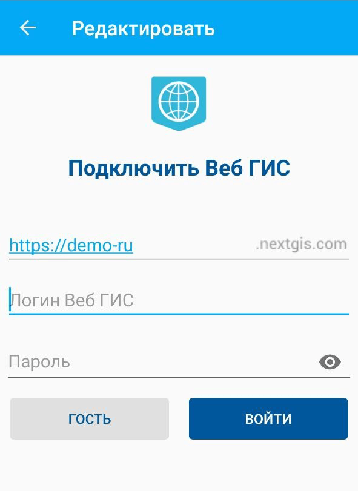

.. _ngmobile_integration:

Управление подключениями к Веб ГИС
==================================

С основными возможностями программного обеспечения Веб ГИС можно ознакомиться в разделе `Веб ГИС: описание и возможности <https://docs.nextgis.ru/docs_ngcom/source/description.html#ngcom-description>`_.

Приложение NextGIS Mobile может быть интегрировано с Веб ГИС, созданной на платформе NextGIS Web. Это позволяет обмениваться данными с Веб ГИС: отправлять в неё локальные слои, скачивать данные с сервера, редактировать данные и просматривать на веб-картах треки, записанные с помощью приложения.

Для того, чтобы подключиться к Веб ГИС, необходимо `авторизоваться <https://docs.nextgis.ru/docs_ngmobile/source/auth.html>`_. Ваша собственная Веб ГИС, если она уже создана, и Веб ГИС, в которые вы добавлены как участник `команды <https://docs.nextgis.ru/docs_ngcom/source/teams.html>`_., будут доступны сразу.

Если вас добавили в новую команду уже после авторизации в NextGIS Mobile, Веб ГИС может не появиться в списке доступных. Чтобы обновить список доступных Веб ГИС, авторизуйтесь в приложении заново. Данные, добавленные в него, при этом не потеряются.

.. seealso:: `Как создать свою Веб ГИС <https://docs.nextgis.ru/docs_ngcom/source/create_webgis.html>`_.

.. _ngmobile_create_a_connection_to_webgis:

Добавление Веб ГИС
----------------------

Добавить подключение к Веб ГИС в приложение возможно двумя способами. 

**Через дерево слоёв**

1. Откройте дерево слоёв |ic_layer_tree| (см. :numref:`ngmobile_main_activity_pic`). 
2. Нажмите кнопку "Добавить геоданные" |button_add_layer|.
3. В открывшемся меню выберите пункт "Добавить из Веб ГИС" 

.. figure:: _static/ngm_layer_tree_add_from_wg_ru.png
   :name: ngmobile_the_menu_button_add_pic
   :align: center
   :width: 8cm
  
   Меню кнопки "Добавить геоданные"

4. Во всплывающем окне нажмите на кнопку "Добавить Веб ГИС".

.. figure:: _static/ngm_add_webgis_ru.png
   :name: ngm_add_webgis_pic
   :align: center
   :width: 8cm
   
   Переход к добавлению учётной записи Веб ГИС
   
5. В открывшемся окне введите имя Веб ГИС, имя пользователя и пароль NextGIS ID и нажмите кнопку "Войти".

.. figure:: _static/ngm_webgis_login_ru.png
   :name: ngm_webgis_login_pic
   :align: center
   :width: 8cm
   
   Добавление новой учётной записи Веб ГИС
   
Если у вас ещё нет Веб ГИС, нажмите на этом экране **Создать**, вы будете перенаправлены в личный кабинет в браузере, где сможете `создать свою Веб ГИС <https://docs.nextgis.ru/docs_ngcom/source/create_webgis.html>`_.

**Через меню настроек**

1. Вызовите меню, нажав на три точки в правом верхнем углу (см. :numref:`ngmobile_open_settings_pic`). 
   
2. Выберите пункт "Настройки".

.. figure:: _static/ngm_menu_ru.png
   :name: ngmobile_settings2_pic
   :align: center
   :width: 8cm

   Главное меню

3. Выберите пункт "Веб ГИС".  

.. figure:: _static/ngm_settings_webgis_ru.png
   :name: ngmobile_settings_ngw_pic
   :align: center
   :width: 8cm
   
   Меню "Настройки"
  
4. В открывшемся меню нажмите **Добавить Веб ГИС**.  
   
.. figure:: _static/ngm_nowebgis_ru.png
   :name: ngm_nowebgis_pic
   :align: center
   :width: 8cm

   Меню "Веб ГИС"

5. В открывшемся окне введите имя ГИС, имя пользователя и пароль NextGIS ID и нажмите кнопку **Войти** (см. :numref:`ngm_webgis_login_pic`).

.. _ngm_create_connection_onp:

Создание подключения к NextGIS Web на своём сервере
-----------------------------------------------------

С основными возможностями программного обеспечения NextGIS Web можно ознакомиться в разделе `Основные возможности NextGIS Web <http://docs.nextgis.ru/docs_ngweb/source/general.html#ngweb-keyfeatures>`_.
   
Если Вы хотите хранить данные на собственном сервере NextGIS Web, можно войти в свою учётную запись, нажав на кнопку "Добавить Веб ГИС" при любом из описанных выше способов `создания соединения с Веб ГИС <https://docs.nextgis.ru/docs_ngmobile/source/ngw_integration.html#ngmobile-create-a-connection-to-webgis>`_ и затем перейдя по ссылке внизу экрана.

.. figure:: _static/ngm_webgis_switch_op_ru.png
   :name: ngmobile_new_webgis_nextgis_pic
   :align: center
   :width: 8cm

   Экран "Добавить Веб ГИС"

В открывшемся окне следует ввести параметры подключения: адрес Веб ГИС, имя пользователя и пароль, нажать кнопку **Войти**.

.. figure:: _static/ngm_webgis_login_op_ru.png
   :name: ngm_webgis_login_op_pic
   :align: center
   :width: 8cm

   Окно ввода параметров подключения
      
.. note::
   Mногие клавиатуры смартфонов и планшетов при автоподстановке текста, а также 
   при вставке копируемого текста из буфера обмена добавляют пробел в конце текста 
   в поле ввода (имя пользователя, пароль). В таком случае лишний пробел нужно удалить. Иначе полученный текст с пробелом воспринимается NextGIS Web как другое имя пользователя или другой пароль, что приводит к отказу в создании подключения.

.. _ngmobile_change_account:

Редактирование учётной записи Веб ГИС
-------------------------------------

1. Откройте меню, нажав на три точки в правом верхнем углу (см. :numref:`ngmobile_open_settings_pic`). 
2. Далее выберите пункт меню "Настройки".
3. В открывшемся меню выберите пункт "Веб ГИС". 
4. Далее в списке выберите ранее созданную учётную запись. 
5. В открывшемся окне выберите пункт меню "Редактировать учётную запись".

.. figure:: _static/ngm_webgis_edit_acc_ru.png
   :name: ngm_webgis_edit_acc_pic
   :align: center
   :width: 8cm
    
   Редактирование учётной записи Веб ГИС

6. В открывшемся окне в ранее созданную учётную запись при необходимости 
можно внести изменения в поля:

1. Имя пользователя.
2. Пароль.

   Внесение изменений в ранее созданную учётную запись

.. _ngmobile_delete_account:

Удаление учётной записи Веб ГИС
-------------------------------

Удаление учётной записи Веб ГИС может осуществляться несколькими способами. 

1. Удалить подключение к Веб ГИС можно **в самом приложении** NextGIS Mobile.

* Откройте меню, нажав на три точки в правом верхнем углу (см. :numref:`ngmobile_open_settings_pic`).
* Выберите пункт меню "Настройки".
* В открывшемся меню опций выберите пункт "Веб ГИС". 
* Далее выберите ранее созданную учётную запись Веб ГИС.  
* Выберите пункт меню **Удалить учётную запись**.

.. figure:: _static/ngm_webgis_remove_acc_ru.png
   :name: ngmobile_remove_account1_pic
   :align: center
   :width: 8cm
    
   Удаление подключения к Веб ГИС
   
* Подтвердите удаление.

.. figure:: _static/ngm_webgis_remove_confirm_ru.png
   :name: ngm_webgis_remove_confirm_pic
   :align: center
   :width: 8cm
    
   Подтверждение удаления

2. Также подключение к Веб ГИС можно удалить **через настройки устройства**:

На устройстве (мобильном телефоне/планшете) зайдите в "Настройки". Перейдите к Аккаунтам/учётным записям в настройках устройства.

.. figure:: _static/settings_in_os.png
   :name: ngmobile_settings_in_os_pic
   :align: center
   :width: 8cm
   
   Выбор аккаунтов в настройках ОС
   
Выберите из списка "NextGIS".

.. figure:: _static/accounts_in_os.png
   :name: ngmobile_accounts_in_os_pic
   :align: center
   :width: 8cm
   
   Выбор в настройках аккаунт NextGIS

В открывшемся окне выберите ранее созданную учётную запись Веб ГИС.

.. figure:: _static/remove_account_in_os.png
   :name: ngmobile_remove_account_in_os_pic
   :align: center
   :width: 8cm
   
   Выбор учётной записи Веб ГИС через настройки ОС

В контекстном меню или на странице учётной записи нажмите **Удалить**.

.. figure:: _static/remove_account1_in_os.png
   :name: ngmobile_remove_account1_in_os_pic
   :align: center
   :width: 8cm
   
   Удаление учётной записи Веб ГИС через настройки ОС

.. |ic_layer_tree| image:: _static/ic_layer_tree.png
   :width: 7mm
   :alt: три белые полоски