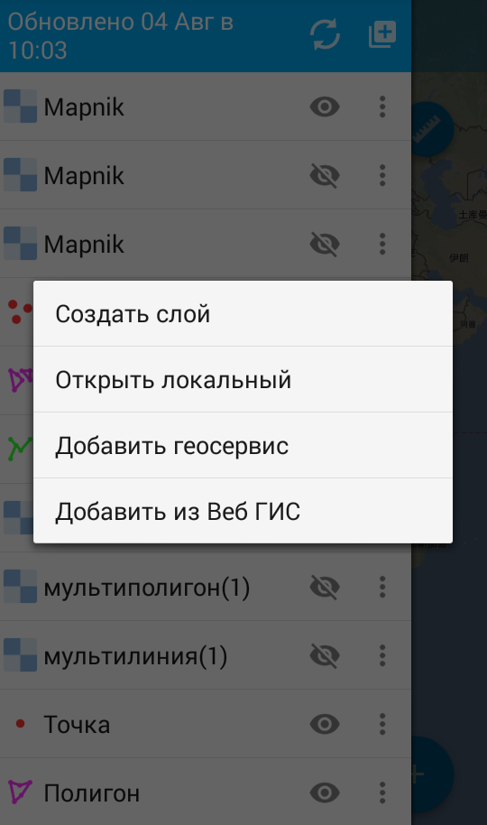
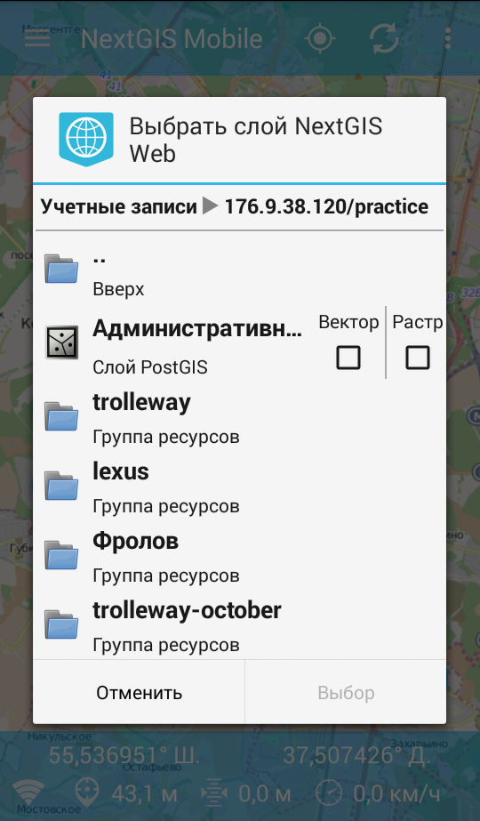
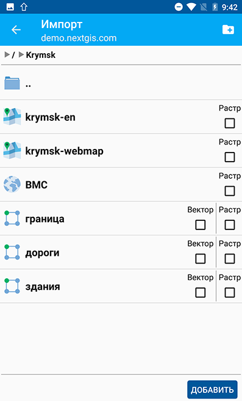
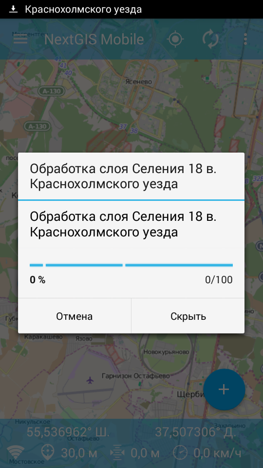
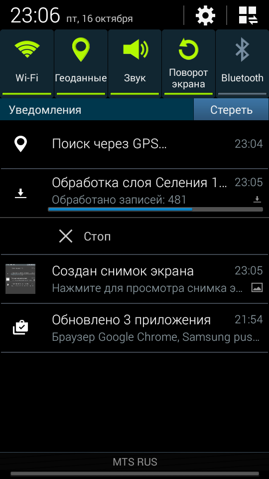
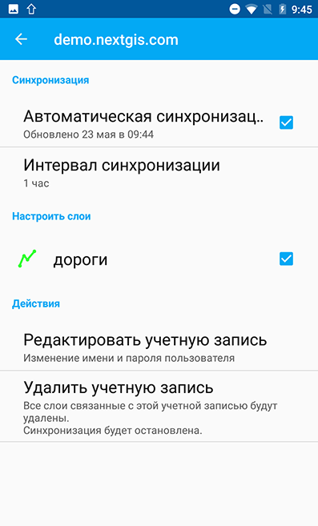
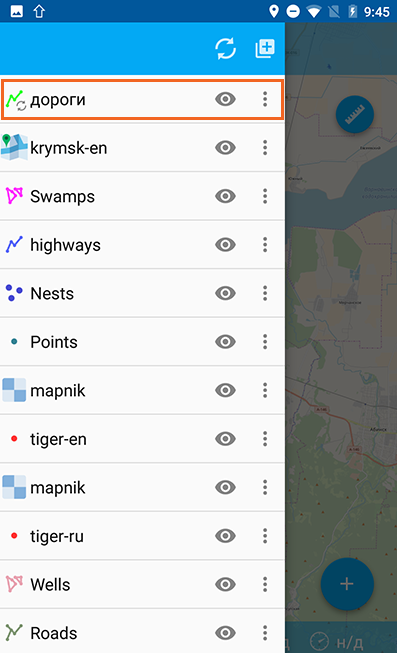

.. _ngmobile_integration:

Интеграция с nextgis.com 
========================

.. only:: html
   
   С основными возможностями программного обеспечения Веб ГИС можно ознакомиться 
   в разделе :ref:`Веб ГИС <ngcom_description>`.

.. only:: latex

   С основными возможностями программного обеспечения Веб ИС можно ознакомиться 
   в разделе `Веб ГИС: описание и возможности <https://docs.nextgis.ru/docs_ngcom/source/description.html#ngcom-description>`_.

Приложение NextGIS Mobile может быть интегрировано с Веб ГИС, созданной на платформе NextGIS Web. Это позволяет обмениваться данными с Веб ГИС: отправлять в неё локальные слои, скачивать данные с сервера, редактировать данные и просматривать на веб-картах треки, записанные с помощью приложения.

Для того, чтобы подключиться к Веб ГИС, необходимо `авторизоваться <https://docs.nextgis.ru/docs_ngmobile/source/auth.html>`_.

Если из этого личного кабинета NextGIS ID уже была создана Веб ГИС, она будет автоматически добавлена в приложение. Также будут добавлены Веб ГИС, где этот пользователь участвует в `команде <https://docs.nextgis.ru/docs_ngcom/source/teams.html>`_.

Если у пользователя ещё нет Веб ГИС, её можно `создать <https://docs.nextgis.ru/docs_ngcom/source/create_webgis.html>`_ из личного кабинета.

Также можно дополнительно добавить подключения к другим `облачным Веб ГИС <https://docs.nextgis.ru/docs_ngmobile/source/ngw_integration.html#ngmobile-create-a-connection>`_ и `Веб ГИС, развёрнутым на своём сервере <https://docs.nextgis.ru/docs_ngmobile/source/ngw_integration.html#ngm-create-connection-onp>`_.

Созданное подключение к Веб ГИС можно `редактировать <https://docs.nextgis.ru/docs_ngmobile/source/ngw_integration.html#ngmobile-change-account>`_ или `удалить <https://docs.nextgis.ru/docs_ngmobile/source/ngw_integration.html#ngmobile-delete-account>`_.

.. _ngmobile_create_a_connection_to_webgis:

Добавление Веб ГИС
----------------------

Добавить подключение к Веб ГИС в приложение возможно двумя способами. 

**Через дерево слоёв**

1. Открыть дерево слоев (см. :numref:`ngmobile_main_activity_pic` п. 1). 
2. Нажать кнопку "Добавить геоданные" (см. :numref:`ngmobile_layer_tree_pic`, п. 4).
3. В открывшемся меню выбрать пункт "Добавить из Веб ГИС" 

  
   Меню кнопки "Добавить геоданные"

4. В открывшемся окне необходимо нажать на кнопку "Добавить Веб ГИС".

.. figure:: _static/ngm_add_webgis_ru.png
   :name: ngm_add_webgis_pic
   :align: center
   :width: 10cm
   
   Переход к добавлению учетной записи Веб ГИС
   
5. В открывшемся окне ввести имя ГИС, имя пользователя и пароль NextGIS ID и нажать кнопку "Войти".

.. figure:: _static/ngm_webgis_login_ru.png
   :name: ngm_webgis_login_pic
   :align: center
   :width: 10cm
   
   Добавление новой учетной записи Веб ГИС
   
Если у вас ещё нет Веб ГИС, нажмите на этом экране **Создать**, вы будете перенаправлены в личный кабинет в браузере, где сможете `создать свою Веб ГИС <https://docs.nextgis.ru/docs_ngcom/source/create_webgis.html>`_.

**Через меню настроек**

1. Вызвать меню, нажав на три точки в правом верхнем углу (см. :numref:`ngmobile_main_activity_pic` п. 5). 
   
2. Далее выбрать пункт "Настройки".

.. figure:: _static/ngm_menu_ru.png
   :name: ngmobile_settings2_pic
   :align: center
   :width: 10cm

   Контекстное меню

3. Выбрать пункт "Веб ГИС".  

.. figure:: _static/ngm_settings_webgis_ru.png
   :name: ngmobile_settings_ngw_pic
   :align: center
   :width: 10cm
   
   Меню "Настройки"
  
4. В открывшемся меню следует нажать на кнопку "Добавить Веб ГИС".  
   
.. figure:: _static/ngm_nowebgis_ru.png
   :name: ngm_nowebgis_pic
   :align: center
   :width: 10cm

   Меню "Веб ГИС"

5. В открывшемся окне ввести имя ГИС, имя пользователя и пароль NextGIS ID и нажать кнопку "Войти" (см. :numref:`ngm_webgis_login_pic`).

.. _ngm_create_connection_onp:

Создание подключения к NextGIS Web на своём сервере
-----------------------------------------------------

.. only:: html
   
   С основными возможностями программного обеспечения NextGIS Web можно ознакомиться 
   в разделе :ref:`ngw_keyfeatures`.

.. only:: latex

   С основными возможностями программного обеспечения NextGIS Web можно ознакомиться 
   в разделе `Основные возможности NextGIS Web <http://docs.nextgis.ru/docs_ngweb/source/general.html#ngweb-keyfeatures>`_.
   
Если Вы хотите хранить данные на собственном сервере NextGIS Web, можно войти в свою учетную запись, нажав на кнопку "Добавить Веб ГИС" при любом из описанных выше способов создания Веб ГИС и затем перейдя по ссылке внизу экрана.

.. figure:: _static/ngm_webgis_switch_op_ru.png
   :name: ngmobile_new_webgis_nextgis_pic
   :align: center
   :width: 10cm

   Экран "Добавить Веб ГИС"

В открывшемся окне следует ввести параметры подключения: адрес Веб ГИС, имя пользователя и пароль, нажать кнопку "Войти" (см. :numref:`ngmobile_ngw_connection_settings_pic`).

.. figure:: _static/ngm_webgis_login_op_ru.png
   :name: ngm_webgis_login_op_pic
   :align: center
   :width: 10cm

   Окно ввода параметров подключения
      
.. note::
   Mногие клавиатуры смартфонов и планшетов при автоподстановке текста, а также 
   при вставке копируемого текста из буфера обмена добавляют пробел в конце текста 
   в поле ввода (имя пользователя, пароль). В таком случае лишний пробел нужно удалить. Иначе полученный текст с пробелом воспринимается NextGIS Web как другое имя пользователя или другой пароль, что приводит к отказу в создании подключения.

.. _ngmobile_change_account:

Редактирование учетной записи Веб ГИС
-------------------------------------

1. Вызвать контекстное меню (см. :numref:`ngmobile_main_activity_pic` п. 5). 
2. Далее выбрать пункт меню "Настройки" (см. :numref:`ngmobile_settings2_pic`).
3. В открывшемся меню необходимо выбрать пункт "Веб ГИС"
   (см. :numref:`ngmobile_settings_ngw_pic`). 
4. Далее в списке необходимо выбрать ранее созданную учетную запись 
   Веб ГИС (см. :numref:`ngmobile_settings_ngw_pic`). 
5. В открывшемся окне выбрать пункт меню "Редактировать учетную запись".

.. figure:: _static/ngm_webgis_edit_acc_ru.png
   :name: ngm_webgis_edit_acc_pic
   :align: center
   :width: 10cm
    
   Редактирование учетной записи Веб ГИС

6. В открывшемся окне в ранее созданную учетную запись при необходимости 
можно внести изменения в поля (см. :numref:`ngmobile_edit_account_pic`):

1. Имя пользователя.
2. Пароль.

.. figure:: _static/ng_mobile_edit_account.png
   :name: ngmobile_edit_account_pic
   :align: center
   :width: 10cm

   Внесение изменений в ранее созданную учетную запись

.. _ngmobile_delete_account:

Удаление учетной записи Веб ГИС
-------------------------------

Удаление учетной записи Веб ГИС может осуществляться несколькими способами. 
При использовании **первого способа** удаление учетной записи Веб ГИС, необходимо 
выполнить следующую последовательность шагов:

1. Вызвать контекстное меню (см. :numref:`ngmobile_main_activity_pic` п. 5). 
2. Далее выбрать пункт меню "Настройки" (см. :numref:`ngmobile_settings2_pic`).
3. В открывшемся меню опций необходимо выбрать пункт "Веб ГИС"
   (см. :numref:`ngmobile_settings_ngw_pic`). 

4. Далее следует выбрать ранее созданную учетную запись 
   Веб ГИС (см. :numref:`ngmobile_settings_ngw_pic`). 
   
5. Выбрать пункт меню "Удалить учетную запись".

.. figure:: _static/ngm_webgis_remove_acc_ru.png
   :name: ngmobile_remove_account1_pic
   :align: center
   :width: 10cm
    
   Удаление учетной записи Веб ГИС
   
6. Подтвердить удаление.

.. figure:: _static/ngm_webgis_remove_confirm_ru.png
   :name: ngm_webgis_remove_confirm_pic
   :align: center
   :width: 10cm
    
   Удаление учетной записи Веб ГИС

Для удаления учетной записи Веб ГИС **вторым способом** необходимо выполнить 
следующую последовательность шагов:

1. На устройстве (мобильном телефоне/планшете) вызвать "Настройки операционной системы".
2. Перейти к Аккаунтам/Учетным записям в настройках устройства (см. :numref:`ngmobile_settings_in_os_pic`).

.. figure:: _static/settings_in_os.png
   :name: ngmobile_settings_in_os_pic
   :align: center
   :width: 10cm
   
   Выбор аккаунтов в настройках ОС
   
3. Выбрать из списка учетную запись "NextGIS" (см. :numref:`ngmobile_accounts_in_os_pic`).

.. figure:: _static/accounts_in_os.png
   :name: ngmobile_accounts_in_os_pic
   :align: center
   :width: 10cm
   
   Выбор в настройках ОС аккаунт NextGIS

4. В открывшемся окне необходимо вырать ранее созданную учетную запись Веб ГИС (см. :numref:`ngmobile_remove_account_in_os_pic`).

.. figure:: _static/remove_account_in_os.png
   :name: ngmobile_remove_account_in_os_pic
   :align: center
   :width: 10cm
   
   Выбор учетной записи Веб ГИС через настройки ОС

5. В открывшемся окне "Синхронизация" нажать на кнопку контекстного меню в правом верхнем углу и выбрать в открывшемся списке "Удалить аккаунт" (см. :numref:`ngmobile_remove_account1_in_os_pic`).

.. figure:: _static/remove_account1_in_os.png
   :name: ngmobile_remove_account1_in_os_pic
   :align: center
   :width: 10cm
   
   Удаление учетной записи Веб ГИС через настройки ОС

.. _ngmobile_add_layer_webgis:

Добавление слоя (векторного или растрового) из Веб ГИС
------------------------------------------------------

Для добавления слоя (векторного или растрового) из Веб ГИС необходимо выполнить 
следующую последовательность шагов:

1. Открыть дерево слоев (см. :numref:`ngmobile_main_activity_pic` п. 1). 
2. Нажать кнопку "Добавить геоданные" (см. :numref:`ngmobile_layer_tree_pic`, п. 4).
3. В открывшемся меню выбрать пункт "Добавить из Веб ГИС" (см. :numref:`ngmobile_the_menu_button_Add_data_pic`) 
4. Выбрать из списка учетную запись Веб ГИС (см. :numref:`ngmobile_select_ngw_layer_pic`).
   Подробнее о создании учетной записи Веб ГИС см. в разделе :ref:`ngmobile_create_a_connection_to_webgis`. 
5. В открывшемся окне находится список внутренних ресурсов и слоев Веб ГИС (векторных и растровых) выбранной учетной записи (см. :numref:`ngmobile_list_of_files_pic`).

   
   Список ресурсов и слоев Веб ГИС

6. Выбрать нужную группу ресурсов Веб ГИС, внутри которой следует отметить необходимый 
   слой (вектор и/или растр) путем проставления отметок и выбрать пункт 
   меню "Добавить" (см. :numref:`ngmobile_file_selection_pic`).
 

   
   Выбор в группе ресурсов Веб ГИС необходимого слоя

.. note::
   В случае необходимости выбора нескольких слоев
   Веб ГИС в разных группах ресурсов одной учетной записи, поставленная отметка 
   выбора слоя сохраняется при переходе из одной группы ресурсов в другую.  

7. Открывшееся окно обработки выбранного слоя содержит диалоговое окно с пунктами меню 
   "Отмена" и "Скрыть" (см. :numref:`ngmobile_processing_layer_pic`).
    

   Окно обработки слоя

Если необходимо остановить процедуру обработки слоя Веб ГИС следует выбрать 
пункт меню "Отмена". 
Для предотвращения блокирования интерфейса программы и для дальнейшей работы с 
программой следует выбрать пункт меню "Скрыть". В результате такого выбора 
панель обработки слоя Веб ГИС перенесется в панель статуса 
(см. :numref:`ngmobile_download_status_pic`).

   Панель статуса
 
.. note::
   Если необходимо завершить процесс обработки слоя Веб ГИС, который перенесен 
   в панель статуса, на панели обработки слоя следует сделать следующее: коснитесь экрана 
   большим и указательным пальцами и разведите их в стороны, скользя пальцами по экрану. 
   В результате этого действия индикатор процесса обработки слоя Веб ГИС будет перенесен 
   в панель статуса, а также появится кнопка "Стоп", при нажатии на которую процесс обработки
   слоя завершится.

В результате выполнения выше перечисленных действий на карту будут добавлены выбранные
слои (вектор и/или растр) Веб ГИС, которые появятся в дереве слоев сверху. 

.. _ngmobile_synchronization_layer_webgis:

Настройка синхронизации векторного слоя с Веб ГИС
-------------------------------------------------

Для осуществления процесса оперативного обмена правками геоданных и обеспечения 
идентичности выбранной информации между компьютером и мобильным устройством пользователя 
необходимо использовать синхронизацию. Для осуществления синхронизации векторного 
слоя с Веб ГИС необходимо выполнить следующую последовательность шагов:
 
1. Вызвать контекстное меню (см. :numref:`ngmobile_main_activity_pic` п. 5). 
2. Далее выбрать пункт меню "Настройки" (см. :numref:`ngmobile_settings2_pic`).
3. В открывшемся меню опций необходимо выбрать пункт "Веб ГИС"
   (см. :numref:`ngmobile_settings_ngw_pic`). 

4. Далее следует выбрать ранее созданную учетную запись Веб ГИС (см. :numref:`ngmobile_select_ngw_layer_pic`). 
   
5. В открывшемся меню имеются пункты (см. :numref:`ngmobile_connection_properties_window_pic`):
  
   - автоматическая синхронизация;
   - интервал синхронизации (можно изменить, может составлять от 5 минут до 2 часов);
   - синхронизация конкретного слоя с Веб ГИС.

 
   Настройки учетной записи Веб ГИС

После выбора слоя и проставления отметки о разрешении процесса синхронизации с 
Веб ГИС возле иконки слоя появляется иконка о начале процесса 
синхронизации в виде замкнутых стрелок. Такая же иконка появляется и в дереве слоев 
возле иконки слоя, участвующего в синхронизации (см. :numref:`ngmobile_layers_tree_int_pic`):

   Дерево слоев
