.. _ngmobile_integration:

Integration with NextGIS Web 
==============================

.. only:: html
   
   You can learn more about the main features of Web GIS in :ref:`Web GIS <ngcom_description>`. 

.. only:: latex

   You can learn more about the main features of Web GIS 
   in `Web GIS: Description and Main Features <https://docs.nextgis.ru/docs_ngcom/source/description.html#ngcom-description>`_.

NextGIS Mobile can be connected to a Web GIS created on the NextGIS Web platform. This integration allows to exchange data with a Web GIS: upload local layers to the server, download data from the server, edit the data, view tracks recorded with the app on a Web Map.

To add a connection to a Web GIS, you need to be `logged in <https://docs.nextgis.com/docs_ngmobile/source/auth.html>`_.

If the NextGIS ID already has a Web GIS associated with it, it will be automatically added to the app. All the Web GIS where the user is a `team member <https://docs.nextgis.ru/docs_ngcom/source/teams.html>`_ will also be added.

If you don't have a Web GIS yet, `create it <https://docs.nextgis.com/docs_ngcom/source/create_webgis.html>`_ from your account.

You can add more connections to `cloud-based Web GIS <https://docs.nextgis.com/docs_ngmobile/source/ngw_integration.html#ngmobile-create-a-connection>`_ as well as `on-premise Web GIS  <https://docs.nextgis.com/docs_ngmobile/source/ngw_integration.html#ngm-create-connection-onp>`_.

You can `edit <https://docs.nextgis.com/docs_ngmobile/source/ngw_integration.html#ngmobile-change-account>`_ or `delete <https://docs.nextgis.com/docs_ngmobile/source/ngw_integration.html#ngmobile-delete-account>`_ a Web GIS connection.

.. _ngmobile_add_layer_webgis:

Add a layer (vector/raster) from Web GIS
------------------------------------------------------

1. Open Layers tree panel (item 1 in :numref:`ngmobile_main_activity_pic_1`). 

2. Then tap "Add geodata" button.

3. Select “Add from Web GIS” in the opened menu. 

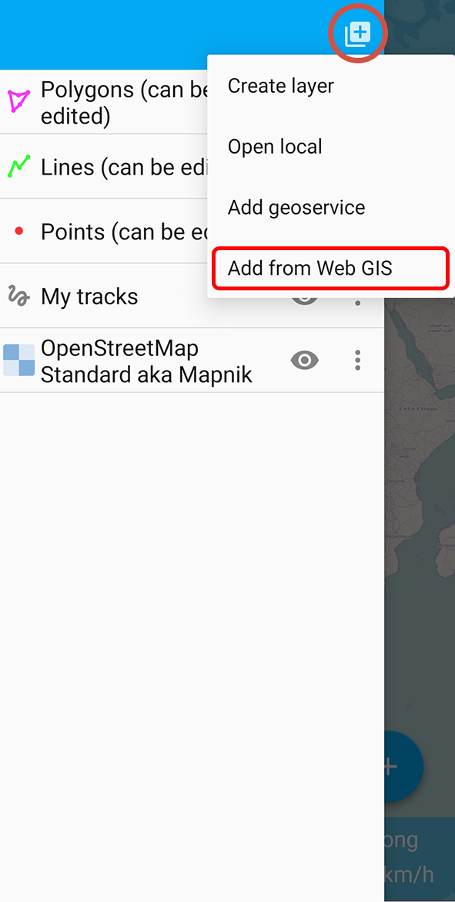

   Select how to add data

4. If you have multiple Web GIS connections added to the app, select the one you need (see :numref:`ngmobile_select_ngw_layer_pic`). 

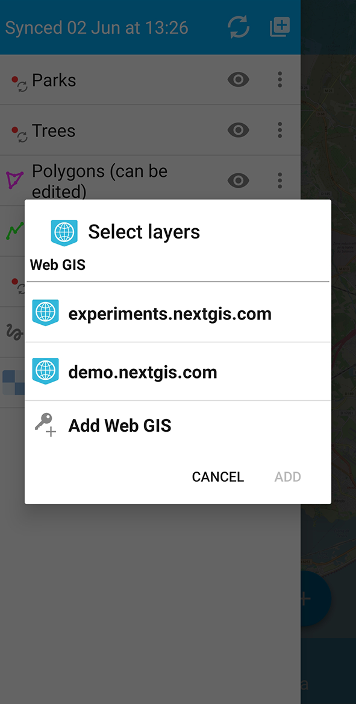

   Selecting Web GIS

.. note:: How to add a Web GIS connection :ref:`ngmobile_create_a_connection_to_webgis`. 

In the opened window you can see the list of internal resources and layers (vector and raster) for the selected Web GIS account. Select a group of Web GIS resources, then tick a layer and tap "Add". A vector layer can be added both as vector and as raster.
 
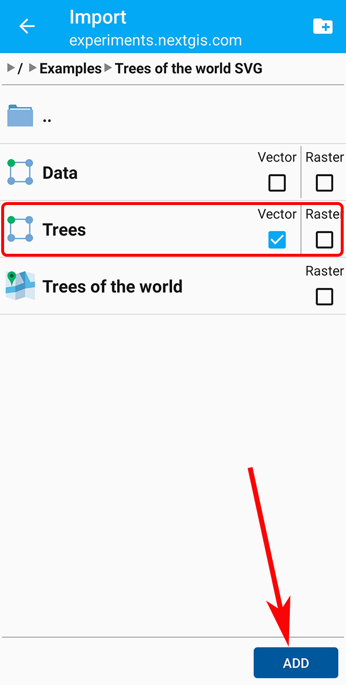
   
   Selecting a layer in the Web GIS resource group

.. note::
   If you need to select several layers in different 
   groups of the same Web GIS, the ticked layers 
   stay selected while you switch between groups.  

6. A pop-up window of layer processing progress will appear.
    
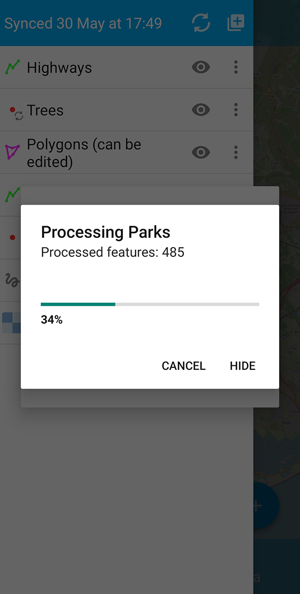

   Layer processing pop-up

If you need to stop downloading the layer, press **Cancel**. 
To continue using the app as the layer is being processed, press **Hide**. The progress bar will be moved to the notification panel 
(see :numref:`ngmobile_download_status_pic`).

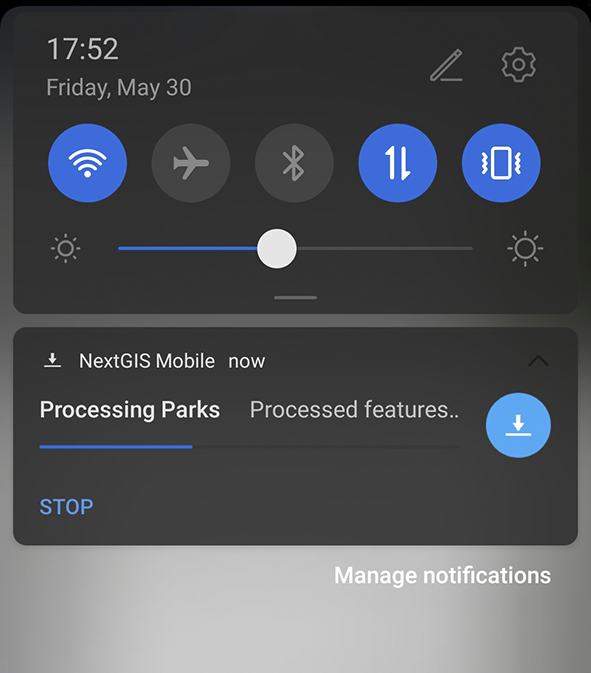

   Download status in the notification panel
 

If you want to stop downloading the layer, 
open the notification panel and press **Stop**.

.. _ngmobile_upload:

Upload layer to Web GIS
------------------------

Click on three dots next to the layer name to open the context menu and select "Send to NextGIS".

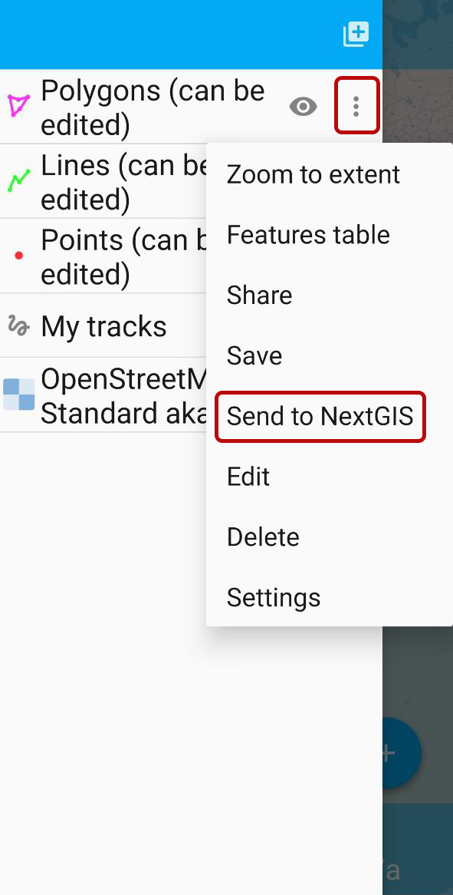

   Layer context menu

Select the Web GIS you wish to add the layer to from the list, see :numref:`ngmobile_select_ngw_layer_pic`.

Next select the resource group and tap **Add**.

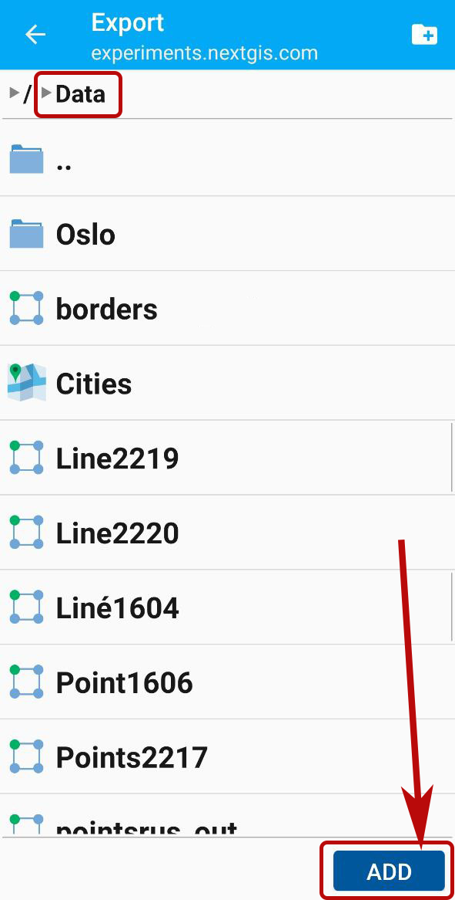

   Adding local layer to Web GIS”

If the layer was uploaded successfully, you'll see the sync symbol |icon_layer_sync| next to the layer's icon.

In Web GIS you'll find the uploaded data, with no style.

.. _ngmobile_synchronization_layer_webgis:

Parameters for synchronization with Web GIS
-------------------------------------------------

NextGIS Mobile application can access the server at set intervals to share edits and keep layers on the device and in the Web GIS up to date.

To enable synchronization:
 
1. Open the menu by tapping the three dots in the top right corner  (item 5 in :numref:`ngmobile_main_activity_pic_1`). 
2. Select "Settings" (:numref:`ngmobile_settings2_pic`).
3. Select "Web GIS" 
   (:numref:`ngmobile_settings_ngw_pic`).  

4. Select the Web GIS from the list.

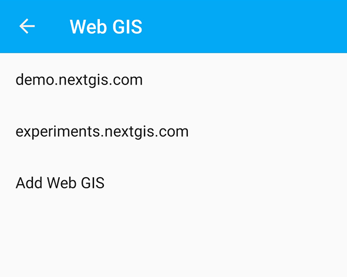

   List of added Web GIS connections

5. On the Web GIS settings screen you can:
  
   - Turn on automatic synchronization;
   - Set up sync interval (between 5 min and 2 hours);
   - Turn on/off synchronization for a particular Web GIS layer.

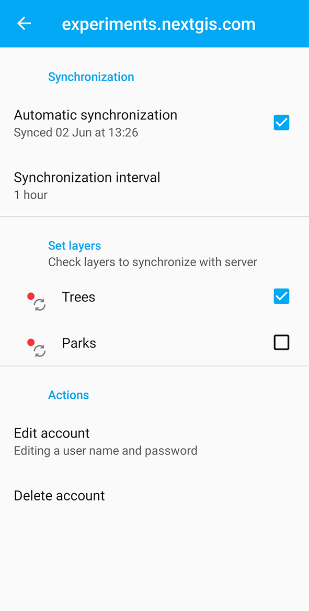
 
   Settings of a Web GIS account

Synchronized layers are marked with the |icon_layer_sync| icon. The same icon appears by the layer name in the layer tree.

.. |icon_layer_sync| image:: _static/icon_layer_sync.png
   :width: 6mm
   :alt: circular arrows

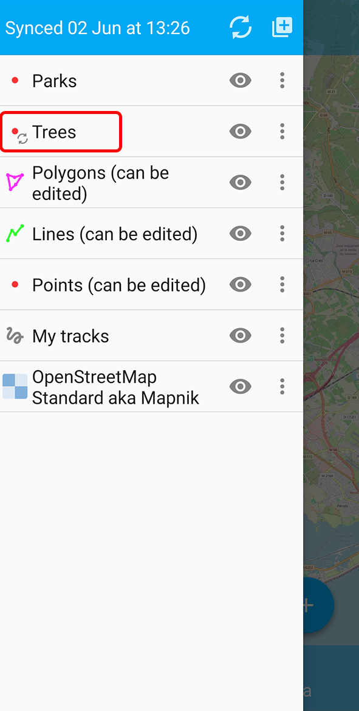

   Synchronized layers marked in the layer tree

.. _ngmobile_create_a_connection_to_webgis:

Add Web GIS connection
----------------------

There are two ways to connect your NextGIS Mobile app to a Web GIS. 

**Via layer tree**

1. Open Layers tree panel (item 1 in :numref:`ngmobile_main_activity_pic_1`). 
2. Then tap on "Add geodata" button (item 4 in :numref:`ngmobile_layer_tree_pic`).
3. Select “Add from Web GIS”. 

  
   Add geodata dialog

4. In the opened dialog select “Add Web GIS”.

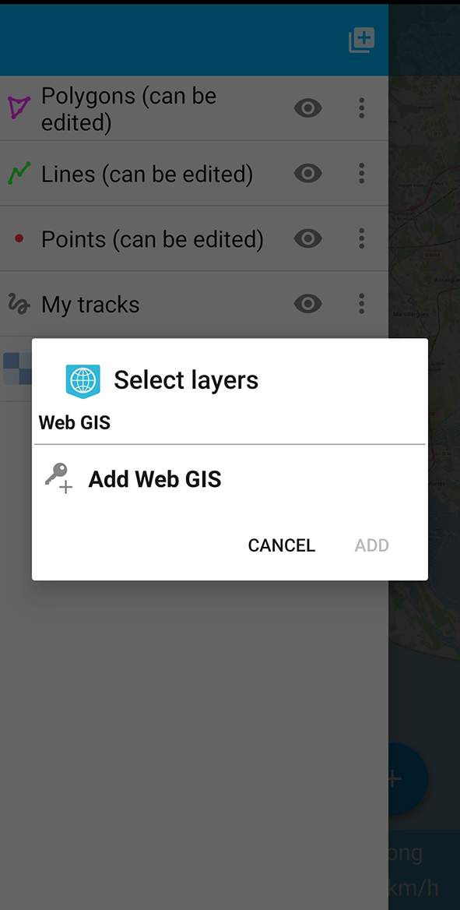
   
   Web GIS dialog
   
5. On the next screen enter the Web GIS name, username and password of your NextGIS ID and press **Sign in**.

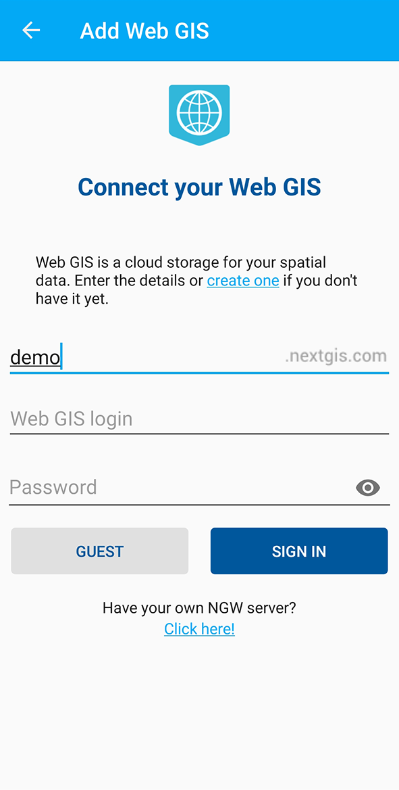
   
   Adding new Web GIS connection
   
If you don't have a Web GIS, tap **create** on this screen. Your account page will be opened in a browser. From that page you can `create a Web GIS <https://docs.nextgis.com/docs_ngcom/source/create_webgis.html>`_.

**From the Settings**

1. Open Layers tree panel (item 1 in :numref:`ngmobile_main_activity_pic_1`). 
   
2. Select "Settings".

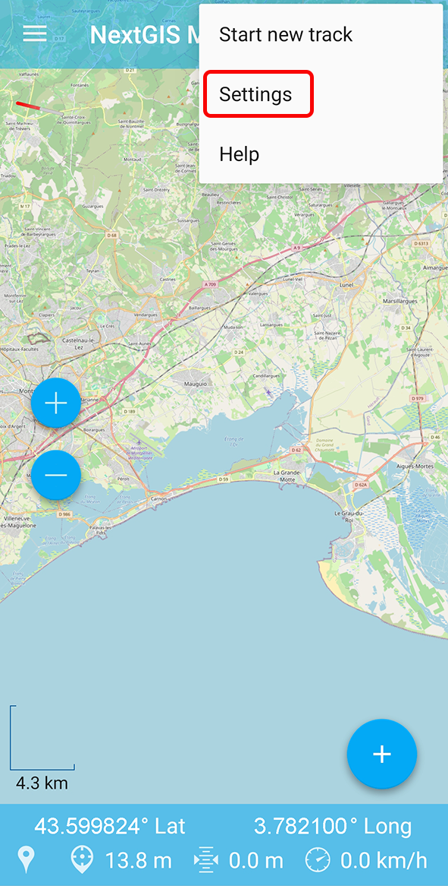

   Main menu

3. Select "Web GIS".  

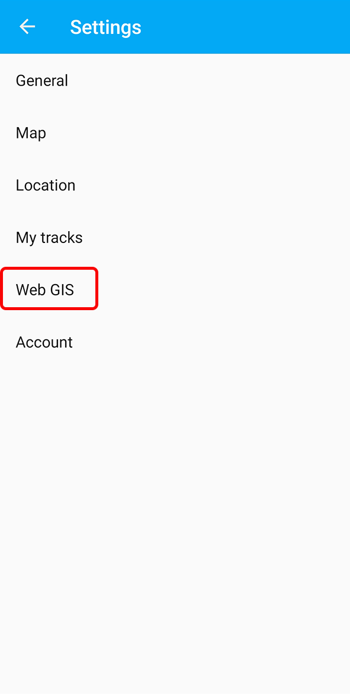
   
   Settings menu
  
4. In the opened menu press **Add Web GIS**.  
   
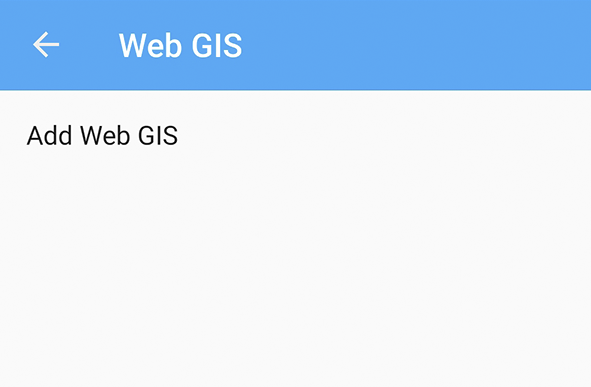

   Web GIS menu

On the next screen enter the Web GIS name, username and password of your NextGIS ID and press **Sign in** (see :numref:`ngm_webgis_login_pic`).

.. _ngm_create_connection_onp:

Add connection to NextGIS Web on-premise
-----------------------------------------------------

.. only:: html
   
   You can learn more about main features of NextGIS Web on-premise 
   in :ref:`ngw_keyfeatures`.

.. only:: latex

   You can learn more about main features of NextGIS Web on-premise 
   in `Key features of NextGIS Web <http://docs.nextgis.com/docs_ngweb/source/general.html#ngweb-keyfeatures>`_.
   
If you keep your data on your own NextGIS Web server, tap "Add Web GIS" using either of the ways to add a new Web GIS connection (see above), then tap the link at the bottom of the screen (see :numref:`ngmobile_new_webgis_nextgis_pic`).

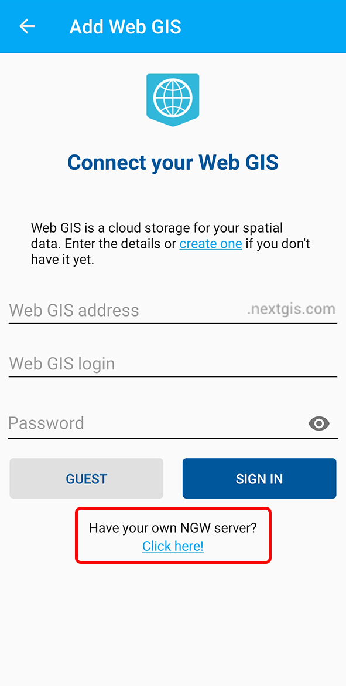

   Add Web GIS dialog

In the opened dialog fill in the connection details: Web GIS URL, username and password, then press **Sign in**.

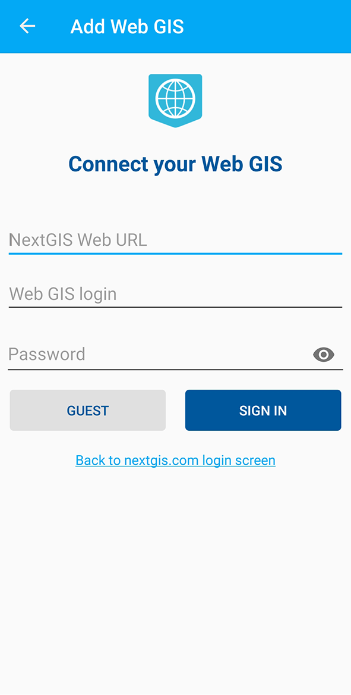

   Web GIS connection parameters
      
.. note::
   Many devices automatically add a space at the end of a text field when using  
 auto-complete or pasting from a clipboard.  
 In this case you need to delete the space manually. For NextGIS Web an additional character makes it a different username / password, so you won't be able to log in.

.. _ngmobile_change_account:

Edit Web GIS connection
-------------------------------------

1. Open the menu by tapping the three dots in the top right corner  (item 5 in :numref:`ngmobile_main_activity_pic_1`). 
2. Select "Settings" (:numref:`ngmobile_settings2_pic`).
3. Select "Web GIS" in the opened menu
   (:numref:`ngmobile_settings_ngw_pic`).  
4. Select a Web GIS from the list 
   (see :numref:`ngmobile_settings_ngw_pic`). 
5. On the next screen select "Edit account".

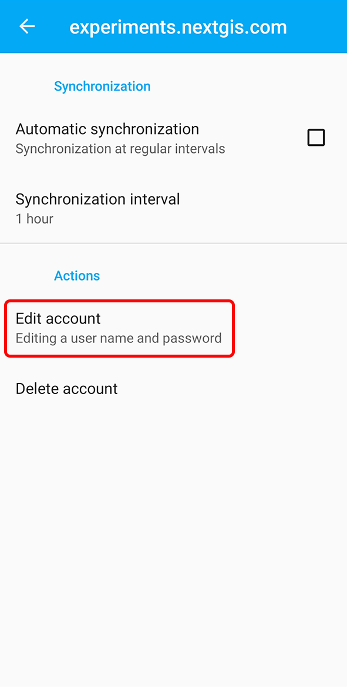
    
   Editing Web GIS connection

6. In the opened window you can modify the following 
fields (see :numref:`ngmobile_edit_account_pic`):

1. Username;
2. Password.

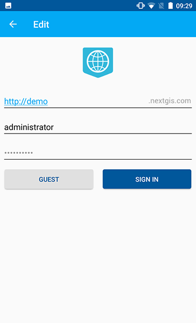

   Editing a Web GIS connection

.. _ngmobile_delete_account:

Delete Web GIS connection
-------------------------------

There are two ways to delete a connection to a Web GIS. 

You can delete the connection **in the app settings**.

1. Open the menu by tapping the three dots in the top right corner  (item 5 in :numref:`ngmobile_main_activity_pic_1`). 
2. Select "Settings" (:numref:`ngmobile_settings2_pic`).
3. Select "Web GIS" 
   (:numref:`ngmobile_settings_ngw_pic`).  

4. Select a Web GIS from the list. 
  
   
5. Select "Delete account".

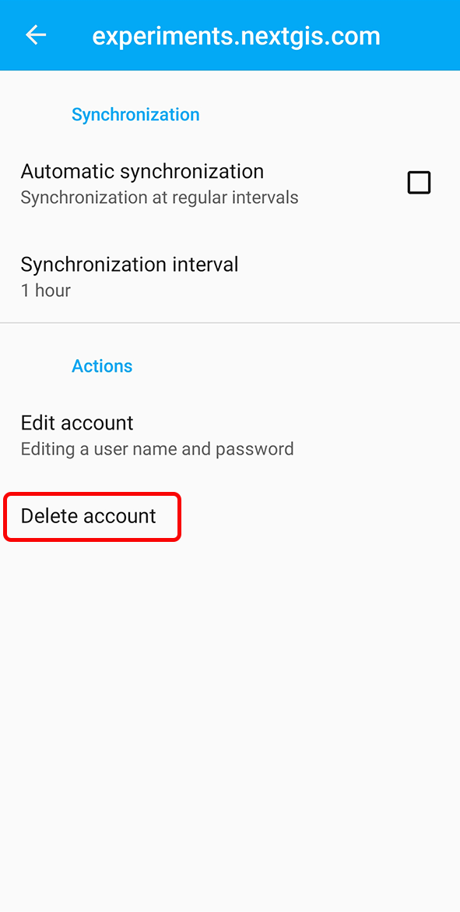
    
   Delete Web GIS connection
   
6. Confirm deleting the account.

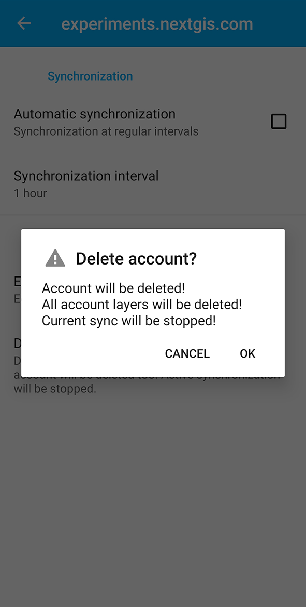
    
   Delete Web GIS connection

You can also delete a connection to a Web GIS in your **device settings**.

1. Go to the Settings of your phone or tablet.
2. Go to Accounts section of the settings.

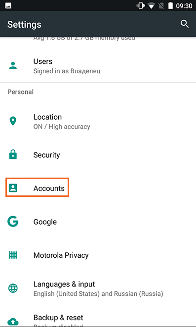
   
   Selecting accounts in OS settings
   
3. Select the "NextGIS" account from the list.

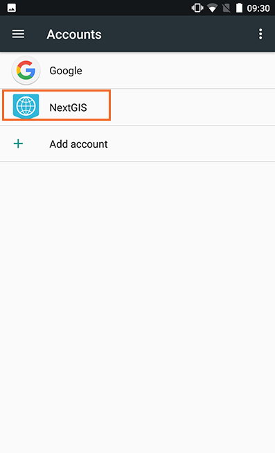
   
   NextGIS account in OS settings

4. Select the Web GIS connection you want to delete.

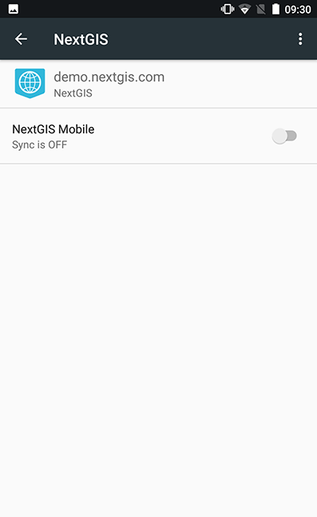
   
   Selecting Web GIS account in OS settings

Tap **Delete** (it can be on the same page or in a context menu).

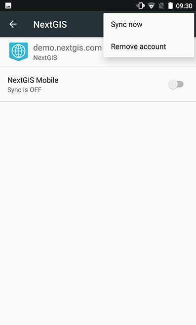
   
   Deleting Web GIS account through the OS settings
