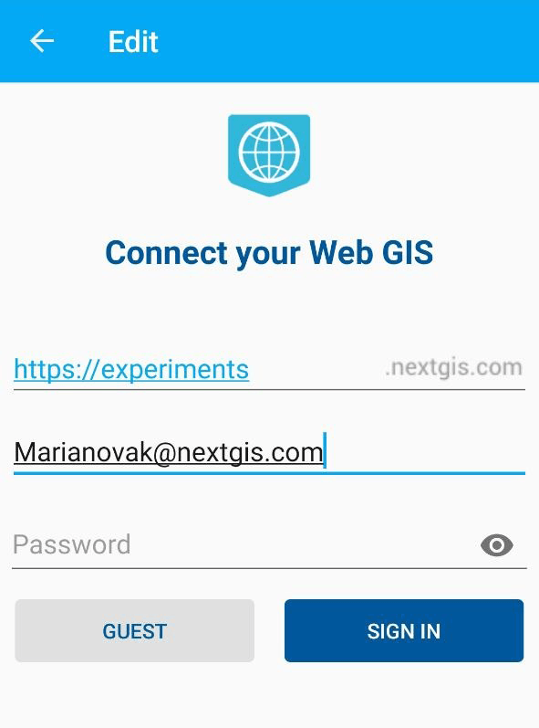

.. _ngmobile_integration:

Manage Web GIS Connection
==================================

NextGIS Mobile can be connected to a Web GIS created on the NextGIS Web platform. This allows data exchange with the server: 

* send local layers to Web GIS,
* download data from the server,
* edit data,
* view tracks recorded with the app on Web Maps.

The main features of the Web GIS software can be found in the section `Web GIS: Description and Main Features <https://docs.nextgis.com/docs_ngcom/source/description.html#ngcom-description>`_.

After `authorization <https://docs.nextgis.com/docs_ngmobile/source/auth.html>`_, your own Web GIS and those to which you are added as a `team member <https://docs.nextgis.com/docs_ngcom/source/teams.html>`_ will be available immediately.

.. seealso:: `How to create your own Web GIS <https://docs.nextgis.com/docs_ngcom/source/create_webgis.html>`_.

If you were added to a new team **after** logging into NextGIS Mobile, the Web GIS may not automatically appear in the list. Then you can `add a connection <https://docs.nextgis.com/docs_ngmobile/source/ngw_integration.html#ngmobile-create-a-connection-to-webgis>`_ through the settings.

.. _ngmobile_create_a_connection_to_webgis:

Add Web GIS connection
----------------------

There are two ways to connect your NextGIS Mobile app to a Web GIS. 

**Via layer tree**

1. Open the layer tree |ic_layer_tree| (see :numref:`ngmobile_main_activity_pic`). 
2. Tap the "Add Geodata" button |button_add_layer|.
3. Select “Add from Web GIS” (:numref:`ngmobile_the_menu_button_Add_data_pic`). 

.. figure:: _static/ngm_layer_tree_add_from_wg_en.png
   :name: ngmobile_the_menu_button_add_pic
   :align: center
   :width: 8cm
  
   Add geodata dialog

4. In the pop-up window, select **Add Web GIS**.

.. figure:: _static/ngm_add_webgis_en.png
   :name: ngm_add_webgis_pic
   :align: center
   :width: 8cm
   
   Web GIS dialog
   
5. On the next screen enter the Web GIS name, username and password of your NextGIS ID and press **Sign in**.

.. figure:: _static/ngm_webgis_login_en.png
   :name: ngm_webgis_login_pic
   :align: center
   :width: 8cm
   
   Adding new Web GIS connection
   
If you don't have a Web GIS, tap **create** on this screen. Your account page will be opened in a browser. From that page you can `create a Web GIS <https://docs.nextgis.com/docs_ngcom/source/create_webgis.html>`_.

**From the Settings**

1. Open the menu by tapping the three dots in the top right corner |ic_menu|. 
   
2. Select **Settings**.

.. figure:: _static/ngm_menu_en.png
   :name: ngmobile_settings2_pic
   :align: center
   :width: 8cm

   Main menu

3. Select **Web GIS**.  

.. figure:: _static/ngm_settings_webgis_en.png
   :name: ngmobile_settings_ngw_pic
   :align: center
   :width: 8cm
   
   Settings menu
  
4. In the opened menu press **Add Web GIS**.  
   
.. figure:: _static/ngm_nowebgis_en.png
   :name: ngm_nowebgis_pic
   :align: center
   :width: 8cm

   Web GIS menu

On the next screen enter the Web GIS name, username and password of your NextGIS ID and press **Sign in** (see :numref:`ngm_webgis_login_pic`).

.. _ngm_create_connection_onp:

Add connection to NextGIS Web on-premise
-----------------------------------------------------
   
If you want to store data on your own NextGIS Web server, then when `creating a connection to Web GIS <https://docs.nextgis.com/docs_ngmobile/source/ngw_integration.html#ngmobile-create-a-connection-to-webgis>`_, you need to switch to the option **your own NextGIS Web server**:

.. figure:: _static/ngm_webgis_switch_op_en.png
   :name: ngmobile_new_webgis_nextgis_pic
   :align: center
   :width: 8cm

   Adding Web GIS

In the opened dialog fill in the connection details: Web GIS URL, username and password, then press **Sign in**.

.. figure:: _static/ngm_webgis_login_op_en.png
   :name: ngm_webgis_login_op_pic
   :align: center
   :width: 8cm

   Web GIS connection parameters
      
.. note::
   Many devices automatically add a space 
   at the end of a text field when using 
   auto-complete or pasting from a clipboard.  In this case you need to delete the space manually. For NextGIS Web an additional character makes it a different username / password, so you won't be able to log in.

.. _ngmobile_change_account:

Edit Web GIS connection
-------------------------------------

1. Open the menu by tapping the three dots in the top right corner |ic_menu|. 
2. Select "Settings".
3. In the Settings, select **Web GIS**. 
4. Next, select the previously added Web GIS from the list. 
5. On the next screen select **Edit account**.

.. figure:: _static/ngm_webgis_edit_acc_en.png
   :name: ngm_webgis_edit_acc_pic
   :align: center
   :width: 8cm
    
   Edit Web GIS connection

6. Two parameters of Web GIS connection can be edited:

1. Username;
2. Password.

   Editing a Web GIS connection

.. _ngmobile_delete_account:

Delete Web GIS connection
-------------------------------

There are two ways to delete Web GIS connection from the app. 

1. Remove the connection **in the app settings**.

1. Open the menu by tapping the three dots in the top right corner |ic_menu|.
* Select **Settings**.
* In the opened options menu, select **Web GIS**. 
* Select the Web GIS you want to delete from the list.  
* Select "Delete account".

.. figure:: _static/ngm_webgis_remove_acc_en.png
   :name: ngmobile_remove_account1_pic
   :align: center
   :width: 8cm
    
   Deleting Web GIS Connection
   
* Confirm deletion.

.. figure:: _static/ngm_webgis_remove_confirm_en.png
   :name: ngm_webgis_remove_confirm_pic
   :align: center
   :width: 8cm
    
   Connection deleting confirmation

2. You can also delete a connection to a Web GIS in your **device settings**.

Go to the Settings of your phone or tablet. Go to Accounts in your device settings.

.. figure:: _static/settings_in_os_eng.png
   :name: ngmobile_settings_in_os_pic
   :align: center
   :width: 8cm
   
   Selecting accounts in OS settings
   
Select the "NextGIS" account from the list.

.. figure:: _static/accounts_in_os_eng.png
   :name: ngmobile_accounts_in_os_pic
   :align: center
   :width: 8cm
   
   NextGIS account in OS settings

Select the Web GIS connection you want to delete.

.. figure:: _static/remove_account_in_os_eng.png
   :name: ngmobile_remove_account_in_os_pic
   :align: center
   :width: 8cm
   
   Selecting Web GIS account in OS settings

Tap **Delete** (it can be on the same page or in a context menu).

.. figure:: _static/remove_account1_in_os_eng.png
   :name: ngmobile_remove_account1_in_os_pic
   :align: center
   :width: 8cm
   
   Deleting Web GIS account through the OS settings

.. |ic_layer_tree| image:: _static/ic_layer_tree.png
   :width: 7mm
   :alt: three white stripes

.. |button_add_layer| image:: _static/button_add_layer.png
   :width: 6mm
   :alt: double squares with "+"

.. |ic_menu| image:: _static/ic_menu.png
   :width: 7mm
   :alt: tree dots