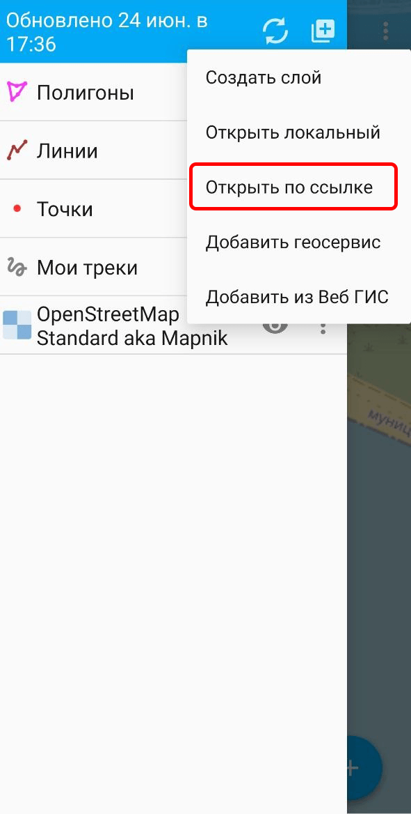
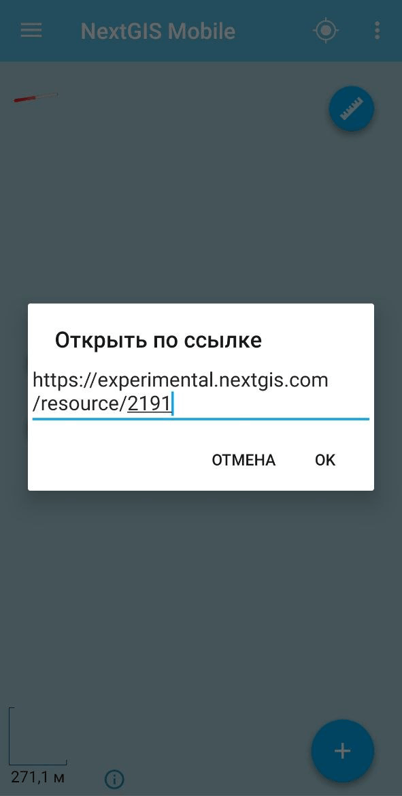
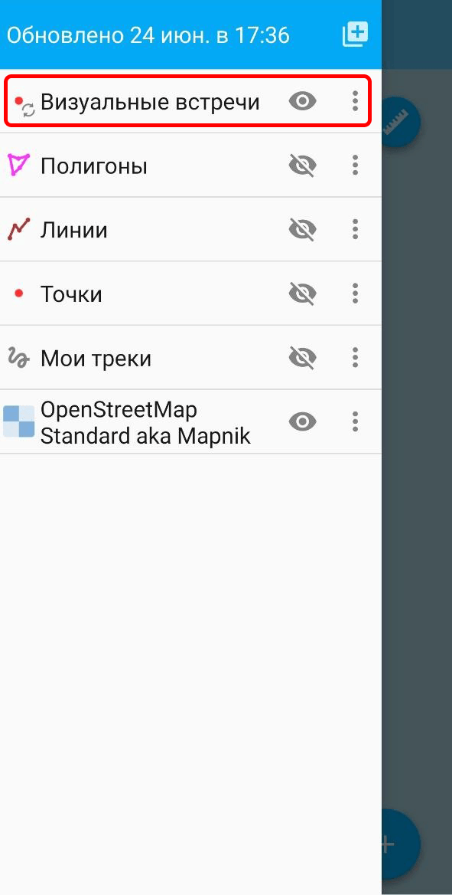
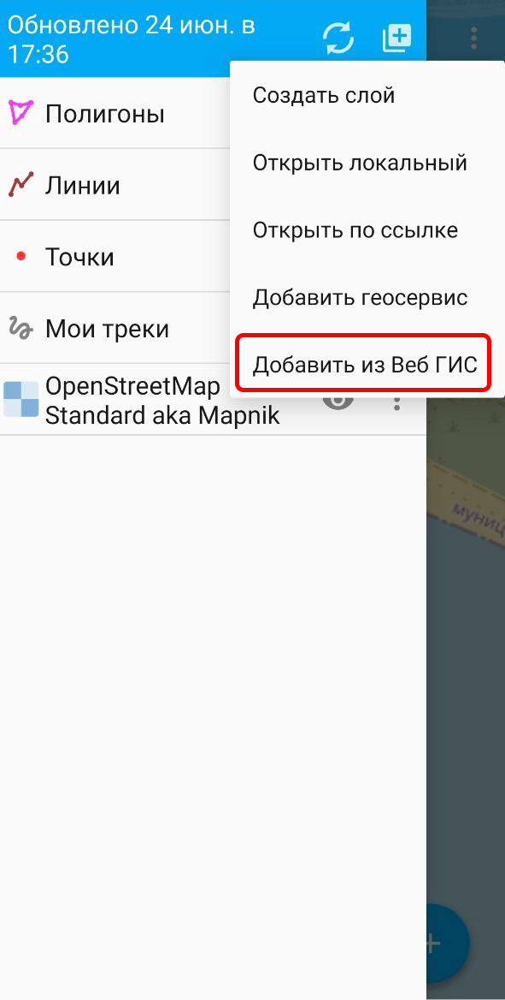
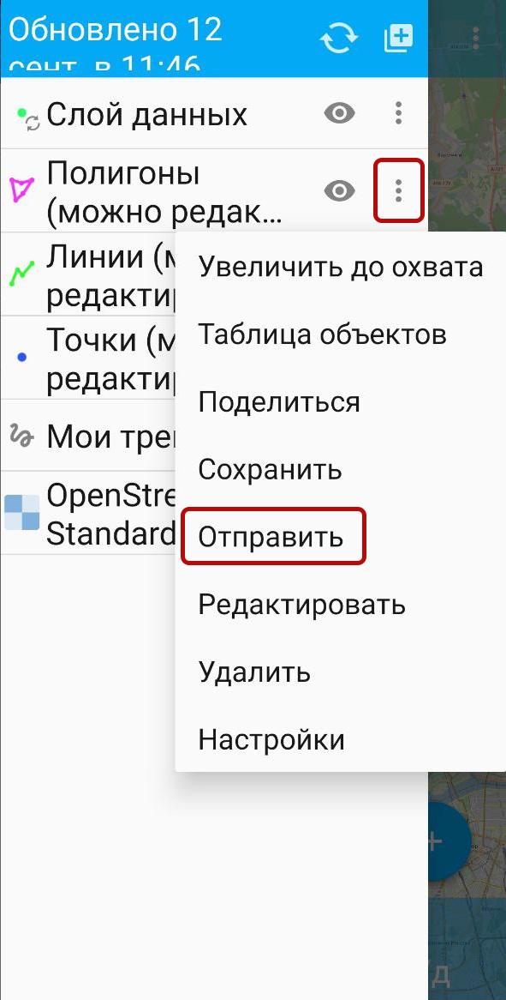
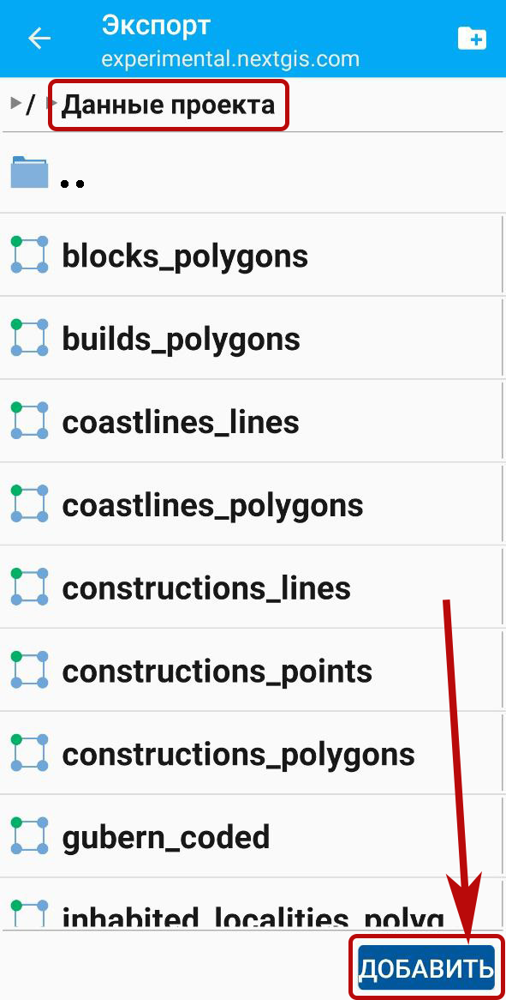
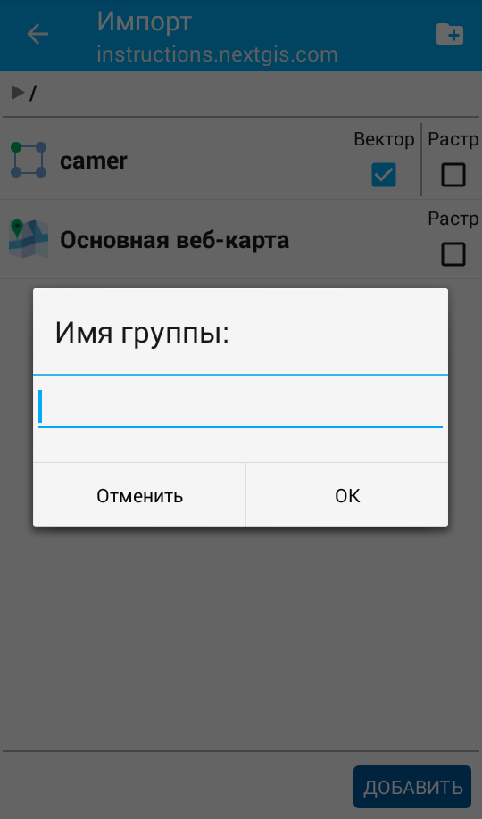

.. _ngm_wg:

Работа с данными хранилища Веб ГИС
==================================

Добавить данные из хранилища можно двумя способами:

* `по ссылке <https://docs.nextgis.ru/docs_ngmobile/source/ngw_load.html#ngmob-url>`_;
* `выбрав в дереве ресурсов <https://docs.nextgis.ru/docs_ngmobile/source/ngw_load.html#ngmobile-add-layer-webgis>`_ Веб ГИС.

.. _ngmob_url:

Добавление слоя Веб ГИС по ссылке
----------------------------------

1. Скопируйте ссылку на слой Веб ГИС.

2. Откройте дерево слоёв, нажав на три полоски в левом верхнем углу (см. :numref:`ngmobile_main_activity_pic` п. 1). 

3. Нажмите кнопку "Добавить геоданные". В открывшемся меню выберите пункт "Открыть по ссылке".

   Выбор способа добавления данных

4. В открывшемся диалоговом окне вставьте скопированную ссылку.

   Добавление ссылки на слой

Нажмите **Ок**. Слой будет добавлен в дерево слоёв верхней строчкой.

Если у пользователя, под которым вы `авторизованы <https://docs.nextgis.ru/docs_ngmobile/source/auth.html>`_ в NextGIS Mobile, есть `права на изменение данных <https://docs.nextgis.ru/docs_ngcom/source/permissions.html>`_ в этом слое, то будет доступна опция "редактирование".

.. _ngmobile_add_layer_webgis:

Добавление слоя из Веб ГИС через выбор в меню
------------------------------------------------------

1. Откройте дерево слоёв, нажав на три полоски в левом верхнем углу (см. :numref:`ngmobile_main_activity_pic` п. 1). 

2. Нажмите кнопку "Добавить геоданные".

3. В открывшемся меню выберите пункт "Добавить из Веб ГИС" (см. :numref:`ngmobile_the_menu_button_Add_data_pic`) 

   Выбор способа добавления данных

4. Если подключено несколько Веб ГИС, выберите из списка нужную (см. :numref:`ngmobile_select_ngw_layer_pic`). 

.. figure:: _static/ngm_select_webgis_ru.png
   :name: ngmobile_select_ngw_layer_pic
   :align: center
   :width: 10cm

   Выбор Веб ГИС

.. note:: Как добавить подключение к Веб ГИС см. в разделе :ref:`ngmobile_create_a_connection_to_webgis`. 

5. В открывшемся окне находится список групп ресурсов и слоёв  (векторных и растровых) выбранной Веб ГИС. Выберите нужную группу ресурсов Веб ГИС, внутри неё отметьте галочкой необходимый слой, затем нажмите кнопку **Добавить**. Если у векторного слоя в Веб ГИС создан стиль, его можно добавить также в виде растра.
 
.. figure:: _static/ngm_add_layer_select_ru.png
   :name: ngmobile_file_selection_pic
   :align: center
   :width: 10cm
   
   Выбор в группе ресурсов Веб ГИС необходимого слоя

.. note::
   В случае необходимости выбора нескольких слоёв
   в разных группах ресурсов одной Веб ГИС, поставленная отметка 
   выбора слоя сохраняется при переходе из одной группы ресурсов в другую.  

6. Откроется окно обработки выбранного слоя.
    
.. figure:: _static/ngm_processing_layer_ru.png
   :name: ngmobile_processing_layer_pic
   :align: center
   :width: 10cm

   Окно обработки слоя

Если необходимо остановить процедуру обработки слоя Веб ГИС, нажмите **Отмена**. 
Чтобы продолжить работу с программой, пока слой обрабатывается, нажмите **Скрыть**. Панель обработки слоя Веб ГИС перенесется в панель статуса 
(см. :numref:`ngmobile_download_status_pic`).

.. figure:: _static/ngm_download_status_ru.png
   :name: ngmobile_download_status_pic
   :align: center
   :width: 10cm

   Панель статуса
 

Если необходимо завершить процесс обработки слоя Веб ГИС, который перенесен 
в панель статуса, нажмите кнопку **Стоп** в уведомлении.

.. _ngmobile_upload:

Отправка локального слоя в Веб ГИС
-----------------------------------

Нажмите на три точки рядом со слоем, который хотите отправить в Веб ГИС. В контекстном меню выберите "Отправить".

   Контекстное меню слоя

Выберите нужную Веб ГИС из списка, см. :numref:`ngmobile_select_ngw_layer_pic`.

Выберите нужную группу ресурсов и нажмите **Добавить**.

   Добавление локального слоя в Веб ГИС

Если добавление прошло успешно, у миниатюры слоя появится значок синхронизации |icon_layer_sync|.

В Веб ГИС появится отправленный слой без стиля.

.. note:: 

   Количество слоёв, которые можно отправить в Веб ГИС, зависит от вашего `тарифного плана <https://nextgis.ru/pricing-base/>`_. На плане Free можно загрузить до 15 слоёв. Чтобы загружать больше слоёв, `подключите подписку Premium <https://my.nextgis.com/subscription/>`_ в личном кабинете.

.. _ngm_resource_group:

Создание группы ресурсов в Веб ГИС
----------------------------------

На верхней панели инструментов в правом углу имеется иконка в виде папки с плюсом.
При нажатии на эту иконку откроется диалог для создания новой группы данных в вашей Веб ГИС. 
В поле диалога следует задать имя для новой группы и нажать на кнопку ОК.
В случае удачного создания и сохранения новой папки, название новой папки появится в окне содержимого вашей Веб ГИС: 

   
   Создание новой группы

.. _ngmobile_synchronization_layer_webgis:

Настройка синхронизации векторного слоя с Веб ГИС
-------------------------------------------------

Приложение NextGIS Mobile может с заданной периодичностью обращаться к серверу, чтобы обмениваться правками и поддерживать соответствие слоёв на устройстве и в Веб ГИС.

Чтобы включить синхронизацию:
 
1. Откройте меню, нажав на три точки в правом верхнем углу (см. :numref:`ngmobile_main_activity_pic` п. 5). 
2. Выберите пункт меню "Настройки" (см. :numref:`ngmobile_settings2_pic`).
3. В открывшемся меню опций выберите пункт "Веб ГИС"
   (см. :numref:`ngmobile_settings_ngw_pic`). 

4. Из списка подключенных Веб ГИС выберите нужную. 

.. figure:: _static/ngm_webgis_list_ru.png
   :name: ngm_webgis_list_pic
   :align: center
   :width: 10cm

   Список подключённых Веб ГИС
   
5. На экране настроек Веб ГИС вы можете:
  
   - Включить автоматическую синхронизацию;
   - Задать интервал синхронизации (от 5 минут до 2 часов);
   - Включить/выключить синхронизацию конкретного слоя с Веб ГИС.

.. figure:: _static/ngm_webgis_sync_param_ru.png
   :name: ngmobile_connection_properties_window_pic
   :align: center
   :width: 10cm
 
   Настройки учётной записи Веб ГИС

Синхронизируемые слои будут отмечены иконкой |icon_layer_sync|. Такая же иконка появляется и в дереве слоёв возле иконки слоя, участвующего в синхронизации.

.. |icon_layer_sync| image:: _static/icon_layer_sync.png
   :width: 6mm
   :alt: в виде замкнутых в круг стрелок

.. figure:: _static/layers_tree_sync_ru.png
   :name: ngmobile_layers_tree_int_pic
   :align: center
   :width: 10cm

   Синхронизируемые слои в дереве слоёв

