.. _ngm_wg:

Synchronize data with Web GIS
==================================

There are two ways to add data from your Web GIS:

* by URL;
* `selecting layer in the resource tree of your Web GIS <https://docs.nextgis.ru/docs_ngmobile/source/ngw_load.html#ngmobile-add-layer-webgis>`_

.. _ngmob_url:

Add Web GIS layer by URL
----------------------------------

1. Copy the link to the Web GIS layer.

2. Open the layer tree (three stripes |ic_layer_tree| in the top left corner). 

3. Tap the "Add Geodata" button |button_add_layer|. In the opened menu, select "Open link".

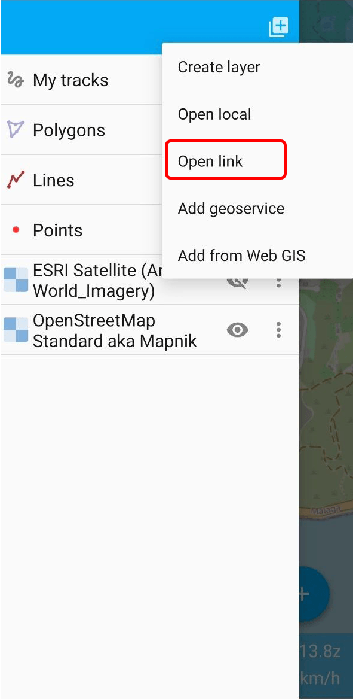

   Select how to add data

4. In the pop-up paste the copied link.

.. figure:: _static/ngm_add_url_en.png
   :name: ngm_add_url_pic
   :align: center
   :width: 9cm

   Adding a layer URL

Tap **OK**. The layer will be added to the top of the layer list.

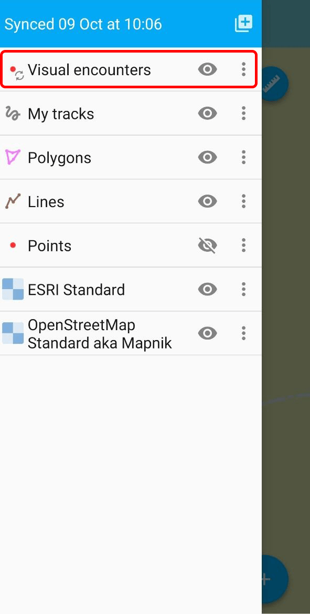

If the user you are `logged in as <https://docs.nextgis.com/docs_ngmobile/source/auth.html>`_ in NextGIS Mobile has `data editing rights <https://docs.nextgis.com/docs_ngcom/source/permissions.html>`_ for this layer, the "edit" option is available.

See how to add a layer by URL in our video:

.. raw:: html

   .

.

.. _ngmobile_add_layer_webgis:

Add Web GIS layer from the menu
------------------------------------------------------

1. Open the layer tree (three stripes |ic_layer_tree| in the top left corner). 

2. Tap the "Add Geodata" button |button_add_layer|.

3. Select “Add from Web GIS” in the opened menu. 

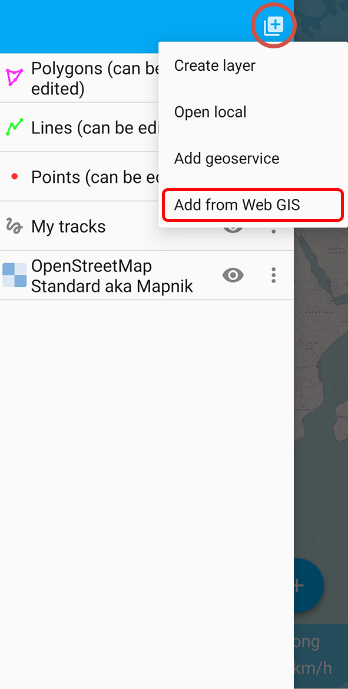

   Select how to add data

4. If you have multiple Web GIS connections, select the one you need. 

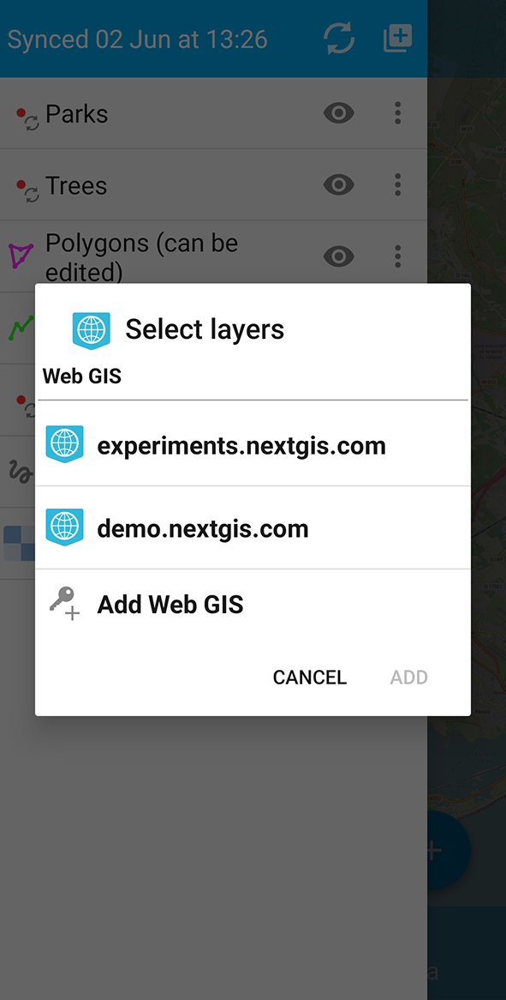

   Selecting Web GIS

.. note:: How to add a Web GIS connection :ref:`ngmobile_create_a_connection_to_webgis`. 

In the opened window you can see the list of internal resources and layers (vector and raster) for the selected Web GIS account. Select a group of Web GIS resources, then tick a layer and tap "Add". If a vector layer in Web GIS has a style, it can also be added as a raster.
 
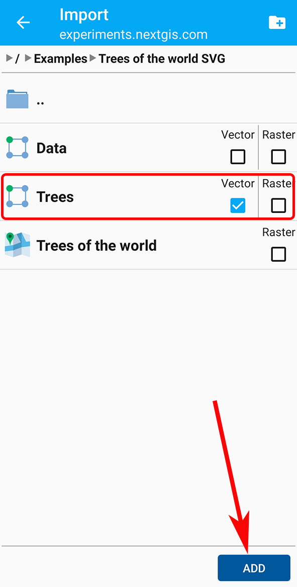
   
   Selecting a layer in the Web GIS resource group

.. note::
   If you need to select several layers in different 
   groups of the same Web GIS, the ticked layers 
   stay selected while you switch between groups.  

6. A pop-up shows loading progress.
    
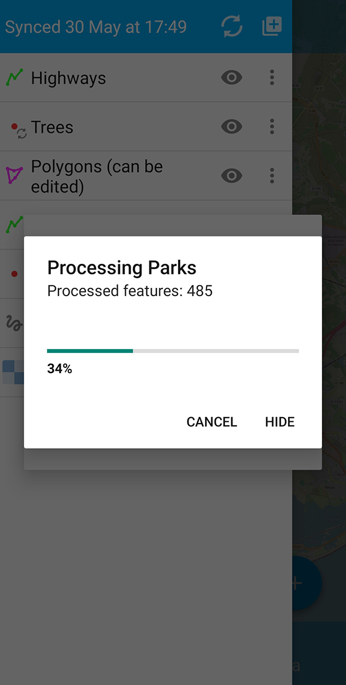

   Layer processing pop-up

If you need to stop downloading the layer, tap **Cancel**. 
To continue using the app as the layer is being processed, tap **Hide**. The progress bar will be moved to the notification panel 
.

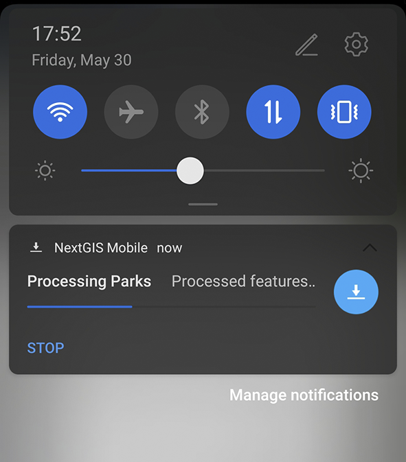

   Download status in the notification panel
 

If you want to stop downloading the layer, 
open the notification panel and tap **Stop**.

.. _ngmobile_upload:

Send local layer to Web GIS
-----------------------------------

Open the layer menu (three dots |ic_menu_grey| next to the layer). In the layer menu, select **Send to Web GIS**.

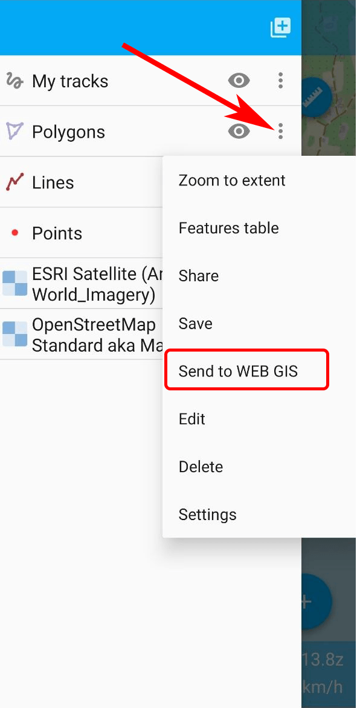

   Layer menu

Select the desired Web GIS from the list, see :numref:`ngmobile_select_ngw_layer_pic`.

Select the desired resource group and tap **Add**.

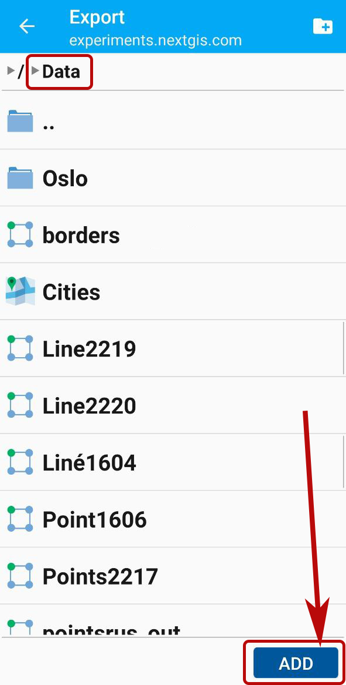

   Adding a local layer to Web GIS

When the upload is complete, the layer thumbnail will have a synchronization icon |icon_layer_sync|.

In your Web GIS, you'll find the uploaded layer with no style.

.. note:: 

   The number of layers that can be uploaded to Web GIS depends on your `subscription plan <https://nextgis.com/pricing-base/>`_. On Free plan, you can upload up to 15 layers. To upload more layers, `switch to Premium <https://my.nextgis.com/subscription/>`_ in your account.

.. _ngm_resource_group:

Create resource group in Web GIS
----------------------------------

When you're selecting a group for the layer you're uploading to WebGIS (see :numref:`ngm_add_to_wg_pic`), in the top right corner there is a folder icon.
It opens a dialog for creating a new resouce group in your Web GIS. 
Enter a name for the group and tap **Ok**.
After the folder is created its name appears in the resource list of the Web GIS: 

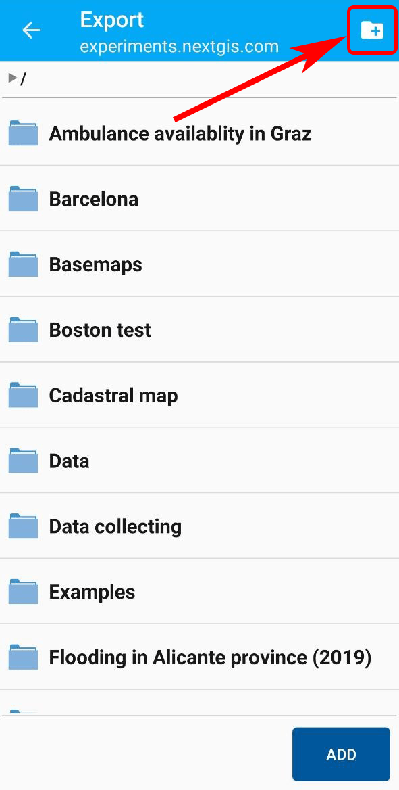
   
   Creating a new group

.. _ngmobile_synchronization_layer_webgis:

Configure synchronization with Web GIS
-------------------------------------------------

NextGIS Mobile application can access the server at set intervals to share edits and keep layers on the device and in the Web GIS up to date.

To enable synchronization:
 
1. Open the menu by tapping the three dots in the top right corner |ic_menu|. 
2. Select "Settings" (:numref:`ngmobile_settings2_pic`).
3. Select "Web GIS" section of the Settings
   (:numref:`ngmobile_settings_ngw_pic`).  

4. Select the Web GIS from the list. 

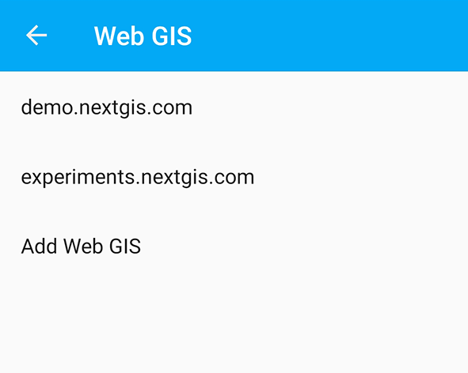

   List of connected Web GIS
   
5. On the Web GIS settings screen you can:
  
   - Turn on automatic synchronization;
   - Set up sync interval (between 5 min and 2 hours);
   - Turn on/off synchronization for a particular Web GIS layer.

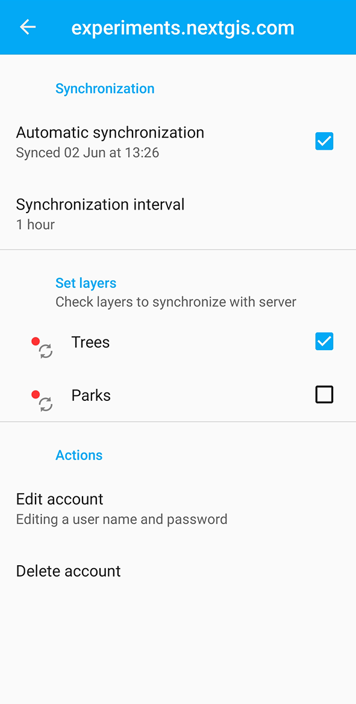
 
   Settings of a Web GIS account

Synchronized layers are marked with the |icon_layer_sync| icon. The same icon appears by the layer name in the layer tree.

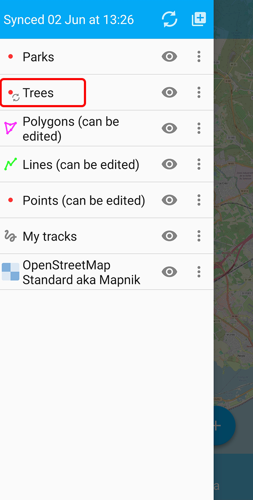

   Synchronized layers marked in the layer tree

.. |ic_layer_tree| image:: _static/ic_layer_tree.png
   :width: 6mm
   :alt: three white stripes

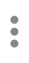

