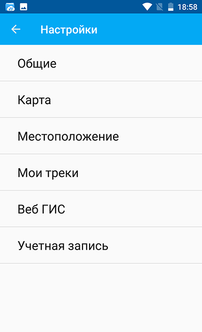
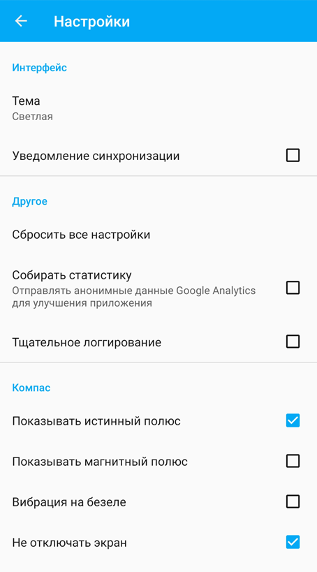
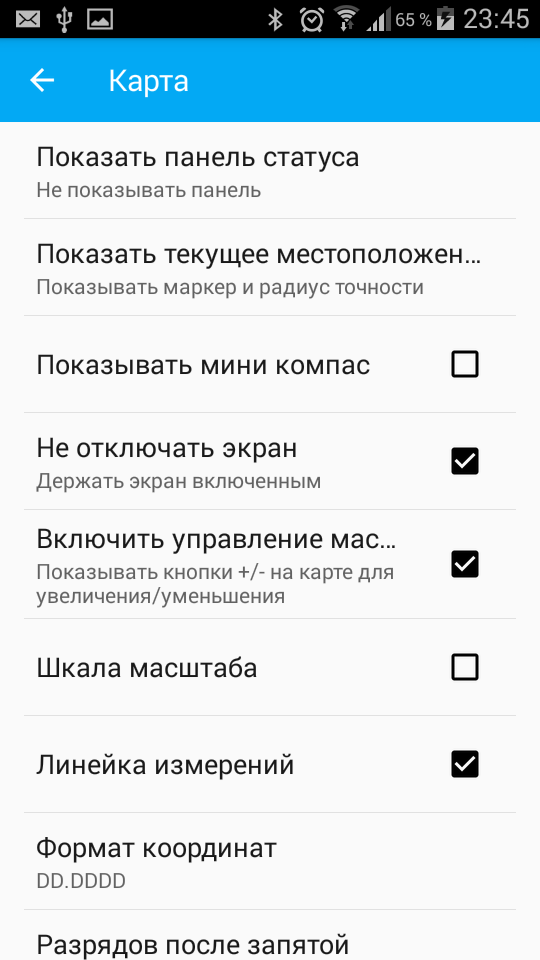
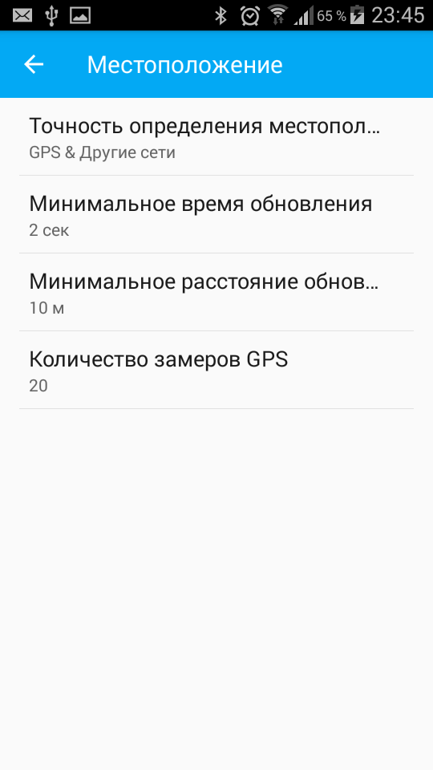
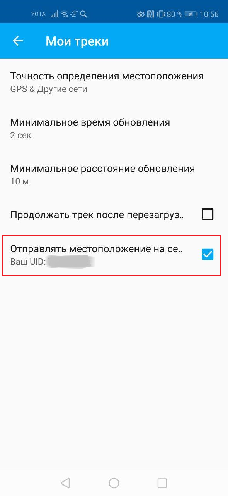

.. _ngmobile_settings:

Настройки приложения NextGIS Mobile
====================================

В зависимости от размера экрана окно настроек может быть однопанельным и двупанельным. 
Внешний вид окна настроек представлен на :numref:`ngmobile_settings_pic` (однопанельный режим). 

   
   Окно настроек
   
Доступны следующие блоки настроек:

* `Общие <https://docs.nextgis.ru/docs_ngmobile/source/settings.html#ngmobile-settings-gen>`_;
* `Карта <https://docs.nextgis.ru/docs_ngmobile/source/settings.html#ngmobile-settings-map>`_;
* `Местоположение <https://docs.nextgis.ru/docs_ngmobile/source/settings.html#ngmobile-settings-loc>`_;
* `Мои треки <https://docs.nextgis.ru/docs_ngmobile/source/settings.html#ngmobile-settings-tracks>`_;
* Веб ГИС;
* Учетная запись.

.. _ngmobile_settings_gen:

Общие
-----------

Блок настроек "Общие" позволяет изменять основные настройки приложения (см. :numref:`ngmobile_settings_general_pic`):

   Блок настроек "Общие"
  
Например, с их помощью можно выбрать тему (Светлую или Темную) и настроить компас.

.. _ngmobile_settings_map:

Карта
------

Блок настроек "Карта" содержит основные настройки карты (см. :numref:`ngmobile_settings_map_pic`).

   
   Окно настроек карты
   
Настройки карты имеют следующий состав:

* способ показа панели статуса (не показывать панель, показывать только вне редактирования, показывать всегда);
* способ показа текущего местоположения (не показывать текущее местоположение, показывать только маркер, показывать маркер и радиус точности);
* отображать/скрывать мини компас;
* при показе карты отключать/не отключать экран;
* отображать/скрывать кнопки управления масштабом (показывать кнопки +/- на карте); 
* отображать/скрывать шкалу масштаба;
* отображать/скрывать линейку измерений;
* формат вывода координат (применяется для отображения координат в панели статуса и других диалогах и окнах);
* настройка количества разрядов после запятой (количество разрядов можно изменить);
* настройка фона карты (светлый, нейтральный, темный);
* путь к картам (можно настроить путь к своей папке для хранения данных карты и слоев геоданных). 

.. note::

   В случае наличия устройства с несколькими SD-картами и ОС Android 4.4 (KitKat) и выше, путь к карте 
   на неосновной SD-карте может быть указан только в домашнюю директорию приложения и ее подпапки 
   (например, Android/data/com.nextgis.mobile). Это справедливо для некоторых устройств без root прав.
   При отображении диалога выбора пути папки, в которые запрещена запись, не будут иметь отметки для их выбора.

.. _ngmobile_settings_loc:

Местоположение
------------------

Блок настроек "Местоположение" содержит настройки определения местоположения устройства (см. :numref:`ngmobile_settings_place_pic`).

   
   Окно настроек местоположения
  
Настройки местоположения имеют следующий состав:
  
* точность определения местоположения/источник координат (:term:`GPS`, другие сети, GPS и другие сети);
* минимальное время обновления координат;
* минимальное расстояние обновления координат;
* количество замеров GPS.

.. _ngmobile_settings_tracks:

Мои треки
----------

В этом блоке настроек устанавливаются параметры записи изменения местоположения. Чтобы записывать трек, включите опцию "Отправлять местоположение на сервер". Также в этом блоке показывается UID устройства, который нужен для создания трекера в Веб ГИС. `Подробнее о работе с треками <https://docs.nextgis.ru/docs_ngcom/source/tracking.html>`_.

   
   Окно настроек трекинга

.. note::

   Если установить значение минимального расстояния обновления координат более 5 м, то операционная система начинает сглаживать трек (убирает выбросы).
