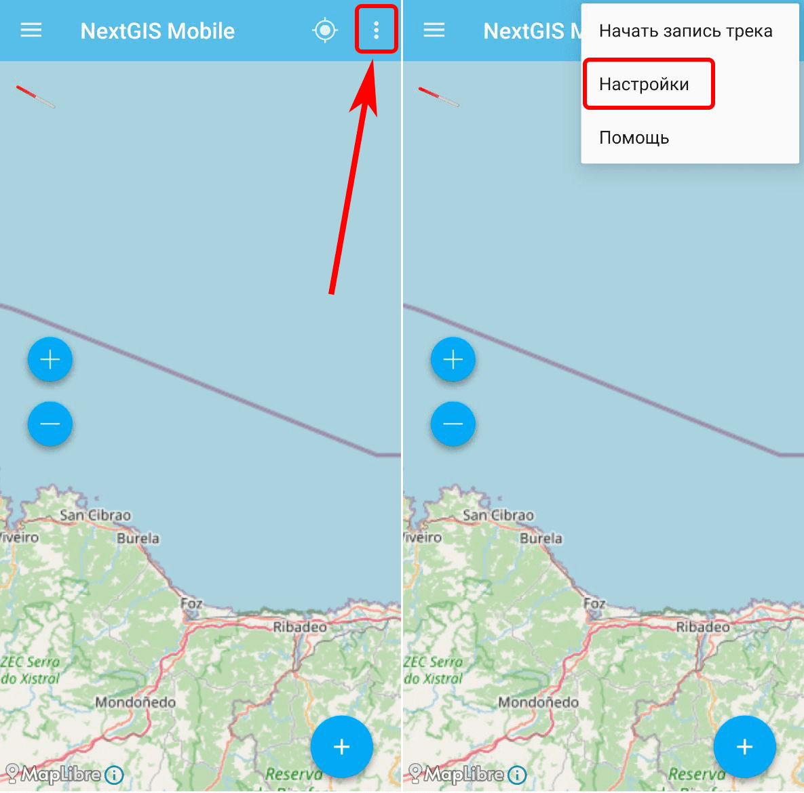
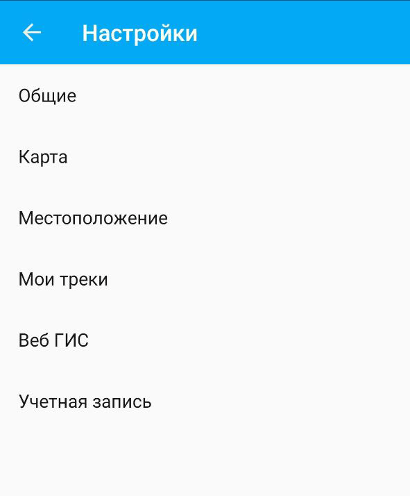
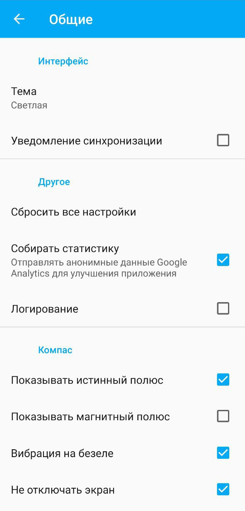
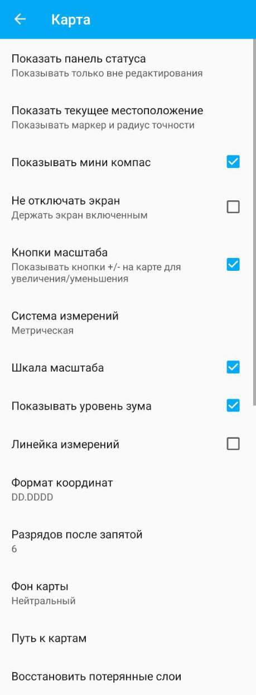
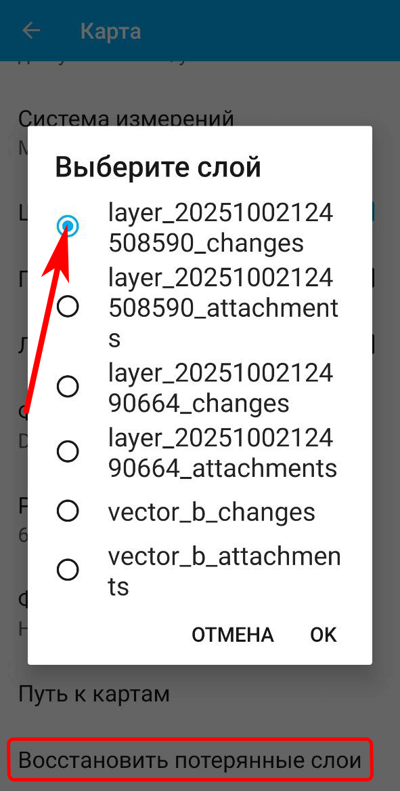
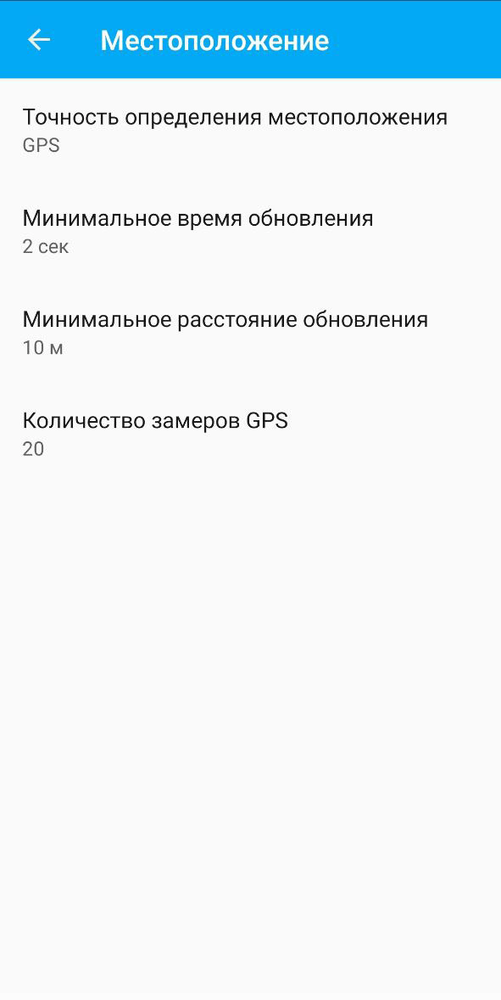
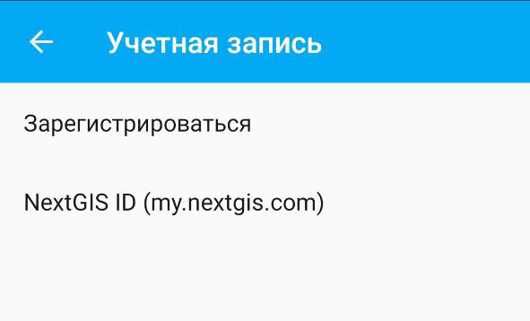
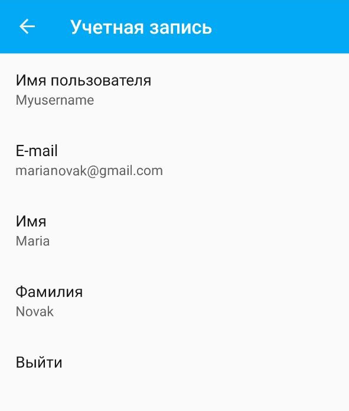

.. _ngmobile_settings:

Настройки 
===========

Чтобы открыть раздел настроек, нажмите на меню из трёх точек |ic_menu| в правом верхнем углу экрана и выберите "Настройки".

   Открытие главного меню и переход к настройкам
   

Внешний вид окна настроек: 

   
   Окно настроек
   
Доступны следующие блоки настроек:

* `Общие <https://docs.nextgis.ru/docs_ngmobile/source/settings.html#ngmobile-settings-gen>`_;
* `Карта <https://docs.nextgis.ru/docs_ngmobile/source/settings.html#ngmobile-settings-map>`_;
* `Местоположение <https://docs.nextgis.ru/docs_ngmobile/source/settings.html#ngmobile-settings-loc>`_;
* `Мои треки <https://docs.nextgis.ru/docs_ngmobile/source/settings.html#ngmobile-settings-tracks>`_;
* `Веб ГИС <https://docs.nextgis.ru/docs_ngmobile/source/ngw_load.html#ngmobile-synchronization-layer-webgis>`_;
* `Учетная запись <https://docs.nextgis.ru/docs_ngmobile/source/settings.html#account>`_.

.. _ngmobile_settings_gen:

Общие
-------

.. admonition:: Как открыть

   |ic_menu| Настройки --> Общие

   Блок настроек "Общие"
  
* Тема: светлая или тёмная;
* Уведомление синхронизации - можно включить дополнительные всплывающие уведомления, которые будут сообщать о том, что идёт синхронизация данных с сервером;
* Сбросить все настройки - вернёт настройки приложения в исходное состояние;
* Собирать статистику - отправлять анонимные данные для улучшения работы приложения;
* Включить `Логирование <https://docs.nextgis.ru/docs_ngmobile/source/log.html#>`_;
* Показывать истинный полюс;
* Показывать магнитный полюс;
* Вибрация на безеле;
* Не отключать экран.

.. _ngmobile_settings_map:

Карта
------

.. admonition:: Как открыть

   |ic_menu| Настройки --> Карта

Блок настроек "Карта" содержит основные настройки `главного окна приложения <https://docs.nextgis.ru/docs_ngmobile/source/main.html#ngmobile-main-activity>`_:

   
   Окно настроек карты

* Показывать панель статуса (не показывать панель, показывать только вне редактирования, показывать всегда);
* Показывать текущее местоположение (не показывать текущее местоположение, показывать только маркер, показывать маркер и радиус точности);
* Показывать/скрывать мини компас;
* Отключать/не отключать экран при показе карты;
* Кнопки масштаба (показывать/скрыть кнопки управления масштабом +/- на карте); 
* Система измерений (метрическая, британская);
* Шкала масштаба (показывать/скрыть);
* Показывать текущий уровень зума (ближайший в сторону уменьшения целочисленный уровень, где 0 - весь мир, 1 - 1/4 карты мира и т.д.);

.. todo:: _static/ngmobile_zooms_ru.png
   :name: ngmobile_zooms_pic
   :align: center
   :width: 10cm

   Шкала масштаба и уровень зума

* Линейку измерений (показывать/скрыть);
* Формат вывода координат (применяется для отображения координат в панели статуса и других диалогах и окнах, можно выбрать:

  * десятичные градусы DD.DDDD; 
  * градусы и десятичные минуты - DD-MM.MM; 
  * градусы, минуты и десятичные секунды - DD-MM-SS.SS);

* Разрядов после запятой (количество разрядов можно изменить);
* Фон карты (светлый, нейтральный, темный);
* Путь к картам (можно настроить путь к своей папке для хранения данных карты и слоев геоданных);
* `Восстановить потерянные слои <https://docs.nextgis.ru/docs_ngmobile/source/settings.html#ngmob-restore-layer>`_. 

.. _ngmob_restore_layer:

Восстановление слоёв
--------------------

В некоторых редких ситуациях, таких как сбой памяти, аварийное завершение при записи и т.п. возможна рассинхронизация списка слоёв на карте в приложении и памяти.

Чтобы восстановить такой слой, зайдите в :menuselection:`Настройки -> Карта` и нажмите **Восстановить потерянные слои**.

   Выбор слоя для восстановления

В этом меню показывается название файла слоя. Стандартные слои, создаваемые при установке приложения, имеют следующие названия:

* Точки - vector_a
* Линии - vector_b
* Полигоны - vector_c

Чтобы узнать название другого слоя, вызовите его контекстное меню и перейдите в настройки слоя. На вкладке `Общие <https://docs.nextgis.ru/docs_ngmobile/source/layer_settings.html#ngmobile-tab-general-settings>`_ вы найдёте полный путь к локальному файлу.

.. _ngmobile_settings_loc:

Местоположение
------------------

.. admonition:: Как открыть

   |ic_menu| Настройки --> Местоположение

   
   Окно настроек местоположения
  
Настройки местоположения имеют следующий состав:
  
* Точность определения местоположения/источник координат (:term:`GPS`, другие сети, GPS и другие сети);
* Минимальное время обновления координат;
* Минимальное расстояние обновления координат;
* Количество замеров GPS.

.. note:: Чтобы настроить время и расстояние обновления координат при записи трека, вам нужен раздел "Мои треки".

.. _ngmobile_settings_tracks:

Мои треки
----------

.. admonition:: Как открыть

   |ic_menu| Настройки --> Мои треки

В этом блоке настроек устанавливаются параметры записи изменения местоположения. 

.. figure:: _static/ngmob_set_mytracks_ru.png
   :name: my_tracks_settings_pic
   :align: center
   :width: 9cm
   
   Окно настроек трекинга

* Точность определения местоположения (:term:`GPS`, другие сети, GPS и другие сети);
* Минимальное время обновления координат;
* Минимальное расстояние обновления координат;
* Продолжать трек после перезагрузки;
* Отправлять местоположение на сервер - позволяет просматривать треки на веб-карте;
* Также в этом блоке показывается UID устройства, который нужен для создания трекера в Веб ГИС. 

`Подробнее о работе с треками <https://docs.nextgis.ru/docs_ngcom/source/tracking.html>`_.

.. note::

   Если установить значение минимального расстояния обновления координат более 5 м, то операционная система начинает сглаживать трек (убирает выбросы).

.. _account:

Учётная запись
-----------------

.. admonition:: Как открыть

   Три точки -> Настройки -> Учётная запись

Отсюда можно:

* перейти к регистрации;
* посмотреть в приложении данные пользователя, под которым вы авторизованы.

   Настройки учётной записи

   Данные учётной записи

Отображаются следующие данные учётной записи (изменить их можно в личном кабинете в разделе `Профиль <https://docs.nextgis.ru/docs_ngcom/source/create.html#ngcom-ngid-profile>`_):

* Имя пользователя;
* E-mail, на который создан аккаунт NextGIS ID;
* Имя и фамилия.

Чтобы сменить сервер авторизации или просто заново ввести логин и пароль, нажмите **Выйти** и пройдите авторизацию заново.

.. |ic_menu| image:: _static/ic_menu.png
   :width: 6mm
   :alt: три точки