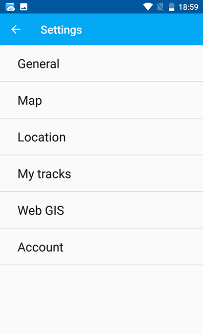
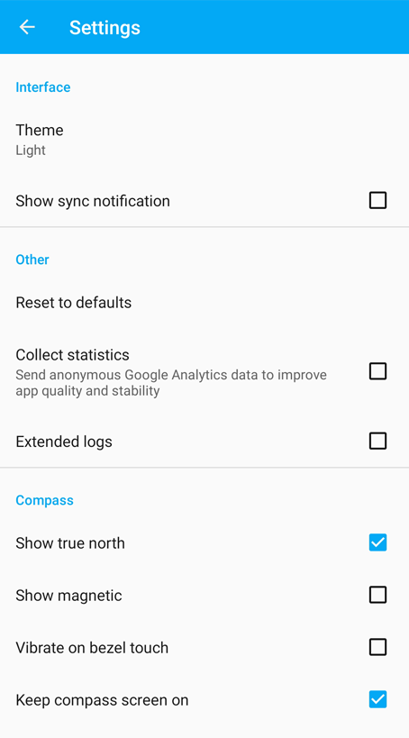
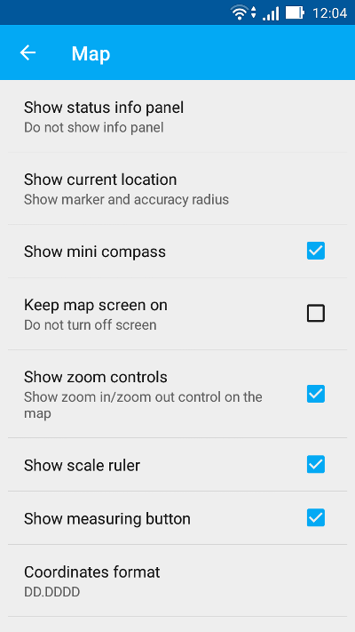
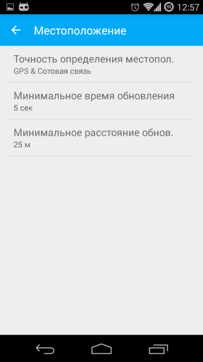
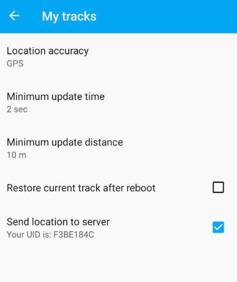

.. _ngmobile_settings:

Settings dialogue
=====================

Depending on the screen size Settings dialogue can fit into one or two panels. Settings dialogue is shown on :numref:`ngmobile_settings_pic` (one panel mode).

   
   Settings

There are following Settings on the main panel:

* `General <https://docs.nextgis.com/docs_ngmobile/source/settings.html#general>`_
* `Map <https://docs.nextgis.com/docs_ngmobile/source/settings.html#map>`_
* `Location <https://docs.nextgis.com/docs_ngmobile/source/settings.html#location>`_
* `My tracks <https://docs.nextgis.com/docs_ngmobile/source/settings.html#my-tracks>`_
* Web GIS
* Account

.. _ngmobile_settings_gen:

General
---------

"General" settings allow to change basic settings of the map (see :numref:`ngmobile_settings_general_pic`).

   
   General settings
   
Here you can select the theme (Light or Dark) and tune up compass settings.

.. _ngmobile_settings_map:

Map
----

"Map" settings allow to change basic settings of the map (see :numref:`ngmobile_settings_map_pic`).

   
   Map settings

Map settings include:

* Show/hide Status info panel
* The way current location displays (show current location, show marker, how marker & accuracy radius)
* Show mini compass
* Do not turn off the screen when map displays - works only on the map screen
* Show/hide zoom control buttons
* Show scale ruler
* Show measuring button
* Coordinates format (for coordinates in Status bar and other dialogs and screens)
* Decimal places
* Map background (light, dark, neutral)
* Map path (here you can specify a path where map and layers data will be stored)

.. note::
	For devices with several SD cards and Android 4.4 and higher, map path not on the main SD card can only be specified in the application home directory and its subdirectories (for example: Android/data/com.nextgis.mobile). This is also true for some devices without root access. Read-only folders won't show up in path selection dialog.

.. _ngmobile_settings_loc:

Location
---------

"Location" settings offer a few location specific settings (see :numref:`ngmobile_settings_place_pic`).

   
   Location settings

Location settings include:

* Coordinate source (mobile networks/Wi-Fi + :term:`GPS`, Other networks or only GPS)
* Minimum update time
* Minimum update distance
* Count of GPS fixes

.. _ngmobile_settings_tracks:

My tracks
-----------

"Tracks" settings are similar to the location settings, but they are applied only for track recording.

Check "Send location to server" if you want to view tracks on a Web Map or save them to a vector layer. In this settings page you can also check your UID (you'll need it to create a tracker in Web GIS). `More about tracking <https://docs.nextgis.com/docs_ngcom/source/tracking.html>`_.

   My tracks settings

.. note::
   If you set value of the minimum update distance at more than 5 m, the operating system will start to smooth the track (remove outliers).
