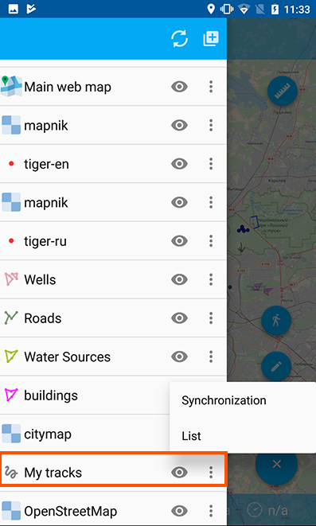
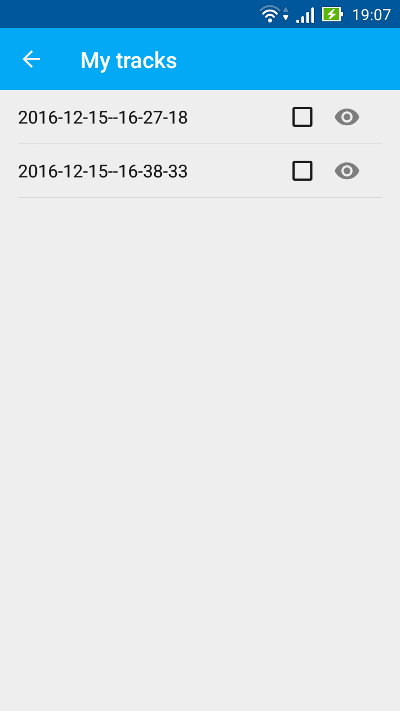

.. sectionauthor:: Дмитрий Барышников <dmitry.baryshnikov@nextgis.ru>

.. _ngmobile_share:

Выгрузка данных
===============

GeoJSON
-------

При выборе пункта контекстного меню "Поделиться" на дереве слоев откроется стандартное системное 
меню выбора способа передачи экспортированных данных (например, по почте, облачное 
хранилище файлов, карта памяти и т.п.). Окно выбора представлено на :numref:`ngmobile_share_pic`. 

.. figure:: _static/ngmobile_share.png
   :name: ngmobile_share_pic
   :align: center
   :height: 10cm
   
   Окно выбора способа передачи экспортированных данных.

При выборе одного из предложенных вариантов, данные из слоя записываются в формат :term:`GeoJSON` (:term:`система координат` Web Mercator, EPSG:3857) и отправляются, используя выбранное приложение. Файлу присваивается такое же название, что и имя слоя.

Ниже представлены некоторые варианты передачи данных (их доступность зависит от того, какие приложения установлены на устройстве):

* Можно отправить данные в качестве прикрепленного файла через Gmail или другое приложение для отправки электронной почты.
* Можно загрузить файл на Google Диск/Dropbox/другой облачный сервер, а затем поделиться им с коллегами.
* Можно отправить файл на другое устройство через Bluetooth или Доступ через LAN.
* Можно сохранить файл на карту памяти.

.. note::
   Во многих версиях Android, для того чтобы появилась возможность сохранения файла на диске, необходимо, чтобы в системе
   присутствовал какой-нибудь файловый менеджер, например ES Explorer или аналогичный.

Выгрузка приложений
-------------------

К каждому объекту в NextGIS Mobile можно приложить одну или несколько фотографий. Фотографии 
хранятся отдельно в виде файлов и при экспорте добавляются в архив слоя, для каждого 
объекта в архиве создается своя папка с приложениями, название папки равно ID объекта.

Пример записи:

(4:10000002.jpg,10000000.jpg,10000001.jpg,10000003.jpg)

Расшифровка:

К данному объекту присоединены 4 фотографии с соответствующими именами. Эти фотографии 
лежат в папке, название которой равно ID объекта.

Выгрузка треков в GPX
----------------------

.. versionadded:: 2.3

Процесс экспорта треков начинается с выбора в дереве слоев слоя "Мои треки". 
Далее следует вызвать контекстное меню, выбрать пункт "Настройки" :numref:`ngmobile_tree_layers_gpx_pic`. 

   Дерево слоев.
 
Откроется окно со списком записанных треков. Если несколько треков записывались в
один день, то треки будут разбиты по сессиям. Если один трек записывался несколько 
дней, то записанный трек будет дробиться на части по дням, в которые происходила 
запись трека :numref:`ngmobile_tracks_list_gpx_pic`. 

   Список с записанными треками.

Из списка записанных треков нужно выбрать необходимый трек или треки путем установки флажка 
напротив имени трека, в результате чего активируются кнопки на верхней панели инструментов.
Для того, чтобы поделиться треком, выберите кнопку "Поделиться" :numref:`ngmobile_tracks_list_and_menus_pic`. 

.. figure:: _static/tracks_list_and_menus.png
   :name: ngmobile_tracks_list_and_menus_pic
   :align: center
   :height: 10cm   

   Активация меню списка записанных треков.
