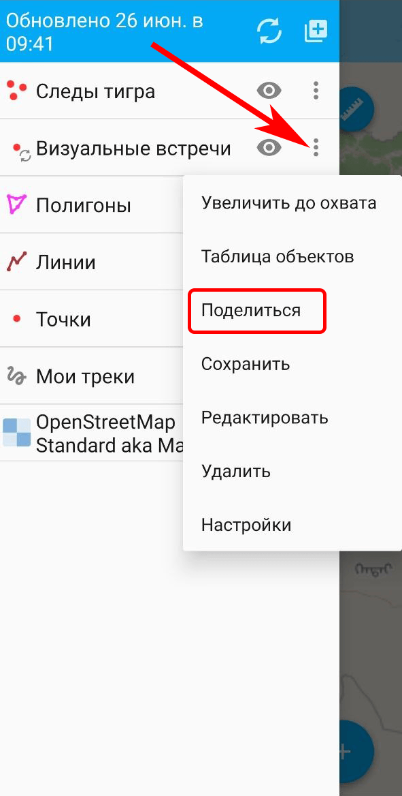
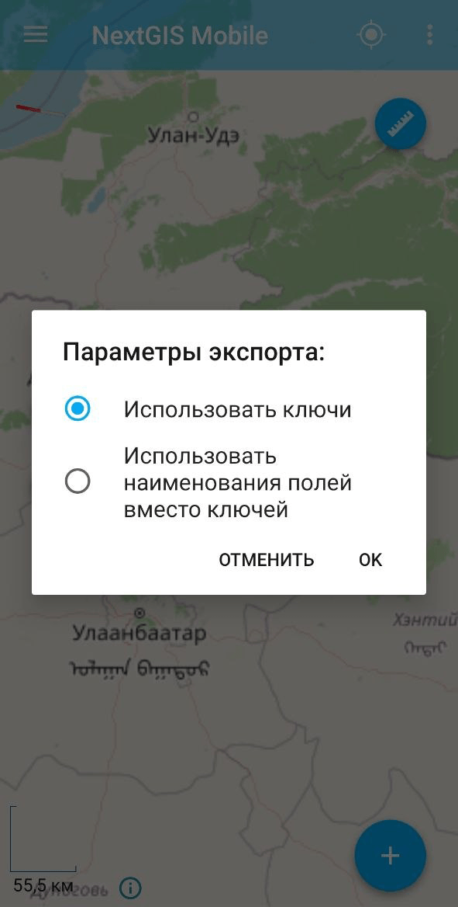
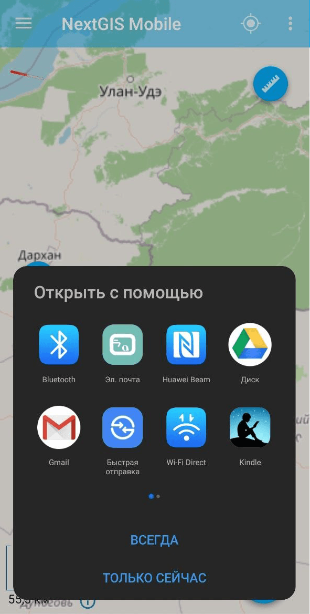
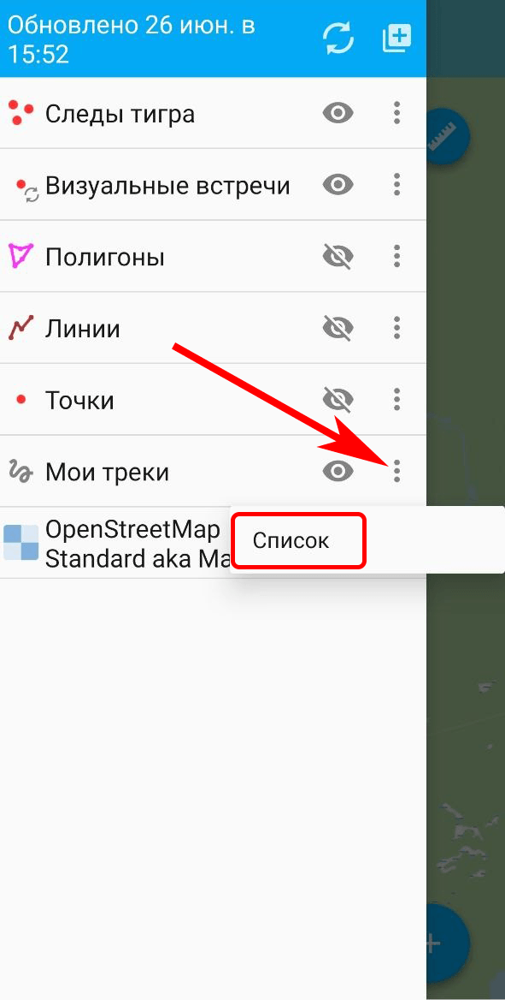
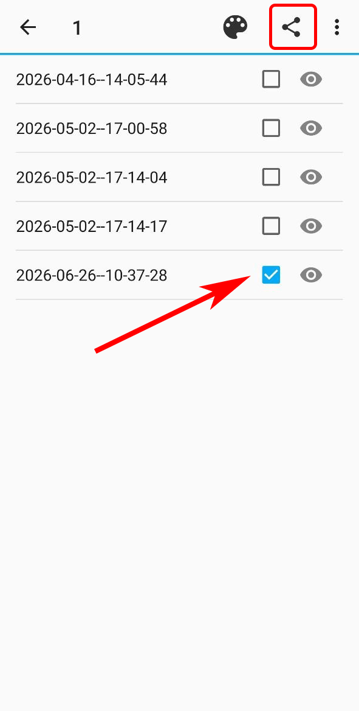

Выгрузка данных
===============

`Треки <https://docs.nextgis.ru/docs_ngmobile/source/share.html#gpx>`_, записанные в приложении NextGIS Mobile, `векторные слои <https://docs.nextgis.ru/docs_ngmobile/source/share.html#ngmobile_export_vector>`_ и `вложения <https://docs.nextgis.ru/docs_ngmobile/source/share.html#ngmobile-export-attachments>`_ к ним можно экспортировать в виде файлов.

В зависимости от того, какие приложения установлены на устройстве, вы можете:

* Отправить файл по электронной почте или через мессенджер.
* Загрузить файл в облачное хранилище, такое как Google диск или Яндекс диск.
* Отправить файл на другое устройство через Bluetooth или Доступ через LAN.
* Сохранить файл в память устройства.

Также можно отправить векторные слои, созданные в приложении, `в Веб ГИС <https://docs.nextgis.ru/docs_ngmobile/source/ngw_load.html#ngmobile-upload>`_ и включить `синхронизацию треков <https://docs.nextgis.ru/docs_ngcom/source/tracking.html#tracking-create>`_ с сервером.

.. _ngmobile_export_vector:

Отправка векторного слоя
------------------------

Для того, чтобы экспортировать данные векторного слоя, 

* Откройте Дерево слоев (см. :numref:`ngmobile_main_activity_pic`, п.1).
* Вызовите контекстное меню нужного слоя, нажав на три точки рядом с ним и выберите "Поделиться".

   Контекстное меню слоя

* В окне параметров экспорта выберите, использовать ключи или наименования для полей. Нажмите **Ок**.

   Параметры экспорта

* Откроется стандартное системное меню выбора способа передачи экспортированных данных. 

   
   Окно выбора способа передачи экспортированных данных

* Выберите нужный вариант (отправить по почте или через мессенджер и т.д.) и завершите экспорт в соответствующем приложении.

Данные слоя записываются в формат :term:`GeoJSON` (:term:`система координат` Web Mercator, EPSG:3857). Файлу присваивается название, соответствующее имени слоя.

.. _ngmobile_share:

Сохранение векторного слоя на устройство
----------------------------------------

Чтобы сохранить слой на устройство в виде файла,

* Откройте Дерево слоев (см. :numref:`ngmobile_main_activity_pic`, п.1).
* Вызовите контекстное меню нужного слоя, нажав на три точки рядом с ним и выберите "Сохранить". 

   Контекстное меню слоя

В окне параметров экспорта выберите, использовать ключи или наименования для полей. Нажмите **Ок**.

   Параметры экспорта

* Откроется окно сохранения файла, где вы можете выбрать расположение и название.

.. _ngmobile_export_attachments:

Выгрузка вложений
-------------------

К каждому объекту векторного слоя в NextGIS Mobile можно `прикрепить одну или несколько фотографий <https://docs.nextgis.ru/docs_ngmobile/source/editing.html#ngmobile-add-geometry>`_. 

.. seealso::

   При `отправке слоя в Веб ГИС <https://docs.nextgis.ru/docs_ngmobile/source/ngw_load.html#ngmobile-upload>`_ вложения автоматически загружаются на сервер.

При экспорте слоя в файл фотографии добавляются в архив, для каждого объекта в архиве создается своя папка с вложениями, папке присваивается название, соответствующее ID объекта.

Пример записи::

(4:10000002.jpg,10000000.jpg,10000001.jpg,10000003.jpg)

Расшифровка:

К данному объекту прикреплены 4 фотографии с соответствующими именами. 
Эти фотографии находятся в папке, название которой соответствует ID объекта.

.. _ngmobile_export_GPX:

Выгрузка треков в GPX
----------------------

Записанные треки можно экспортировать в файл, например, чтобы создать их резервную копию.

* Выберите слой |ic_tracks| "Мои треки" в Дереве слоев. 
* Вызовите контекстное меню, нажав три точки рядом со слоем и нажмите "Список".

   Переход к списку треков из контекстного меню

* Будет открыт список записанных треков. Если несколько треков записывались в один день, то треки будут разбиты по сессиям. Если один трек записывался в течение нескольких дней, то записанный трек будет разбит на на части по дням, в которые происходила запись трека.
* Выберите трек, поставив напротив флажок. На верхней панели появятся кнопки действий с треками.

   Панель инструментов при выборе трека, выделена кнопка "Поделиться"

* Нажмите кнопку |ic_share| "Поделиться".
* Выберите нужный вариант (отправить по почте или через мессенджер, сохранить на устройство и т.д.) и завершите экспорт в соответствующем приложении.

.. |ic_tracks| image:: _static/ic_tracks.png
   :width: 6mm
   :alt: загогулина