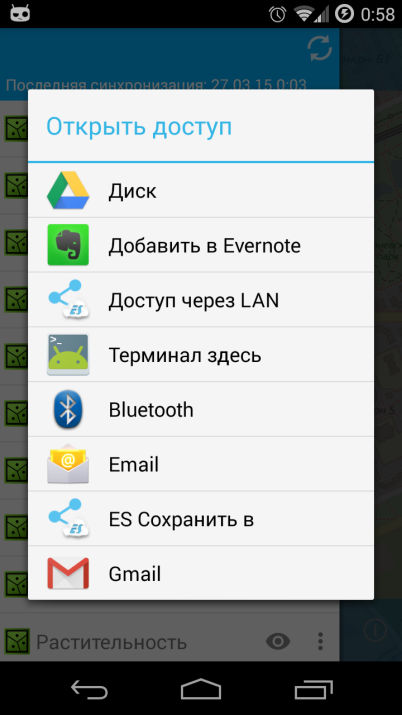

.. _ngmobile_share:

Выгрузка данных
===============

`Треки <https://docs.nextgis.ru/docs_ngmobile/source/share.html#gpx>`_, записанные в приложении NextGIS Mobile, векторные слои и вложения к ним можно экспортировать в виде файлов.

В зависимости от того, какие приложения установлены на устройстве, вы можете:

* Отправить файл по электронной почте или через мессенджер.
* Загрузить файл в облачное хранилище, такое как Google диск или Яндекс диск.
* Отправить файл на другое устройство через Bluetooth или Доступ через LAN.
* Сохранить файл в память устройства.

.. _ngmobile_export_vector:

GeoJSON
-------

Для того, чтобы экспортировать данные векторного слоя, 

* Откройте Дерево слоев (см. :numref:`ngmobile_main_activity_pic`, п.1).
* Вызовите контекстное меню нужного слоя, нажав на три точки рядом с ним (см. :numref:`ngmobile_layer_tree_pic`, п.5). 
* В контекстном меню выберите "Поделиться" (см. :numref:`ngmobile_layer_tree_pic`, п.6). 
* Откроется стандартное системное меню выбора способа передачи экспортированных данных. 

   
   Окно выбора способа передачи экспортированных данных.

* Выберите нужный вариант (отправить по почте или через мессенджер, сохранить на устройство и т.д.) и завершите экспорт в соответствующем приложении.

Данные слоя записываются в формат :term:`GeoJSON` (:term:`система координат` Web Mercator, EPSG:3857). Файлу присваивается название, соответствующее имени слоя.

Процесс сохранения файла на смартфон также показан в видео:

.. raw:: html

   <iframe width="560" height="315" src="https://rutube.ru/play/embed/fbde7d779ec9e6a8fdf889118054faa3/" frameBorder="0" allow="clipboard-write; autoplay" webkitAllowFullScreen mozallowfullscreen allowFullScreen></iframe>

Посмотреть видео на `youtube <https://youtu.be/30RBNCAOjL8>`_, `rutube <https://rutube.ru/video/fbde7d779ec9e6a8fdf889118054faa3/>`_.

.. warning::
   Во многих версиях Android, для того чтобы появилась возможность сохранения файла в память устройства, необходимо, чтобы на устройстве  был установлен какой-либо файловый менеджер, например ES Explorer или аналогичный.

.. _ngmobile_export_attachments:

Выгрузка вложений
-------------------

К каждому объекту векторного слоя в NextGIS Mobile можно `прикрепить одну или несколько фотографий <https://docs.nextgis.ru/docs_ngmobile/source/editing.html#ngmobile-add-geometry>`_. 

.. seealso::

   При `отправке слоя в Веб ГИС <https://docs.nextgis.ru/docs_ngmobile/source/ngw_load.html#ngmobile-upload>`_ вложения автоматически загружаются на сервер.

При экспорте слоя в файл фотографии добавляются в архив, для каждого объекта в архиве создается своя папка с вложениями, папке присваивается название, соответствующее ID объекта.

Пример записи::

(4:10000002.jpg,10000000.jpg,10000001.jpg,10000003.jpg)

Расшифровка:

К данному объекту прикреплены 4 фотографии с соответствующими именами. 
Эти фотографии находятся в папке, название которой соответствует ID объекта.

.. _ngmobile_export_GPX:

Выгрузка треков в GPX
----------------------

Записанные треки можно экспортировать в файл, например, чтобы создать их резервную копию.

* Выберите слой |ic_track| "Мои треки" в Дереве слоев. 
* Вызовите контекстное меню, нажав три точки рядом со слоем.
* В контекстном меню выберите пункт "Список".
* Будет открыт список записанных треков (см. :numref:`ngmobile_tracks_list_gpx_pic`). Если несколько треков записывались в один день, то треки будут разбиты по сессиям. Если один трек записывался в течение нескольких дней, то записанный трек будет разбит на на части по дням, в которые происходила запись трека.

* Выберите трек, поставив напротив флажок. На верхней панели появятся кнопки действий с треками.
* Нажмите кнопку "Поделиться" (см. :numref:`ngmobile_layer_gpx_selected_pic`, п.4).
* Выберите нужный вариант (отправить по почте или через мессенджер, сохранить на устройство и т.д.) и завершите экспорт в соответствующем приложении.