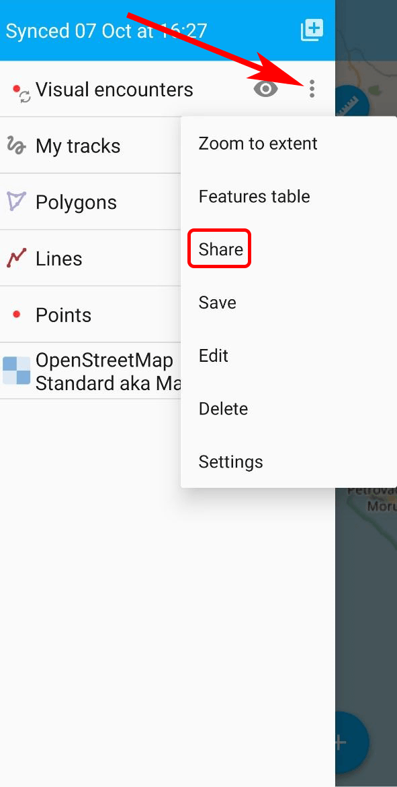
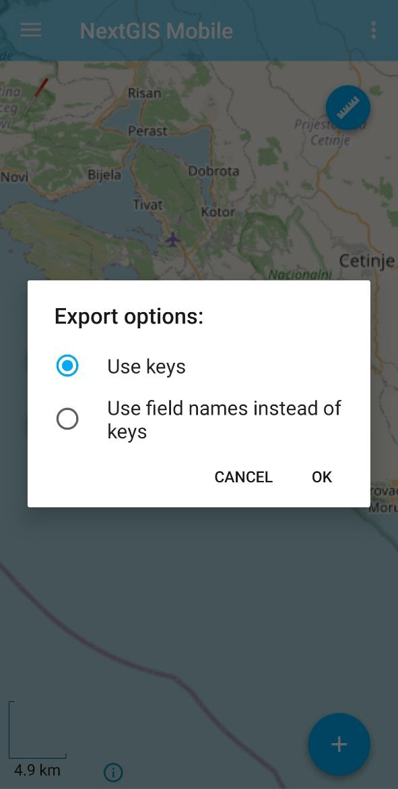
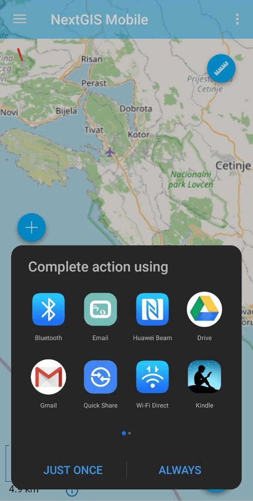
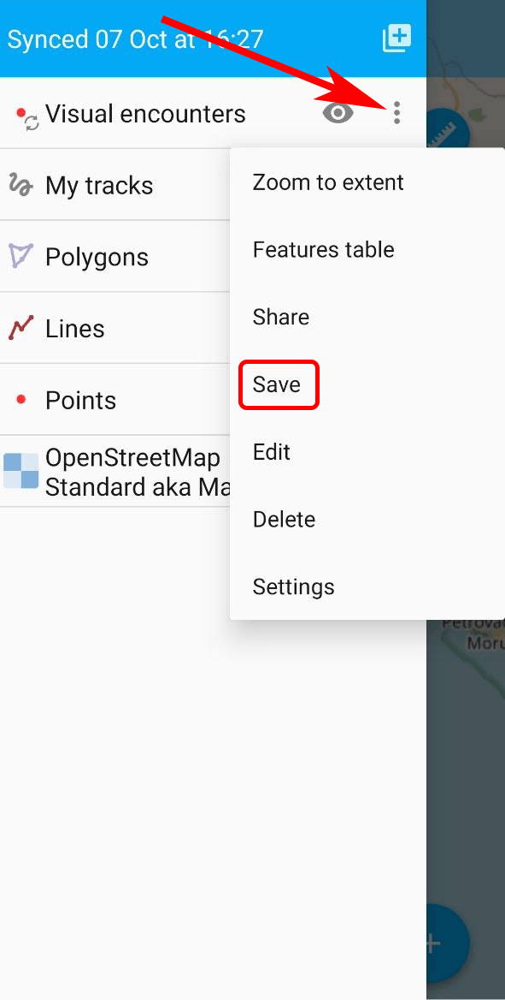
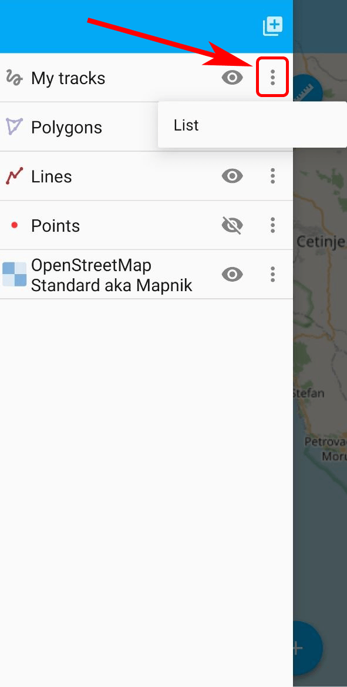
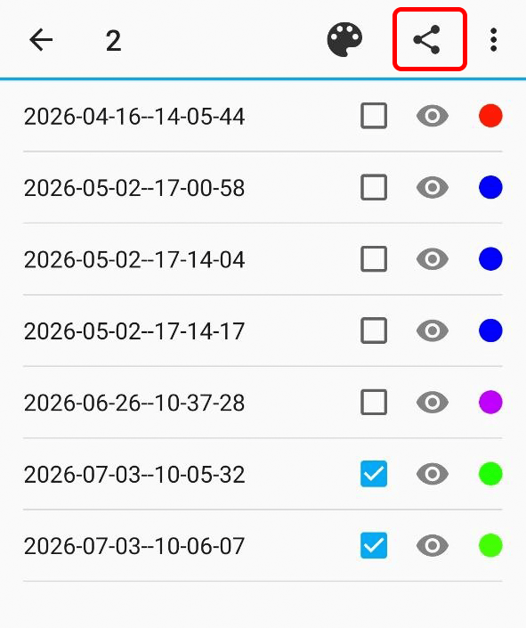

Data Export
===============

Tracks recorded in the NextGIS Mobile application, vector layers, and their attachments can be exported as files.

Depending on the applications installed on the device, you can:

* Send the file by email or via messenger.
* Upload the file to a cloud storage, such as Google Drive.
* Send a file to another device via Bluetooth or LAN access.
* Save the file to the device's memory.

.. seealso:: You can also send vector layers created in the application `to your Web GIS <https://docs.nextgis.com/docs_ngmobile/source/ngw_load.html#ngmobile-upload>`_ and enable `track synchronization <https://docs.nextgis.com/docs_ngcom/source/tracking.html#tracking-create>`_ with the server.

.. _ngmobile_export_vector:

Share vector layer
------------------------

To export vector layer data, 

* Open the Layer Tree |ic_layer_tree| (see :numref:`ngmobile_main_activity_pic`, item 1).
* Open the menu of the desired layer by tapping the three dots |ic_menu_grey| next to it and select **Share**.

   Layer menu

In the export parameters window, select what to use for field names: keys or aliases. Tap **OK**.

   Export parameters

* Selecting which app you want to use to send the file. 

   
   Share dialogue window

* Select the desired option (send by mail or messenger, etc.) and complete the export in the corresponding application.

The layer data is saved in the :term:`GeoJSON` format (Web Mercator coordinate system, EPSG:3857). Layer name is used as the file name.

.. _ngmobile_share:

Save vector layer to your device
----------------------------------------

To save the layer to the device as a file:

* Open the Layer Tree |ic_layer_tree| (see :numref:`ngmobile_main_activity_pic`, item 1).
* Open the menu of the desired layer by tapping the three dots |ic_menu_grey| next to it and select **Save**. 

   Layer menu

In the export parameters window, select what to use for field names: keys or aliases. Tap **OK**.

   Export parameters

A file save window will open, where you can choose the path and name for the file.

.. _ngmobile_export_attachments:

Export attachments
-------------------

One or more photos can be attached to each feature of a vector layer in NextGIS Mobile (`learn more <https://docs.nextgis.com/docs_ngmobile/source/editing.html#ngmobile-add-geometry>`_. 

.. seealso::

   When you `upload a layer to the Web GIS <https://docs.nextgis.com/docs_ngmobile/source/ngw_load.html#ngmobile-upload>`_ , attachments are automatically uploaded to the server.

When you save a layer to your device as a file, the photos are added to an archive. Each feature has a corresponding folder that has its ID as the name.

Example entry::

(4:10000002.jpg,10000000.jpg,10000001.jpg,10000003.jpg)

What it means:

4 photographs with the following names are attached to this feature. 
These photos are in the folder named with the object ID.

.. _ngmobile_export_GPX:

Export tracks to GPX
----------------------

Recorded tracks can be exported to a file, for example, to create a backup.

* Select the |ic_tracks| "My Tracks" layer in the Layer Tree. 
* Open the layer menu by clicking the three dots |ic_menu_grey| next to the layer and click **List**.

   Opening track list from the layer tree

* A list of recorded tracks is opened. If several tracks were recorded on the same day, the tracks will be broken down by sessions. If one track was recorded over several days, then the recorded track will be split into parts at midnight.
* Select the track by placing a checkmark next to it. Action buttons for tracks will appear on the top panel.

   Track toolbar, the "Share" button is highlighted

* Click the "Share" button |ic_share|.
* Select the desired option (send by mail or messenger, save to the device etc.) and complete the export in the corresponding application.

.. |ic_layer_tree| image:: _static/ic_layer_tree.png
   :width: 7mm
   :alt: three lines

.. |ic_menu_grey| image:: _static/ic_menu_grey.png
   :width: 3mm
   :alt: tree dots