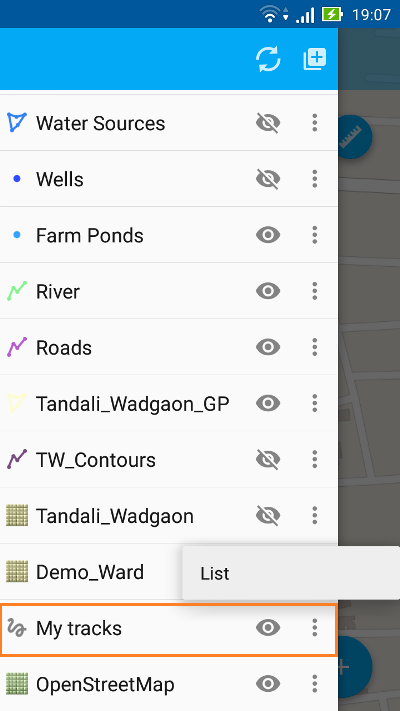

.. sectionauthor:: Дмитрий Барышников <dmitry.baryshnikov@nextgis.ru>.. 

_ngmobile_share:

Uploading data
==============

GeoJSON
-------

The standard system menu of transmission exported data method selection opens if you choose the context menu "Share" (for example, by mail, cloud file storage, memory card, etc.). The selection window is shown in :numref:`ngmobile_share_pic`.

.. figure:: _static/ngmobile_share.png
   :name: ngmobile_share_pic
   :align: center
   :height: 10cm
   
   Selection window of exported data transmission method.

Data from the layer will be stored in the :term:`GeoJSON` format (:term:`coordinate system` Web Mercator, EPSG:3857) after you select one of the options and will be shared by using of chosen app. A name of the file is the same as name of the layer.

.. note::
   In a lot of Android versions to have an opportunity to save a file on the disk some file manager is required (for example ES Explorer or similar).

Applications uploading
----------------------

To the each object in NGM can be attached one or few photos. Photos are stored separately in files and are added to the archive of layer after the export. For the each object in the archive creates its own folder with the applications where folder name equals to the object ID.

Example of entries:

(4:10000002.jpg,10000000.jpg,10000001.jpg,10000003.jpg)

Explanation:

4 photos with corresponding names are attached to the current object. These 4 photos are stored in the folder which name is the same to object ID.

Upload tracks in GPX
--------------------

Tracks exporting processes begins with the selection of "My Tracks" layer in the layers tree. Then select the "Settings" item in a context menu  :numref:`ngmobile_tree_layers_gpx_pic`. 

   Layers tree.

The window with recorded tracks will open. Tracks will be divided by cession if a few tracks have been recorded in a one day. If one of the tracks was recorded in a few days then a recorded track will be splitted up to pieces by days when record was made :numref:`ngmobile_tracks_list_gpx_pic`. 

.. figure:: _static/tracks_list_gpx.png
   :name: ngmobile_tracks_list_gpx_pic
   :align: center
   :height: 10cm

   Recorded tracks list.

Choose a desired track from the list of recorded tracks by setting flag in the checkbox. In the result, buttons on the top toolbar will be active. Choose the button with icon of three points. Select "Share" :numref:`ngmobile_tracks_list_and_menus_pic`. 

.. figure:: _static/tracks_list_and_menus.png
   :name: ngmobile_tracks_list_and_menus_pic
   :align: center
   :height: 10cm   

   List of recorded tracks menu activation.
