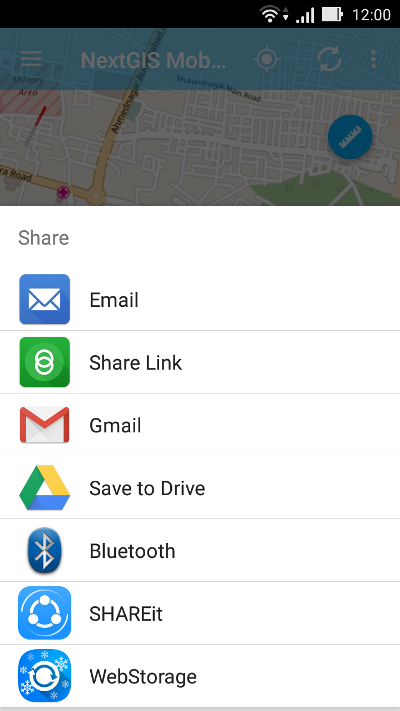

.. sectionauthor:: Дмитрий Барышников <dmitry.baryshnikov@nextgis.ru>

.. _ngmobile_share:

Выгрузка данных
===============

.. _ngmobile_export_vector:

GeoJSON
-------

Для того, чтобы экспортировать данные векторного слоя, следует открыть панель дерева слоев open (см. :numref:`ngmobile_main_activity_pic`, п.1). Далее необходимо нажать на иконку контекстного меню рядом с названием нужного слоя (см. :numref:`ngmobile_layer_tree_pic`, п.5). При выборе пункта контекстного меню "Поделиться" (см. :numref:`ngmobile_layer_tree_pic`, п.6) откроется стандартное системное меню выбора способа передачи экспортированных данных (например, по почте, облачное 
хранилище файлов, карта памяти и т.п.). Окно выбора представлено на :numref:`ngmobile_share_pic`. 

   
   Окно выбора способа передачи экспортированных данных.

При выборе одного из предложенных вариантов данные из слоя будут записаны в формат :term:`GeoJSON` (:term:`система координат` Web Mercator, EPSG:3857) и отправлены через выбранное приложение. Файлу присваивается такое же название, что и имя слоя.

Ниже представлены некоторые варианты передачи данных (их доступность зависит от того, какие приложения установлены на устройстве):

* Можно отправить данные в качестве прикрепленного файла через Gmail или другое приложение для отправки электронной почты.
* Можно загрузить файл на Google Диск/Dropbox/другой облачный сервер, а затем поделиться им с коллегами.
* Можно отправить файл на другое устройство через Bluetooth или Доступ через LAN.
* Можно сохранить файл на карту памяти.

.. warning::
   Во многих версиях Android, для того чтобы появилась возможность сохранения файла на диске, необходимо, чтобы в системе
   присутствовал какой-нибудь файловый менеджер, например ES Explorer или аналогичный.

.. _ngmobile_export_attachments:

Выгрузка приложений
-------------------

К каждому объекту векторного слоя в NextGIS Mobile можно приложить одну или несколько фотографий. Фотографии 
хранятся отдельно в виде файлов и при экспорте добавляются в архив слоя, для каждого 
объекта в архиве создается своя папка с приложениями, папке присваивается то же название, соответствующее ID объекта.

Пример записи:

(4:10000002.jpg,10000000.jpg,10000001.jpg,10000003.jpg)

Расшифровка:

К данному объекту прикреплены 4 фотографии с соответствующими именами. Эти фотографии 
лежат в папке, название которой соответствует ID объекта.

.. _ngmobile_export_GPX:

Выгрузка треков в GPX
----------------------

.. versionadded:: 2.3

Процесс экспорта треков начинается с выбора в дереве слоев группового слоя "Мои треки". 
Далее следует вызвать контекстное меню, выбрать пункт "Список" (см. :numref:`ngmobile_layer_tree_traks_pic`). 

.. figure:: _static/ngmobile_layer_tree_traks.png
   :name: ngmobile_layer_tree_traks_pic
   :align: center
   :height: 10cm
 
   Дерево слоев с записанными треками.
 
Откроется окно со списком записанных треков (см. :numref:`ngmobile_tracks_list_gpx_pic`). Если несколько треков записывались в
один день, то треки будут разбиты по сессиям. Если один трек записывался несколько 
дней, то записанный трек будет дробиться на части по дням, в которые происходила 
запись трека.

Из списка записанных треков нужно выбрать необходимый трек путем установки флажка 
напротив имени трека, в результате чего активируются кнопки на верхней панели инструментов (см. :numref:`ngmobile_layer_gpx_selected_pic`).

Для того, чтобы экспортировать трек, следует нажать на кнопку "Поделиться" (см. :numref:`ngmobile_layer_gpx_selected_pic`, п.4). 

После выбора опции "Поделиться" данные, содержащиеся в выбранном треке будут сохранены в формате GPX и экспортированы через выбранное приложение.
