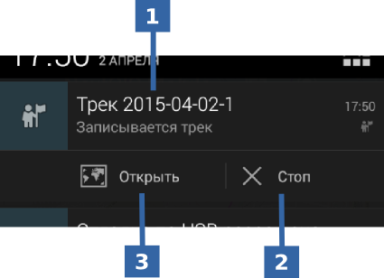
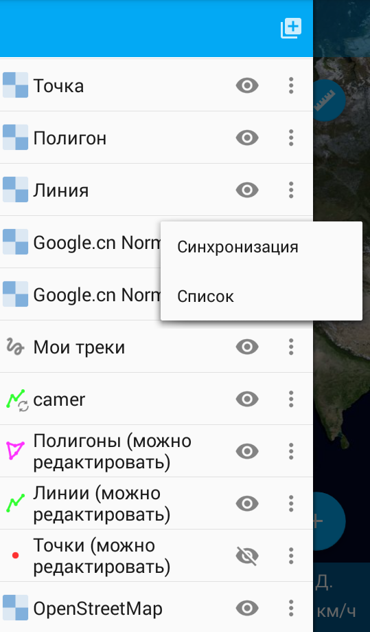
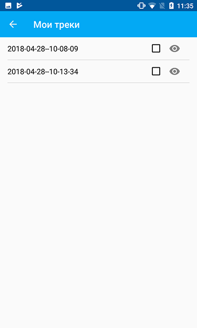
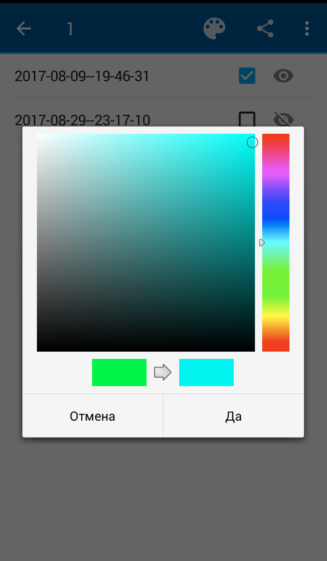

.. sectionauthor:: Дмитрий Барышников <dmitry.baryshnikov@nextgis.ru>

.. tracks:

Треки
=====

Программа позволяет записывать и отображать треки. В процессе записи сохраняются 
точки трека во внутреннюю базу данных. При отображении точки трека в рамках сессии 
объединяются и отображаются в виде линий на карте. 

.. note::
   Следует проверить, чтобы в настройках устройства Android был включен режим Местоположения. Также необходимо убедиться, что конфигурации настроек "Мои треки" и "Местоположение" в настройках NextGIS Mobile были установлены, как показано на :numref:`ngmobile_settings_place_pic`.

Запись
------

Трек может быть записан двумя путями.

Запись трека в формате GPX
^^^^^^^^^^^^^^^^^^^^^^^^^^

1. Для начала записи трека необходимо выбрать команду на панели инструментов или в меню (см. :numref:`ngmobile_track_menu_pic` п. 1 и 2 соответственно). 

.. figure:: _static/ngmobile_track_menu.png
   :name: ngmobile_track_menu_pic
   :align: center
   :width: 9cm
   
   Команда записи трека.
   
   Цифрами обозначено: 1 - кнопка на панели инструментов для записи трека; 2 - пункт меню для записи трека.

Запись трека выполняется независимо от приложения в фоновом процессе. Для индикации состояния выводится сообщение в панель 
статуса операционной системы (см. :numref:`ngmobile_status_track_pic`).

 
   Статус записи трека.
   
   Цифрами обозначено: 1 - название сессии записи трека; 2 - кнопка завершения записи трека; 
   3 - кнопка активации приложения, из которого запущен процесс записи трека.
   
Записываемый трек сразу же рисуется на карте. Иконка статуса записи (шагающий человек) остается видна на панели статуса операционной системы. Зеленый флажок указывает на стартовую точку трека, маркер местоположения показывает текущее положение устройства.

.. note::
Точки трека группируются по дням и сессиям внутри одного дня. Если запись трека переходит на другой день, то он будет разбит на две части.

2. Для того, чтобы остановить запись, необходимо нажать на кнопку "Стоп" либо на панели статуса операционной системы, либо в контекстном меню (см. :numref:`ngmobile_main_activity_pic`, п.5). Иконка статуса исчезнет из панели состояния, маркер местоположения заменится на красный флажок, означающий конец трека, а линия трека изменит свой цвет.

3. После этого можно управлять этим треком, в том числе экспортировать его в формат GPX. Как это сделать, описано в разделе "Выгрузка треков в GPX".

Запись трека на векторный слой
^^^^^^^^^^^^^^^^^^^^^^^^^^^^^^

С помощью трекинга можно также добавить объект на существующий линейный или полигональный векторный слой.

1. Для начала записи трека необходимо выбрать команду "Добавить геометрию обходом" в меню (см. :numref:`ngmobile_main_activity_pic`, п.5). Это откроет список всех редактируемых линейный/мультилинейных и полигональных/мультиполигональных слоев в виде отдельного диалога.

2. Затем следует выбрать слой, на который нужно добавить обходом новый объект. Этот слой откроется в режиме Редактирования и NextGIS Mobile начнет запись новой геометрии на векторный слой.

.. note::   
Можно также включить режим "Редактирования обходом", переключившись на режим редактирования с помощью любого из методов, описанных в разделе "Переход в режим редактирования", и нажав на кнопку "Добавить геометрию обходом".

В случае если точность добавленной геометрии не достаточна, можно перейти в настройки местоположения NextGIS Mobile прямо с экрана "Редактирования обходом".

3. Когда запись закончена, следует нажать на иконку с изображением дискеты. Это приведет к открытию формы ввода атрибутов.
   
4. В результате новый объект добавляется на существующий линейный/мультилинейный или полигональный/мультиполигональный векторный слой.

Управление
----------

Треки представлены в дереве слоев (см. :numref:`ngmobile_layer_tree_traks_pic`) в виде группового слоя. Для осуществления операций над групповым слоем нужно выбрать пункт меню Список.

 
   Дерево слоев с записанными треками.
 
В результате будет открыт список добавленных треков (см. :numref:`ngmobile_settings_track_pic`). Точки треков сгруппированы по дням и по сессиям внутри дня.

 
   Окно управления треками.
   
   Слева направо на панели инструментов обозначено: 
   1. число/количество выделенных треков; 
   2. значок палитры для присвоения цвета каждому треку;
   3. кнопка Поделиться;
   4. кнопка открытия контекстного меню.

Следует выбрать трек, поставив напротив флажок, после чего кнопки в верхней панели инструментов станут доступны (см. :numref:`ngmobile_settings_track_pic`).

Для того, чтобы скрыть слой, следует нажать на иконку с изображением глаза (см. :numref:`ngmobile_settings_track_pic`).

Для присвоения каждому треку желаемого цвета следует выбрать на панели инструментов 
значок в виде палитры. Откроется окно с диалогом выбора цвета для изменения/задания 
цвета для трека (см. :numref:`ngmobile_color_of_track_pic`):

 
   Окно с диалогом выбора цвета для треков.

Контекстное меню содержит следующие пункты:

* Показать/скрыть выделенный трек.
* Удаление выделенного трека (невозможно отменить).
* Выделение всех треков из списка и проведение над ними вышеописанных действий.
