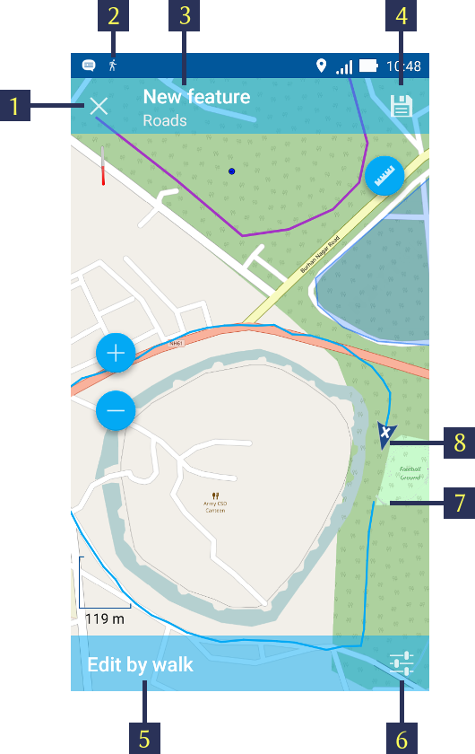

.. sectionauthor:: Dmitry Baryshnikov <dmitry.baryshnikov@nextgis.ru>

.. tracks:

Tracks
======

NextGIS Mobile allows to record and display tracks. Recorded track points are saved to the internal database. Track points recorded within one session are combined and displayed on the map as a line.

.. note::
   Make sure that the Location mode is active in your Android mobile phone settings. Also check the configurations of "Location" settings from NextGIS App settings contextual menu, as shown in :numref:`ngmobile_settings_place_pic`.

Recording a track
-----------------

Tracks can be recorded in two ways.

Record & export tracks in GPX
^^^^^^^^^^^^^^^^^^^^^^^^^^^^^

To start recording a track press "Start new track" button in the Contextual menu on the Main screen (item 5 in :numref:`ngmobile_main_activity_pic_1`). 

Track recording is performed in background mode. To indicate that the process is running a status icon of the walking man is displayed in Android Notification bar. For more information just open it and it will show the status as shown in :numref:`ngmobile_new_gpx_layer_1_pic` below.

.. figure:: _static/new_gpx_layer_1.png
   :name: ngmobile_new_gpx_layer_1_pic
   :align: center
   :height: 4cm
   
   Recording track status.
   
   The numbers indicate: 1 - The status icon; 2 - Name of track session; 3 - "Open recording" button; 4 - "Stop track recording" button.

When the track recording is done, we see on the map screen the path traced so far, as shown below in  :numref:`ngmobile_new_gpx_layer_2_pic`.

.. figure:: _static/new_gpx_layer_2.png
   :name: ngmobile_new_gpx_layer_2_pic
   :align: center
   :height: 10cm

Recorded track is displayed on the map immediately. We have not stopped tracking yet. The status icon (walking man) is still seen in the notification bar. The green flag shows the starting point of the track where as the location marker shows the current location.

To stop tracking open notification bar & tap on "Stop" (see item 4 in :numref:`ngmobile_new_gpx_layer_1_pic`). The status icon now vanishes, The location marker gets repalced by the red flag indicating end of the track and the track is visible in different colour as shown below in :numref:`ngmobile_new_gpx_layer_3_pic`.

.. figure:: _static/new_gpx_layer_3.png
   :name: ngmobile_new_gpx_layer_3_pic
   :align: center
   :height: 10cm

The GPX track is now ready for export. To know more about exporting the tracks, see :ref:`_ngmobile_export_GPX`.

Track points are grouped by days and sessions within a day. If track recording continues the next day, track will be split up into two parts.  

Record tracks to vector layer
^^^^^^^^^^^^^^^^^^^^^^^^^^^^^

We can also add a feature to an existing line or polygon vector layer by tracking.

For this, tap on "Action button" (see item 8 in :numref:`ngmobile_main_activity_pic_1`) & then tap "Geometry by tracking" (see item 5 in :numref:`ngmobile_common_action_menu_pic`). It will open list of Line & Polygon vector layers in a separate panel as shown below in :numref:`ngmobile_selectlayer1_pic`.

.. figure:: _static/ngmobile_selectlayer1.png
   :name: ngmobile_selectlayer1_pic
   :align: center
   :height: 10cm

   Line & Polygon Layers tree.
   
Select the layer to which you need to add the feature by tracking. This will open that layer in editing mode as shown below in :numref:`ngmobile_new_gpx_vector_1`.

   Vector layer editing by tracking
   
   The numbers indicate: 1 - Close tracking; 2 - The status icon; 3 - Layer name; 4 - Save feature; 5 - "Edit by walk" status; 6 - Location settings; 7 - Track start point; 8 - Track end point location.
   
When you tap on "Location" setting (see item 6 in above :numref:`ngmobile_new_gpx_vector_1`) it will open the "Location" settings of NextGIS App (see :numref:`ngmobile_settings_place_pic`).

When tracking is finished tap on the "floppy" button (see item 4 in :numref:`ngmobile_new_gpx_vector_1`). It will open the standard attribute editing form, similar to :numref:`ngmobile_input_form_attributes_pic`, as shown below in :numref:`ngmobile_new_gpx_vector_2`.

.. figure:: _static/new_gpx_vector_2.png
   :name: ngmobile_new_gpx_vector_2
   :align: center
   :height: 10cm

   Vector layer attribute editing
   
The newly added track is now part of the geometry feature of that line or polygon vector layer.  

Managing recorded tracks
------------------------

To start managing tracks first find "My Tracks" group layer in Layers tree. It is shown in the orange box. Then select the "Settings" item in a contextual menu as shown in :numref:`ngmobile_tree_layers_gpx_pic`. Tap on "List".

.. figure:: _static/tree_layers_gpx.png
   :name: ngmobile_tree_layers_gpx_pic
   :align: center
   :height: 10cm

   Layers tree.
   
This will open list of recorded tracks as shown in :numref:`ngmobile_tracks_list_gpx_pic` below.

.. figure:: _static/tracks_list_gpx.png
   :name: ngmobile_tracks_list_gpx_pic
   :align: center
   :height: 10cm

   List of recorded tracks.

When you select the track by ticking on the Chekbox in front of it, buttons in Top toolbar will become active as shown in  :numref:`ngmobile_layer_gpx_selected_pic`below.

.. figure:: _static/layer_gpx_selected.png
   :name: ngmobile_layer_gpx_selected_pic
   :align: center
   :height: 10cm

   Toolbar for selected track.
   
   The numbers indicate: 1 - Close; 2 - Track ID; 3 – Colour pallate; 4 - Share button; 5 - Contextual menu; 6 - Hide track.

To hide that layer, tap on "Open eye" (shown in item 6 in :numref:`ngmobile_layer_gpx_selected_pic`).

When you tap to open contextual menu (see item 5 in :numref:`ngmobile_layer_gpx_selected_pic`), the associated menu items pop up as shown below in :numref:`ngmobile_layer_gpx_menu_pic`. 

.. figure:: _static/layer_gpx_menu.png
   :name: ngmobile_layer_gpx_menu_pic
   :align: center
   :height: 10cm   

   Tracks contextual menu.
   
* Here you can Show or Hide the selected track in the map screen. The starting point is shown in Green markere & the end point is shown in Red marker.
* You can delete the track (permanently).
* You can select all the tracks and perform above actions for all at a once.
