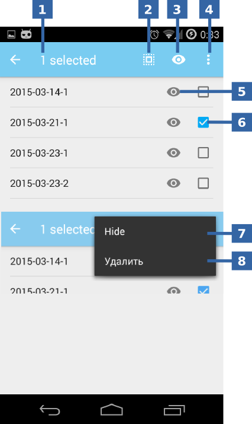

.. sectionauthor:: Дмитрий Барышников <dmitry.baryshnikov@nextgis.ru><dmitry.baryshnikov@nextgis.ru>

.. tracks:

Tracks
======

NextGIS Mobile allows to record and display tracks. Recorded track points are saved to the internal database. Track points recorded within one session are combined and displayed on the map as a line.

Recording a track
------------------

To start recording a track press "Start new track" button in Top toolbar or select "Start new track" item in Contextual menu on the Main screen (items 1 and 2 in :numref:`ngmobile_track_menu_pic`). 

.. figure:: _static/ngmobile_track_menu.png
   :name: ngmobile_track_menu_pic
   :align: center
   :width: 5cm
   
   "Start new track" options.

    The numbers indicate: 1 - "Start new track" button in Top toolbar; 2 - "Start new track" item in Contextual menu.

.. note::
	The button moves to Contextual menu if there's not enough space in Top toolbar.

Track recording is performed in background mode. To indicate that the process is running a status message is displayed in Android Status bar (see :numref:`ngmobile_status_track_pic`).

.. figure:: _static/ngmobile_status_track.png
   :name: ngmobile_status_track_pic
   :align: center
   :height: 5cm
 
 	Recording track status.

 	The numbers indicate: 1 - Name of track session; 2 - "Stop track recording" button; 3 - "Open recording app" button.

Recorded track is displayed on the map immediately. Track points are grouped by days and sessions within a day. If track recording continues the next day, track will be divided into two parts.  

Managing recorded tracks
---------------------------

All recorded tracks are displayed in Layers tree (see :numref:`ngmobile_layer_tree_pic`) as a group layer. The following actions can be performed with a group layer:

* switch on / off the visibility of the group layer (tracks);
* display Tracks control panel (see :numref:`ngmobile_settings_track_pic`).

 
 	Tracks control panel.

   The numbers indicate: 1 - Number of selected tracks; 2 - "All tracks selection" button; 2 - "All tracks visibility" button; 4 - Contextual menu; 5 - "Track visibility" button; 6 - "Track selection" button; 7 - "Track visibility" contextual menu item; 8 - "Delete track" contextual menu item.

Tracks control panel contains a list of recorded tracks. None of the tracks is selected when Tracks control panel is being opened. You can only change individual or all tracks visibility in this mode. To perform actions with a group of tracks select them first (item 6 in :numref:`ngmobile_settings_track_pic`). When you select at least one track Tracks control panel will change its look as seen on :numref:`ngmobile_settings_track_pic`. After that the following actions can be performed with selected tracks:

* switch on / off the visibility of selected tracks;
* delete selected tracks.
