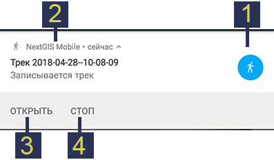
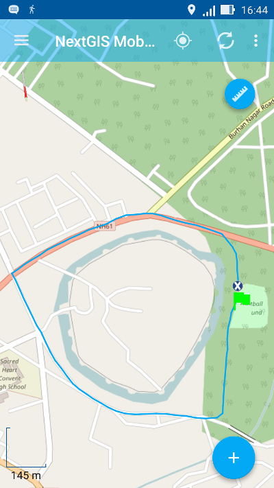
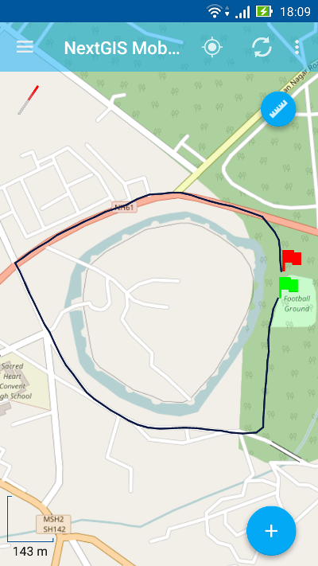
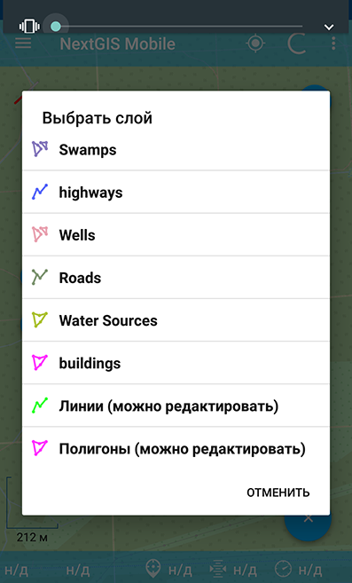
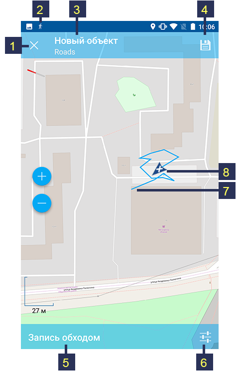
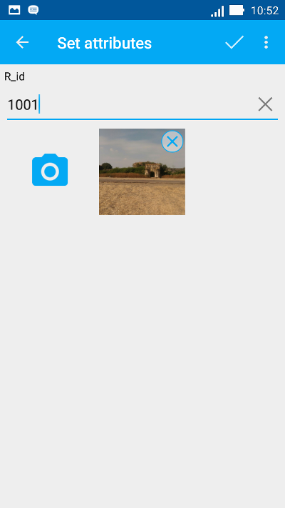
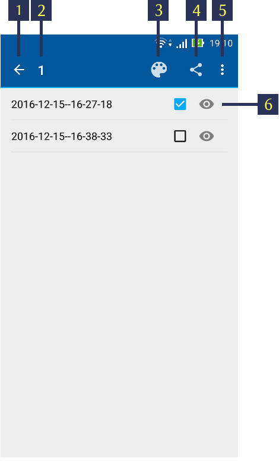
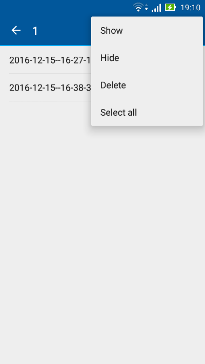

.. sectionauthor:: Дмитрий Барышников <dmitry.baryshnikov@nextgis.ru>

.. _tracks:

Треки
=====

NextGIS Mobile позволяет записывать и отображать треки. В процессе записи точки трека сохраняются во внутреннюю базу данных. При отображении точки трека в рамках сессии объединяются и отображаются в виде линий на карте. 

.. important::
   Чтобы воспользоваться этой функцией, необходимо сначала задать соответствующие настройки на устройстве.

О том, как отправлять треки в Веб ГИС, подробнее `здесь <https://docs.nextgis.ru/docs_ngcom/source/tracking.html#tracking>`_.

.. _tracks_settings:

Настройка устройства
---------------------

Чтобы воспользоваться функцией записи трека, необходимо:

* разрешить приложению запрашивать доступ к местоположению устройства в настройках устройства ("Настройки" -> "Конфиденциальность" -> "Местоположение"). 
* убедиться, что конфигурации настроек "Местоположение" в настройках NextGIS Mobile установлена, как показано на :numref:`ngmobile_settings_place_pic`.
* в блоке настроек "Мои треки" включить опцию "Передавать местоположение на сервер" :numref:`my_tracks_settings_pic`.

.. _ngmobile_record_tracks:

Запись
------

Трек может быть записан двумя способами.

.. _ngmobile_record_tracks_gpx:

Запись трека в формате GPX
^^^^^^^^^^^^^^^^^^^^^^^^^^

Для каждой точки трека сохраняется следующая информация: дата, время, скорость (км/ч), высота (в метрах), направление (азимут от направления на север по часовой стрелке, в градусах от 0 до 360), количество спутников (общее количество спутников GPS и ГЛОНАСС) и HDOP.

1. Для начала записи трека необходимо выбрать команду "Начать запись трека" в контекстном меню главного окна приложения (см. :numref:`ngmobile_main_activity_pic`, п.5). 

Запись трека выполняется в фоновом режиме. Для индикации состояния записи трека в панель уведомлений операционной системы выводится сообщение (см. :numref:`ngmobile_new_gpx_layer_1_pic`).

   
   Статус записи трека.
   
   Цифрами обозначено: 1 - иконка статуса; 2 - название сессии записи трека; 3 - кнопка активации приложения, из которого запущен процесс записи трека; 4 -  кнопка завершения записи трека.
  
Во время записи трека можно увидеть его геометрию на карте (см. :numref:`ngmobile_new_gpx_layer_2_pic`):

   
   Запись трека.
   
Записываемый трек сразу же рисуется на карте. Иконка статуса записи (шагающий человек) отображается в панели уведомлений операционной системы. Зеленый флажок указывает на стартовую точку трека, маркер местоположения показывает текущее положение устройства.

.. note::
Точки трека группируются по дням и сессиям внутри одного дня. Если запись трека продолжается в момент наступления следующего дня, то трек будет разбит на две части.

2. Для того чтобы завершить запись трека, необходимо нажать на кнопку "Стоп" либо в панели уведомлений операционной системы (см. :numref:`ngmobile_new_gpx_layer_1_pic`, п.4), либо в контекстном меню в главном окне приложения (см. :numref:`ngmobile_main_activity_pic`, п.5). Иконка статуса исчезнет из панели уведомлений, маркер местоположения поменяет вид на красный флажок, означающий конец трека, а линия трека изменит свой цвет (см. :numref:`ngmobile_new_gpx_layer_3_pic`).

   
   Записанный трек.
   
3. После завершения записи трека этим треком можно управлять, в том числе экспортировать его в формат GPX. Как это сделать, описано в разделе :ref:`ngmobile_export_GPX`. Также треки можно `отображать на веб-карте <https://docs.nextgis.ru/docs_ngcom/source/tracking.html#tracking-create>`_.

.. _ngmobile_edit_vector_tracks:

Запись трека в векторный слой
^^^^^^^^^^^^^^^^^^^^^^^^^^^^^^

С помощью трекинга можно также добавить объект в существующий линейный или полигональный векторный слой.

1. Для начала записи трека необходимо в меню основных операций (см. :numref:`ngmobile_main_activity_pic`, п.8) выбрать команду "Добавить геометрию обходом" (см. :numref:`ngmobile_edit_menu_pic`, п.5). Это откроет список всех редактируемых слоев с линейной/мультилинейной и полигональной/мультиполигональной геометрией в виде отдельного диалога (см. :numref:`ngmobile_selectlayer1_pic`).

   Диалог выбора слоя.
   
2. Затем следует выбрать слой, в который нужно добавить обходом новый объект. Этот слой откроется в режиме Записи обходом (см. :numref:`ngmobile_new_gpx_vector_1`), и NextGIS Mobile начнет запись новой геометрии в векторный слой.

   Запись трека обходом.
   
   Цифрами обозначено: 1 - остановить запись трека (без сохранения); 2 - иконка статуса; 3 - ID объекта и название слоя; 4 - сохранить объект; 5 - статус "Запись обходом"; 6 - переход в настройки местоположения; 7 - стартовая точка; 8 - текущее местоположение устройства.

.. note::   
Можно также начать запись трека обходом, переключившись в режим редактирования слоя с помощью любого из методов, описанных в разделе :ref:`ngmobile_switch_to_edit`, и нажав на кнопку "Дополнить геометрию обходом" (см. :numref:`ngmobile_creating_lines_pic`, п.9, :numref:`ngmobile_creating_multilines_pic`, п.11, :numref:`ngmobile_creation_landfill_pic`, п.11, и :numref:`ngmobile_creation_multipolygon_pic`, п.11).

В случае если точность добавленной геометрии не достаточна, можно перейти в настройки местоположения NextGIS Mobile (см. :numref:`ngmobile_settings_place_pic`) прямо с экрана "Запись обходом" (см. :numref:`ngmobile_new_gpx_vector_1`, п.6).

3. По окончании записи трека следует нажать на кнопку "Сохранить объект" (см. :numref:`ngmobile_new_gpx_vector_1`, п. 4). Это приведет к открытию формы ввода атрибутов, похожей на :numref:`ngmobile_input_form_attributes_pic`, как показано на :numref:`ngmobile_new_gpx_vector_2`.

   Форма редактирования атрибутов трека.
   
4. В результате записи трека обходом новый объект добавляется в существующий линейный/мультилинейный или полигональный/мультиполигональный векторный слой.

.. _ngmobile_manage_tracks:

Управление
----------

Для осуществления операций над записанными треками следует сначала найти групповой слой "Мои треки" в Дереве слоев. Затем нужно нажать на кнопку контекстного меню, как показано на :numref:`ngmobile_layer_tree_traks_pic`, и выбрать пункт "Список".

.. figure:: _static/ngmobile_layer_tree_traks.png
   :name: ngmobile_layer_tree_traks_pic
   :align: center
   :height: 10cm
 
   Контекстное меню пункта "Мои треки" в Дереве слоев.
 
В результате будет открыт список записанных треков (см. :numref:`ngmobile_tracks_list_gpx_pic`). Точки треков сгруппированы по дням и по сессиям внутри дня.

.. figure:: _static/tracks_list_gpx.png
   :name: ngmobile_tracks_list_gpx_pic
   :align: center
   :height: 10cm

   Список записанных треков.

Следует выбрать трек, поставив напротив флажок, после чего кнопки в верхней панели инструментов будут активированы (см. :numref:`ngmobile_layer_gpx_selected_pic`).

   Окно управления треками.
   
   Цифрами обозначено: 1 - назад; 2 - ID трека; 3 – цветовая палитра; 4 - кнопка "Экспортировать"; 5 - кнопка вызова контекстного меню; 6 - кнопка переключения видимости трека.

Для того чтобы скрыть записанный трек с экрана карты, следует нажать на иконку с изображением глаза (см. :numref:`ngmobile_layer_gpx_selected_pic`, п.6).

Для присвоения каждому треку желаемого цвета следует выбрать на панели инструментов значок в виде палитры (см. :numref:`ngmobile_layer_gpx_selected_pic`, п.3). 

При нажатии кнопки вызова контекстного меню (см. :numref:`ngmobile_layer_gpx_selected_pic`, п.5) откроется контекстное меню управления треками(см. :numref:`ngmobile_layer_gpx_menu_pic`): 

   Контекстное меню управления треками.
   
* Показать/скрыть выделенный трек. Зеленый флажок указывает на стартовую точку трека, красный флажок - на конечную точку трека.
* Удаление выделенного трека (невозможно отменить).
* Выделение всех треков из списка для проведения вышеописанных действий над ними всеми одновременно.
