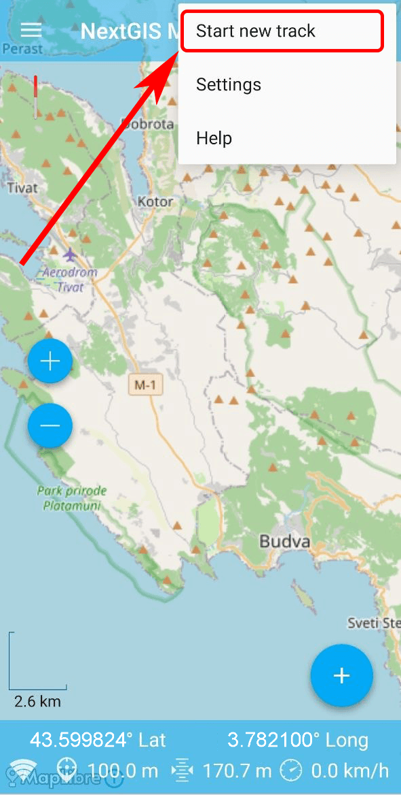
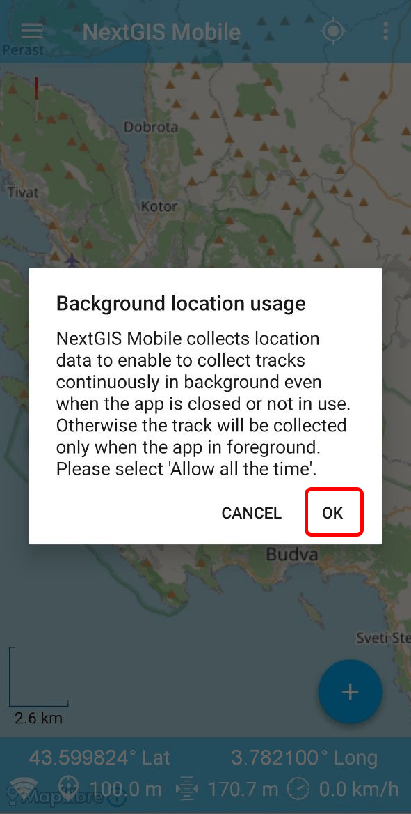
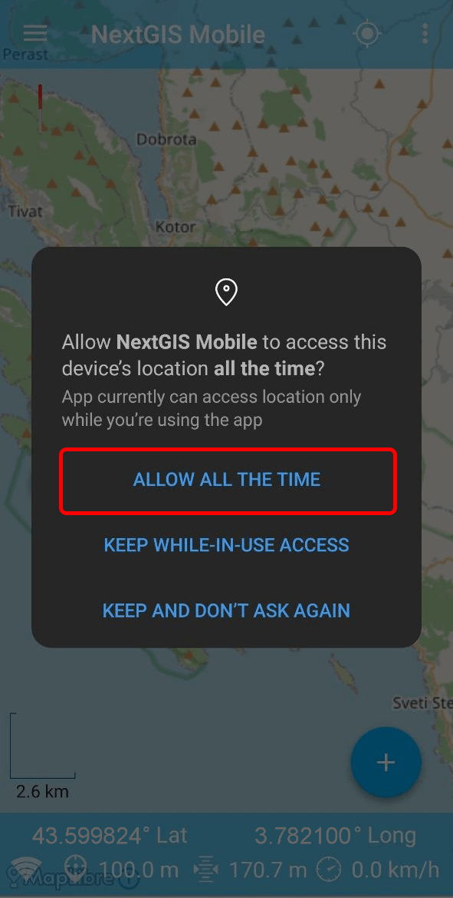
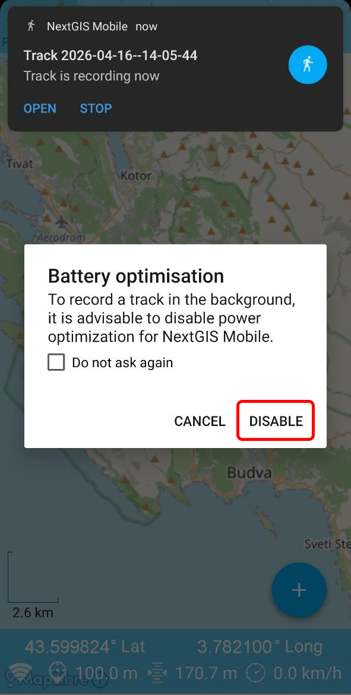
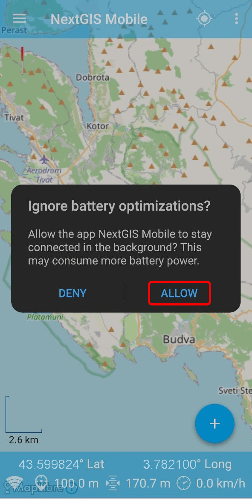
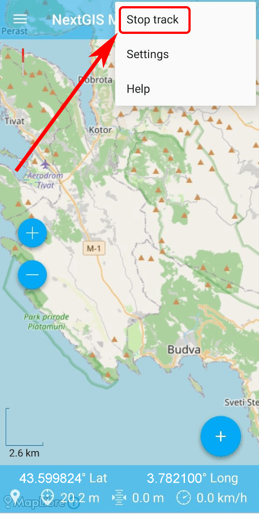
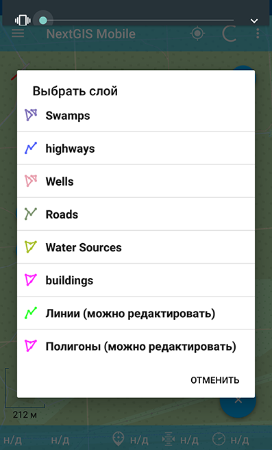
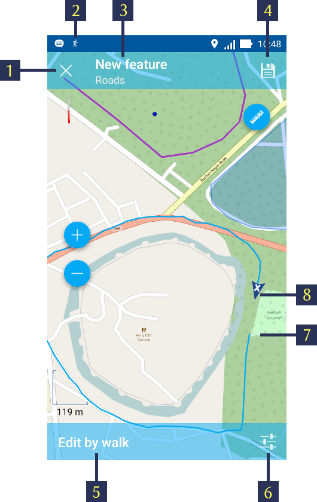
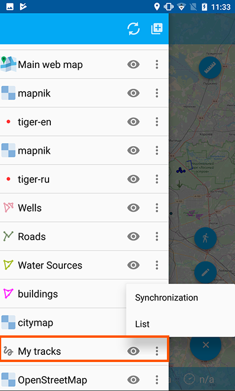

.. _tracks:

Tracks
======

NextGIS Mobile allows to record and display tracks. Track points are recorded to the internal database and combined to display on the map as a line.

.. _tracks_settings:

Settings
--------

To record tracks, set up the following parameters:

* Grant the mobile app permission to access device location (in the Android Settings). 
* In My tracks page of the Settings check "Send location to server":

.. figure:: _static/Mobile_send_to_server_en.png
   :name: ngmob_set_mytracks_pic_2
   :align: center
   :width: 8cm

   Sending locaction to server enabled

* Copy UID indicated in My tracks section and add the tracker `to your Web GIS <https://docs.nextgis.com/docs_ngcom/source/tracking.html#tracking-create>`_.

Now you can send the tracks to Web GIS and `view them on a Web Map<https://docs.nextgis.ru/docs_ngweb/source/trackers.html#tracking-web-map>`_.

.. _ngmobile_record_tracks:

Recording a track
-----------------

Tracks can be recorded in two ways:

* `As GPX <https://docs.nextgis.com/docs_ngmobile/source/tracks.html#ngmobile-record-tracks-gpx>`_;
* `As new vector feature <https://docs.nextgis.com/docs_ngmobile/source/tracks.html#ngmobile-edit-vector-tracks>`_.

.. _ngm_record_gpx:

Record tracks in GPX format
^^^^^^^^^^^^^^^^^^^^^^^^^^^^

For each point of the track, the following information is recorded: date, time, speed (km/h), height (m), course (bearing i.e. the horizontal direction of travel of this device in the range between 0 and 360 counting clockwise from the North), number of satellites and HDOP.

To start recording a track open the main menu by tapping three dots in the top right corner and select **Start new track**.

   Starting new track

Track recording is performed in background mode. You'll need to allow in your device settings. 

* Allow background access to geolocation;
* Disable battery optimisations (otherwise it may shut down the track recording).

See details in our video:

.. raw:: html

   <iframe width="560" height="315" src="https://www.youtube.com/embed/uPkVkVakppE?si=52PecU2RFcwiUiQM" title="YouTube video player" frameborder="0" allow="accelerometer; autoplay; clipboard-write; encrypted-media; gyroscope; picture-in-picture; web-share" referrerpolicy="strict-origin-when-cross-origin" allowfullscreen></iframe>

Watch on `youtube <https://youtu.be/uPkVkVakppE?si=bZKQqlM4xmwuRqbC>`_.

   Request to access geolocation in background

   Allow access to geolocation at all times

   Request to disable battery optimisation

   Allowing NextGIS Mobile to work in the background

To indicate that the process is running a status icon of the walking man is displayed in Android Notification bar. For more information click on it and it will show the track status as shown in :numref:`ngmobile_new_gpx_layer_1_pic` below.

.. figure:: _static/new_gpx_layer_1.png
   :name: ngmobile_new_gpx_layer_1_pic
   :align: center
   :height: 4cm
   
   Recording track status
   
   The numbers indicate: 1 - The status icon; 2 - Name of track session; 3 - "Open recording" button; 4 - "Stop track recording" button.

During track recording you can see the geometry of the track on Map screen as shown below in  :numref:`ngmobile_new_gpx_layer_2_pic`

.. figure:: _static/new_gpx_layer_2.png
   :name: ngmobile_new_gpx_layer_2_pic
   :align: center
   :height: 10cm
   
   Recording track.

Recorded track is displayed on the map immediately even before the recording is completed. The status icon (walking man) is visible in the notification bar. The location marker shows the current device location.

.. note::
   Track points are grouped by days and sessions within a day. If track recording continues the next day track will be split up into two parts. If you want to combine them into one track, use `GPX merge <https://toolbox.nextgis.com/t/gpxmerge>`_

To stop track recording, tap **Stop** either in notification bar (see item 4 in :numref:`ngmobile_new_gpx_layer_1_pic`) or in the main menu.

   Stopping track recording

The status icon will disappear from notification bar, the location marker will be replaced by the red flag indicating the end of the track, and the track line will change its colour as shown below in :numref:`ngmobile_new_gpx_layer_3_pic`

.. figure:: _static/new_gpx_layer_3.png
   :name: ngmobile_new_gpx_layer_3_pic
   :align: center
   :height: 10cm
   
   Recorded track.

You can now manage this track, including its export in GPX format. To learn how to export the tracks see :ref:`ngmobile_export_GPX`. Tracks can also be `displayed on a Web Map <https://docs.nextgis.com/docs_ngcom/source/tracking.html#tracking-create>`_.

.. _ngmobile_edit_vector_tracks:

Record tracks to vector layer
^^^^^^^^^^^^^^^^^^^^^^^^^^^^^

You can also add a feature to an existing line or polygon vector layer by tracking.

1. Tap on Main actions button (see item 8 in :numref:`ngmobile_main_activity_pic_1`) and then"Add geometry by walk" button (see item 5 in :numref:`ngmobile_common_action_menu_pic`). It will open list of all editable Linestring/Multilinestring and Polygon/Multipolygon vector layers in a separate dialogue as shown below in :numref:`ngmobile_selectlayer1_pic`

   Select Layer dialogue.
   
2. Select the layer to which you want to add a new feature by walk. This layer will be opened in Edit mode as shown below in :numref:`ngmobile_new_gpx_vector_1`, and NextGIS Mobile will start recording a new geometry to the vector layer.

   Vector layer editing by walk.
   
   The numbers indicate: 1 - Close editing (without saving); 2 - Status icon; 3 - Feature ID & name of the Layer; 4 - Save feature; 5 - "Edit by walk" mode status; 6 - Location settings; 7 - Start point; 8 - Current device location.

.. note::   
   You can also switch to "Edit by walk" mode by first switching to Edit mode using any of the methods described in :ref:`ngmobile_switch_to_edit` section, and then by tapping "Append geometry by walk" button (see item 9 in :numref:`ngmobile_creating_lines_pic`, item 11 in :numref:`ngmobile_creating_multilines_pic`, item 11 in :numref:`ngmobile_creation_landfill_pic` and item 11 in :numref:`ngmobile_creation_multipolygon_pic`)

If you're not satisfied with the accuracy of the appended geometry, you can access NextGIS Mobile Location settings (see :numref:`ngmobile_settings_place_pic`) directly from "Edit by walk" screen (see item 6 in above :numref:`ngmobile_new_gpx_vector_1`). 

3. When recording is finished tap on the "floppy" button (see item 4 in :numref:`ngmobile_new_gpx_vector_1`). It will open the standard Attributes editing form, similar to :numref:`ngmobile_input_form_attributes_pic`, as shown below in :numref:`ngmobile_new_gpx_vector_2`.

.. figure:: _static/new_gpx_vector_2.png
   :name: ngmobile_new_gpx_vector_2
   :align: center
   :height: 10cm

   Vector layer attribute editing.
   
4. The new feature is now added to the existing Linestring/Multilinestring or Polygon/Multipolygon vector layer.

.. _ngmobile_manage_tracks:

Managing recorded tracks
------------------------

To start managing recorded tracks first find "My Tracks" group in Layers tree panel. Then tap on contextual menu button as shown in :numref:`ngm_tree_layers_gpx_pic` and select "List".

   "My tracks" in Layers tree panel.
   
This will open a list of recorded tracks as shown in :numref:`ngmobile_tracks_list_gpx_pic` below. Tracks' points will be grouped by days and sessions within the day.

.. figure:: _static/tracks_list_gpx.png
   :name: ngmobile_tracks_list_gpx_pic
   :align: center
   :height: 10cm

   List of recorded tracks.

Select a track by ticking the corresponding checkbox, and buttons in Top toolbar will become active as shown in  :numref:`ngmobile_layer_gpx_selected_pic` below.

.. figure:: _static/layer_gpx_selected.png
   :name: ngmobile_layer_gpx_selected_pic
   :align: center
   :height: 10cm

   Toolbar for selected track.
   
   The numbers indicate: 1 - Go back; 2 - Track ID; 3 – Colour palette; 4 - Export button; 5 - Contextual menu; 6 - Track visibility button.

To hide a layer from Map screen tap on "Eye" button (item 6 in :numref:`ngmobile_layer_gpx_selected_pic`).

You can change the colour of the track tapping the "Colour palette" button (item 3 in :numref:`ngmobile_layer_gpx_selected_pic`).

When you tap to open contextual menu (see item 5 in :numref:`ngmobile_layer_gpx_selected_pic`), the following menu items will pop up as shown below in :numref:`ngmobile_layer_gpx_menu_pic`. 

.. figure:: _static/layer_gpx_menu.png
   :name: ngmobile_layer_gpx_menu_pic
   :align: center
   :height: 10cm   

   Tracks contextual menu.
   
* You can Show or Hide the selected track in the map screen. The starting point is shown in Green marker & the end point is shown in Red marker.
* You can delete the track (permanently).
* You can select all the tracks and perform above actions for all of them at a once.
