.. _tracks:

Треки
=====

NextGIS Mobile позволяет записывать и отображать треки. Устройство сохраняет точки во внутреннюю базу данных и объединяет их в линии для отображения на карте. 

.. _tracks_settings:

Настройка устройства
---------------------

Чтобы воспользоваться функцией записи трека, необходимо разрешить приложению **доступ к местоположению** устройства в настройках устройства ("Настройки" -> "Конфиденциальность" -> "Местоположение").

Если вы хотите, чтобы записанные треки отображалсь в вашей Веб ГИС, нужно:

* Убедиться, что вы авторизованы в приложении (три точки справа - Настройки - Учётная запись).
* В блоке настроек "Мои треки" включить опцию "Передавать местоположение на сервер":

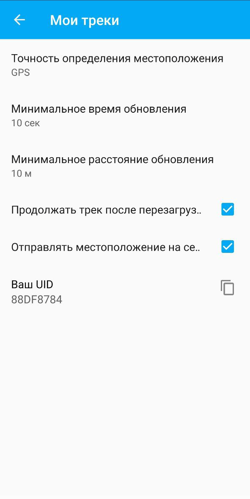

   Передача местоположения на сервер включена

* Скопировать указанный разделе Мои треки UID устройства и `добавить трекер в Веб ГИС <https://docs.nextgis.ru/docs_ngcom/source/tracking.html#tracking-create>`_.

Теперь записанные треки будут передаваться в Веб ГИС и вы сможете `смотреть их на веб-карте <https://docs.nextgis.ru/docs_ngweb/source/trackers.html#tracking-web-map>`_.

.. _ngmobile_record_tracks:

Запись
------

Трек может быть записан двумя способами:

* `В формате GPX <https://docs.nextgis.ru/docs_ngmobile/source/tracks.html#ngmobile-record-tracks-gpx>`_;
* `Как объект векторного слоя <https://docs.nextgis.ru/docs_ngmobile/source/editing.html#ngmobile-add-track>`_.

.. _ngmobile_record_tracks_gpx:

Запись трека в формате GPX
^^^^^^^^^^^^^^^^^^^^^^^^^^

Для каждой точки трека сохраняется следующая информация: дата, время, скорость (км/ч), высота (в метрах), направление (азимут от направления на север по часовой стрелке, в градусах от 0 до 360), количество спутников (общее количество спутников GPS и ГЛОНАСС) и HDOP.

Чтобы начать запись трека, вызвовите главное меню тремя точками в правом верхнем углу и выберите **Начать запись трека**

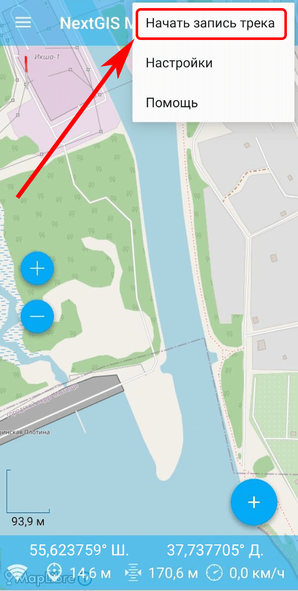

   Начать запись трека

Запись трека выполняется в фоновом режиме. Если вы первый раз записываете трек в приложении, оно запросит дополнительные разрешения (диалоги могут отличаться в зависимости от операционной системы):

* Использование геолокации в фоне - нужно выбрать **разрешить в любом режиме**;
* Отключение энергосбережения - чтобы запись трека не прерывалась, нужно **отключить** оптимизацию энергопотребления для NextGIS Mobile.

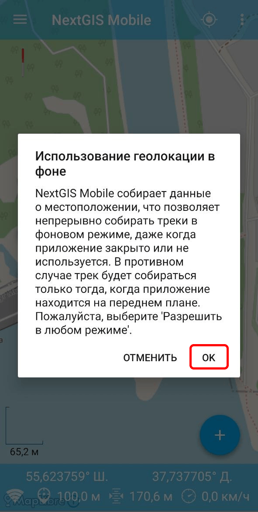

   Запрос доступа к геолокации в фоне

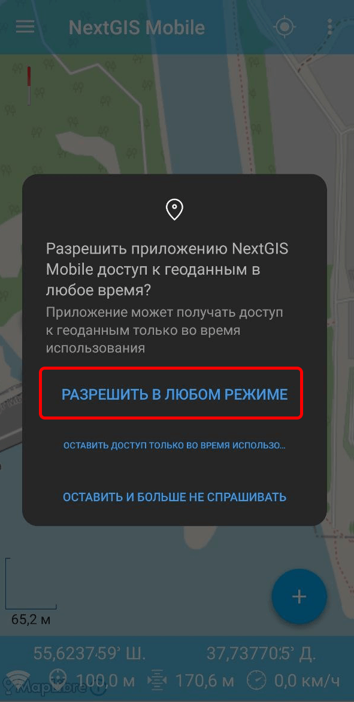

   Разрешение использования геолокации в любом режиме

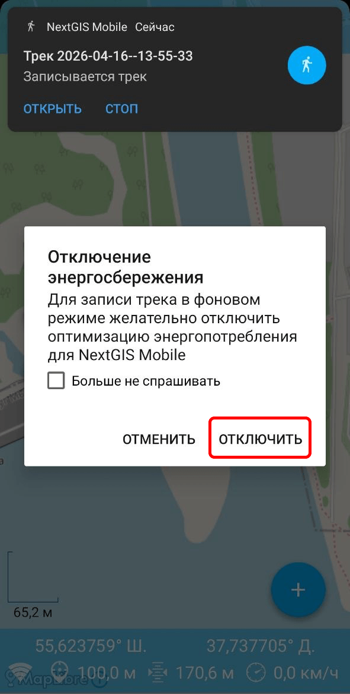

   Запрос на отключение энергосбережения

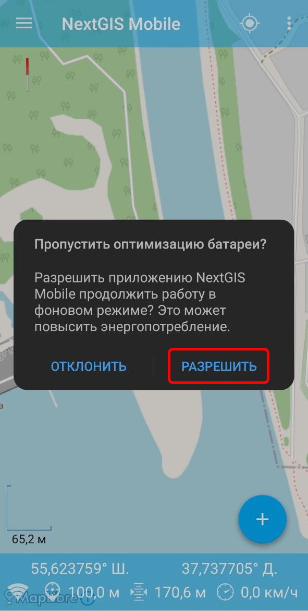

   Разрешение на работу в фоновом режиме

Для индикации состояния записи трека в панель уведомлений операционной системы выводится сообщение (см. :numref:`ngmobile_new_gpx_layer_1_pic`).

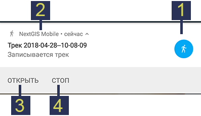
   
   Статус записи трека.
   
   Цифрами обозначено: 1 - иконка статуса; 2 - название сессии записи трека; 3 - кнопка активации приложения, из которого запущен процесс записи трека; 4 -  кнопка завершения записи трека.
  
Записываемый трек сразу же рисуется на карте. Иконка статуса записи (шагающий человек) отображается в панели уведомлений операционной системы. Маркер местоположения показывает текущее положение устройства.

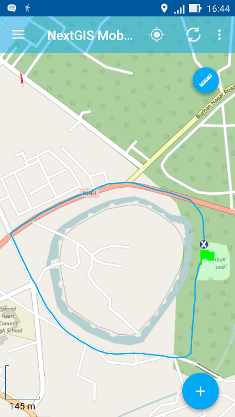
   
   Запись трека.
   

.. note:: Точки трека группируются по дням и сессиям внутри одного дня. Если запись трека продолжается в момент наступления следующего дня, то трек будет разбит на две части. Соединить несколько треков в один можно при помощи инструмента `Объединение треков GPX <https://toolbox.nextgis.com/t/gpxmerge>`_.

Для того чтобы завершить запись трека, нажмите **Стоп** либо в панели уведомлений операционной системы (см. :numref:`ngmobile_new_gpx_layer_1_pic`, п.4), либо в контекстном меню в главном окне приложения (см. :numref:`ngmobile_main_activity_pic`, п.5).

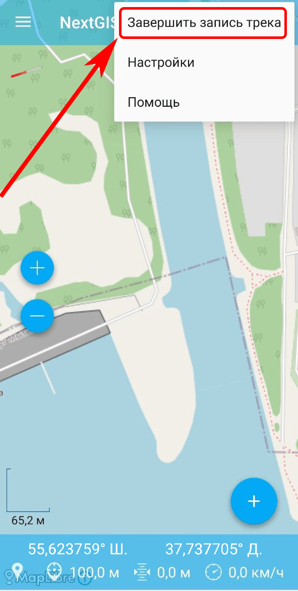

   Завершение записи трека

Иконка статуса исчезнет из панели уведомлений, маркер местоположения поменяет вид на красный флажок, означающий конец трека, а линия трека изменит свой цвет (см. :numref:`ngmobile_new_gpx_layer_3_pic`).

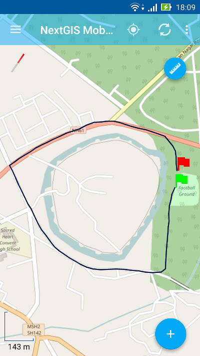
   
   Записанный трек
   
После завершения записи трека этим треком можно управлять, в том числе экспортировать его в формат GPX. Как это сделать, описано в разделе :ref:`ngmobile_export_GPX`. Также треки можно `отображать на веб-карте <https://docs.nextgis.ru/docs_ngcom/source/tracking.html#tracking-create>`_.

.. seealso:: С помощью трекинга можно также `добавить объект в существующий линейный или полигональный векторный слой <https://docs.nextgis.ru/docs_ngmobile/source/editing.html#ngmobile-add-track>`_.

.. _ngmobile_manage_tracks:

Управление треками
-------------------

Выберите слой |ic_tracks| "Мои треки" в Дереве слоев. Вызовите контекстное меню, нажав на три точки рядом со слоем, и выберите пункт "Список".

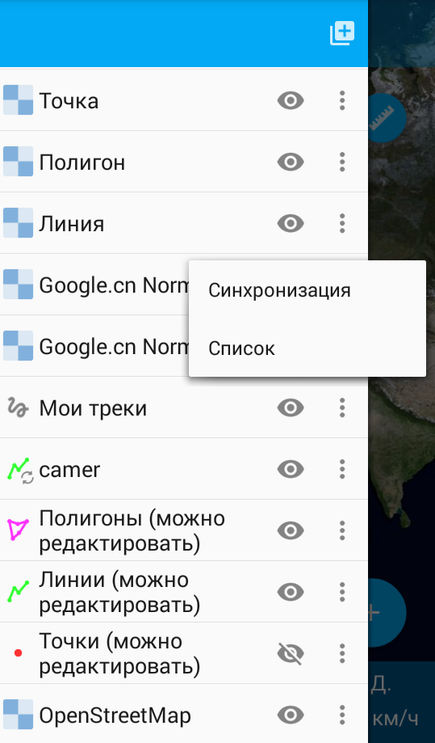
 
   Контекстное меню пункта "Мои треки" в Дереве слоев.
 
Будет открыт список записанных треков. Точки треков сгруппированы по дням и по сессиям внутри дня.

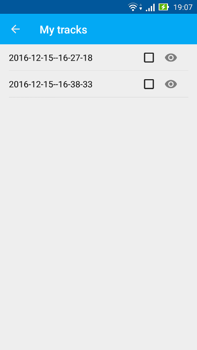

   Список записанных треков.

Чтобы выбрать трек, отметьте его флажком. В верхней панели инструментов будут активированы кнопки.

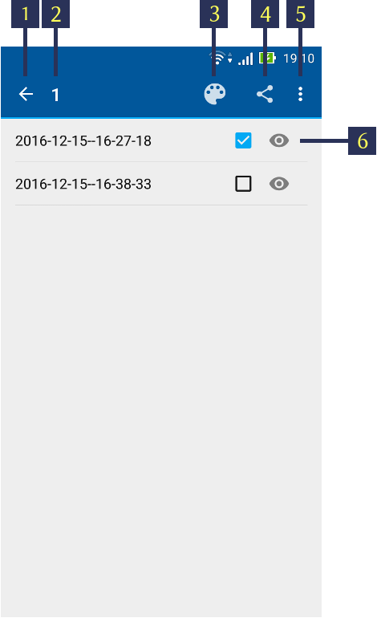

   Окно управления треками.
   
   Цифрами обозначено: 1 - назад; 2 - ID трека; 3 – цветовая палитра; 4 - кнопка "Экспортировать"; 5 - кнопка вызова контекстного меню; 6 - кнопка переключения видимости трека.

С помощью этого меню вы можете:

* настроить цвет выделенного трека;
* поделиться треками;
* включить/выключить видимость треков, нажав на |ic_eye|.

При нажатии на три точки в правом верхнем углу откроется контекстное меню управления треками (см. :numref:`ngmobile_layer_gpx_menu_pic`): 

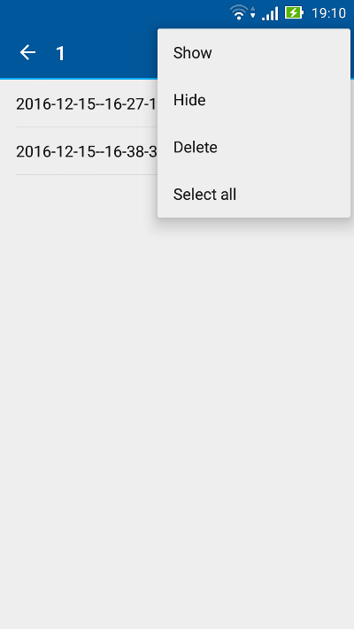

   Контекстное меню управления треками.
   
* Показать/скрыть выделенные треки.
* Удаление выделенных треков (**! невозможно отменить**).
* Выбрать все треки в списке, чтобы массово настроить их видимость или удалить.

.. warning:: Удалённый трек нельзя восстановить! Чтобы не потерять важную информацию, рекомендуем сделать резервную копию трека, `сохранив его в файл GPX <https://docs.nextgis.ru/docs_ngmobile/source/share.html#gpx>`_.

.. |ic_walk| image:: _static/ic_walk.png
   :width: 7mm
   :alt: человечек

.. |ic_save| image:: _static/ic_save.png
   :width: 7mm
   :alt: дискета

.. |ic_tick| image:: _static/ic_tick.png
   :width: 7mm
   :alt: галочка

.. |ic_tracks| image:: _static/ic_tracks.png
   :width: 7mm
   :alt: закорючка

.. |ic_eye| image:: _static/ic_eye.png
   :width: 7mm
   :alt: глаз