.. _tracks:

Tracks
======

With NextGIS Mobile you can record your movements and display tracks. The app records points of your location to its internal database and visualizes them as lines on the map. 

.. _tracks_settings:

Setting up
---------------------

To record a track, make sure the app has access to your **location** (check the device settings, something like :menuselection:`Settings -> Confidentiality -> Location`).

To display your tracks on a Web Map in your WebGIS:

* Make sure you're logged in (|ic_menu| - Settings - Account).
* Copy the device ID (Settings - My tracks - Device ID) and `add the tracker to Web GIS <https://docs.nextgis.com/docs_ngcom/source/tracking.html#tracking-create>`_.
* In Settings - My tracks enable **Send location to server**

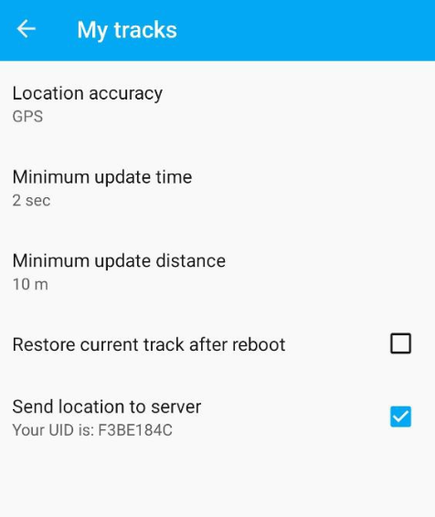

   Sending location to server is enabled

Now the tracks you record are automatically send to your Web GIS and can be `viewed on a Web Map <https://docs.nextgis.com/docs_ngweb/source/trackers.html#tracking-web-map>`_.

.. _ngmobile_record_tracks:

Record a track
---------------

For each recorded location point the app captures the following information: date, time, speed (km/h), height (m), course (bearing i.e. the horizontal direction of travel of this device in the range between 0 and 360 counting clockwise from the North), number of satellites and HDOP.

Tracks are stored on the device in GPX format.

.. seealso:: Use tracking to `add a new line or polygon to an existing vector layer <https://docs.nextgis.com/docs_ngmobile/source/editing.html#ngmobile-add-track>`_.

To start recording a track, open the main menu |ic_menu| and select **Start new track**.

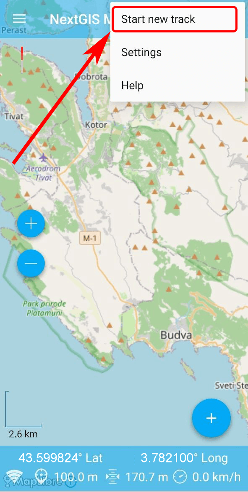

   Starting a new track

Track recording is performed in background mode. If it's the first time you're recording a track, the app asks for additional permissions (exact dialogs depend on your OS):

* Allow background access to geolocation (select **Allow all the time**);
* Disable battery optimisation (otherwise it may shut down the track recording) - allow NextGIS Mobile to be active in the background.

See details in our video:

.. raw:: html

   <iframe width="560" height="315" src="https://www.youtube.com/embed/uPkVkVakppE?si=52PecU2RFcwiUiQM" title="YouTube video player" frameborder="0" allow="accelerometer; autoplay; clipboard-write; encrypted-media; gyroscope; picture-in-picture; web-share" referrerpolicy="strict-origin-when-cross-origin" allowfullscreen></iframe>

Watch on `youtube <https://youtu.be/uPkVkVakppE?si=bZKQqlM4xmwuRqbC>`_.

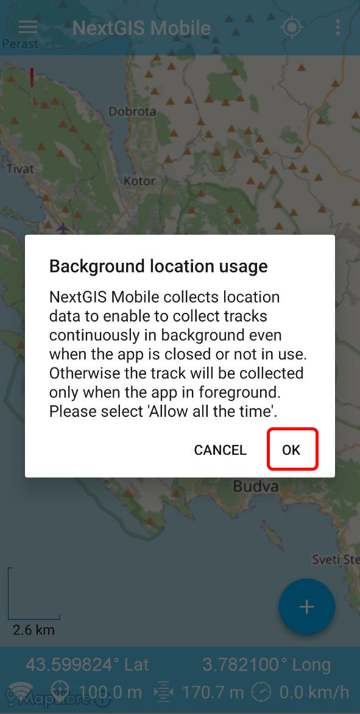

   Request for background access to geolocation

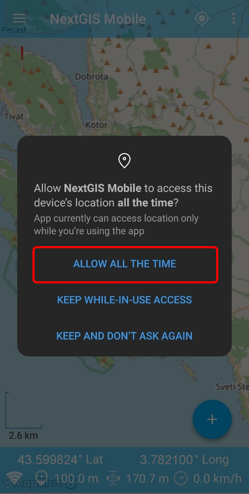

   Allowing background access to geolocation all the time

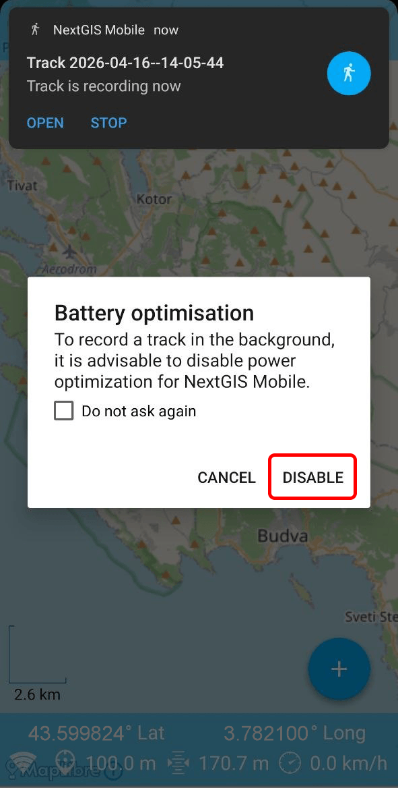

   Request to disable battery optimization

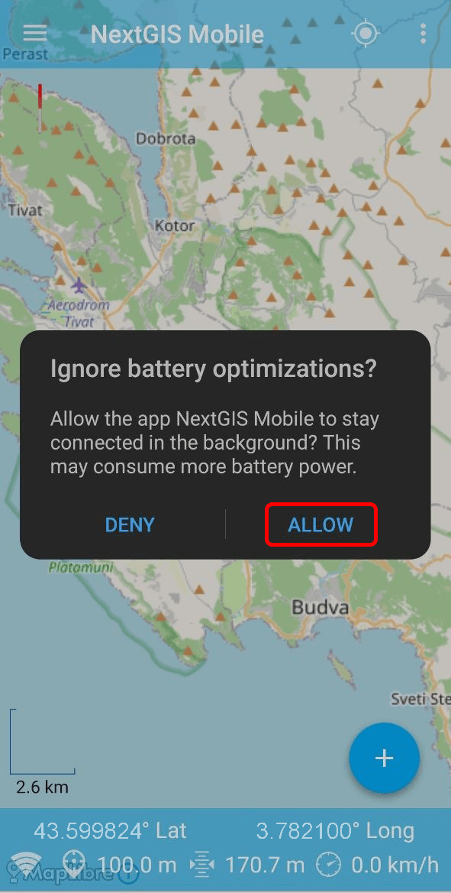

   Allowing the app to stay connected in the background

When a track is recording, it's indicated in the notifications panel.

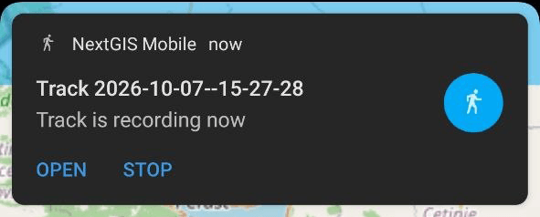
   
   Track recording status 
   

  
While the track is recording, you can see it on the map. Recording status icon (a walking figure) is displayed in the notification panel of your device. Your current location is marked by an arrow |ic_location_moving|.

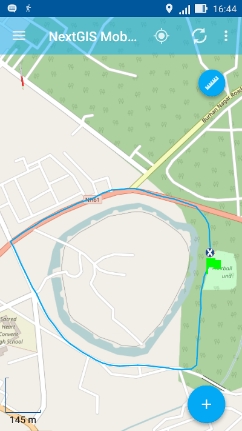
   
   Track is recording
   

.. note:: Track points are grouped by days and sessions within a day. If track recording continues the next day track will be split up into two parts. If you want to combine them into one track, use `GPX merge <https://toolbox.nextgis.com/t/gpxmerge>`_.

To stop track recording, tap **Stop** either in notification bar (see :numref:`ngmobile_new_gpx_layer_1_pic`.) or in the main menu.

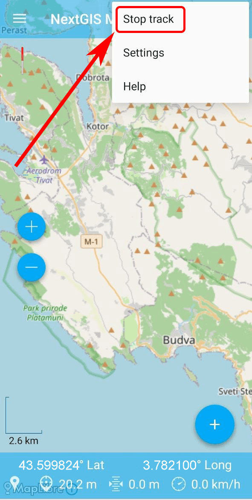

   Stopping track recording

The status icon will disappear from notification bar, the location marker will be replaced by the red flag indicating the end of the track.

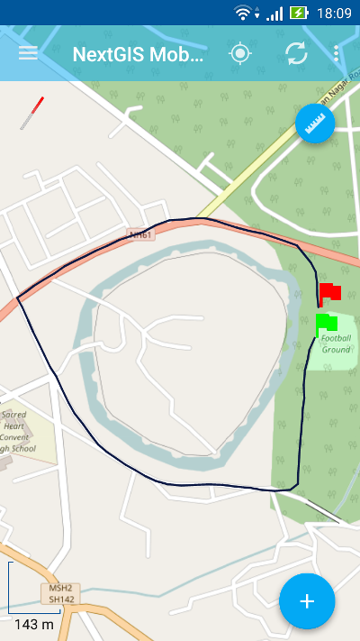
   
   Recorded track
   
You can now manage this track, including its export in GPX format. To learn how to export the tracks see :ref:`ngmobile_export_GPX`. Tracks can also be `displayed on a Web Map <https://docs.nextgis.com/docs_ngcom/source/tracking.html#tracking-create>`_.

.. _ngmobile_manage_tracks:

Manage tracks
-------------------

Select the |ic_tracks| "My tracks" layer in the Layer tree. Open the layer menu |ic_menu_grey| and select **List**.

.. figure:: _static/ngm_tree_tracks_menu_en.png
   :name: ngmobile_layer_tree_traks_pic
   :align: center
   :width: 8cm
 
   Opening track list from the layer tree
 
A list of all recorded tracks is opened. Recorded points are grouped into days and sessions within one day.

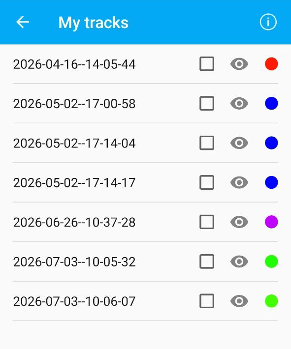

   List of recorded tracks

To select a track mark it by a tick. When at least one track is selected, a toolbar appears.

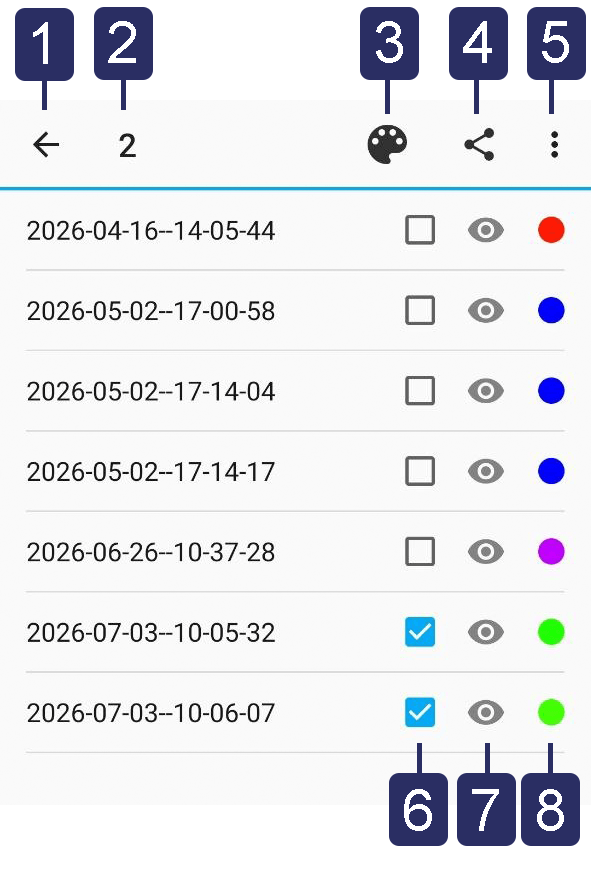

   Managing tracks
   
   The numbers indicate: 1 - Go back; 2 - Number of selected tracks; 3 – Colour palette; 4 - Share/export; 5 - Actions menu; 6 - Track selection; 7 -Track visibility; 8 - Track color.

Use these tools to:

* set the color of track(s);
* share tracks as GPX files;
* make particular tracks visible/invisible by toggling the eye icon |ic_eye|.

Tap the three dots in the top right corner to open the menu.

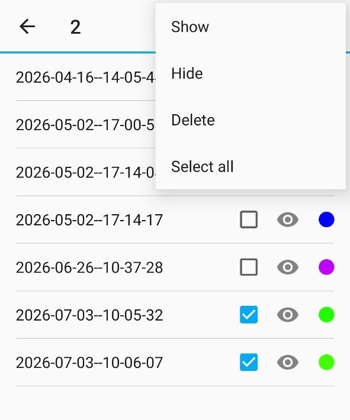

   Track actions menu

Use this menu to:

* Make selected tracks visible/invisible;
* Delete selected tracks (**! cannot be undone**);
* Select all the tracks in the list to perform a group action (set visibility or delete).

.. warning:: Once a track is deleted, it cannot be restored! To avoid losing important data, we advise to make backups of the tracks by `saving them as GPX files <https://docs.nextgis.com/docs_ngmobile/source/share.html#gpx>`_.

.. |ic_add_layer| image:: _static/ic_add_layer.png
   :width: 7mm
   :alt: double squares with "+"

.. |ic_walk| image:: _static/ic_walk.png
   :width: 7mm
   :alt: person

.. |ic_tracks| image:: _static/ic_tracks.png
   :width: 7mm
   :alt: squiggle

.. |ic_eye| image:: _static/ic_eye.png
   :width: 7mm
   :alt: eye

.. |ic_menu| image:: _static/ic_menu.png
   :width: 6mm
   :alt: tree dots

.. |ic_menu_grey| image:: _static/ic_menu_grey.png
   :width: 3mm
   :alt: three dots