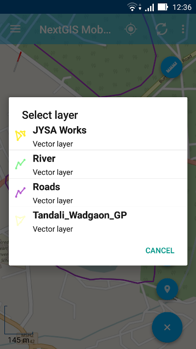

.. sectionauthor:: Дмитрий Барышников <dmitry.baryshnikov@nextgis.ru>

.. _tracks:

Треки
=====

Программа позволяет записывать и отображать треки. В процессе записи сохраняются 
точки трека во внутреннюю базу данных. При отображении точки трека в рамках сессии 
объединяются и отображаются в виде линий на карте. 

.. note::
   Следует проверить, чтобы в настройках устройства Android был включен режим Местоположения. Также необходимо убедиться, что конфигурации настроек "Мои треки" и "Местоположение" в настройках NextGIS Mobile были установлены, как показано на :numref:`ngmobile_settings_place_pic`.

Запись
------

Трек может быть записан двумя путями.

.. _ngmobile_record_tracks:

Запись трека в формате GPX
^^^^^^^^^^^^^^^^^^^^^^^^^^

1. Для начала записи трека необходимо выбрать команду "Начать запись трека" в контекстном меню (см. :numref:`ngmobile_main_activity_pic`, п.5). 

Запись трека выполняется независимо от приложения в фоновом процессе. Для индикации состояния выводится сообщение в панель 
статуса операционной системы (см. :numref:`ngmobile_new_gpx_layer_1_pic`).

.. figure:: _static/new_gpx_layer_1.png
   :name: ngmobile_new_gpx_layer_1_pic
   :align: center
   :height: 4cm
   
   Статус записи трека.
   
   Цифрами обозначено: 1 - иконка статуса; 2 - название сессии записи трека; 3 - кнопка активации приложения, из которого запущен процесс записи трека; 4 -  кнопка завершения записи трека.
  
Во время записи трека можно увидеть его геометрию на карте (см. :numref:`ngmobile_new_gpx_layer_2_pic`):

.. figure:: _static/new_gpx_layer_2.png
   :name: ngmobile_new_gpx_layer_2_pic
   :align: center
   :height: 10cm
   
   Запись трека.
   
Записываемый трек сразу же рисуется на карте. Иконка статуса записи (шагающий человек) остается видна на панели статуса операционной системы. Зеленый флажок указывает на стартовую точку трека, маркер местоположения показывает текущее положение устройства.

.. note::
Точки трека группируются по дням и сессиям внутри одного дня. Если запись трека переходит на другой день, то он будет разбит на две части.

2. Для того, чтобы остановить запись, необходимо нажать на кнопку "Стоп" либо на панели статуса операционной системы (см. :numref:`ngmobile_new_gpx_layer_1_pic`, п.4), либо в контекстном меню (см. :numref:`ngmobile_main_activity_pic`, п.5). Иконка статуса исчезнет из панели состояния, маркер местоположения заменится на красный флажок, означающий конец трека, а линия трека изменит свой цвет (см. :numref:`ngmobile_new_gpx_layer_3_pic`).

.. figure:: _static/new_gpx_layer_3.png
   :name: ngmobile_new_gpx_layer_3_pic
   :align: center
   :height: 10cm
   
   Записанный трек.
   
3. После этого можно управлять этим треком, в том числе экспортировать его в формат GPX. Как это сделать, описано в разделе :ref:`ngmobile_export_GPX`.

.. _ngmobile_edit_vector_tracks:

Запись трека на векторный слой
^^^^^^^^^^^^^^^^^^^^^^^^^^^^^^

С помощью трекинга можно также добавить объект на существующий линейный или полигональный векторный слой.

1. Для начала записи трека необходимо в меню основных операций (см. :numref:`ngmobile_main_activity_pic`, п.8) выбрать команду "Добавить геометрию обходом" (см. :numref:`ngmobile_edit_menu_pic`, п.5). Это откроет список всех редактируемых слоев с геометрией линия/мультилиния и полигон/мультиполигон в виде отдельного диалога (см. :numref:`ngmobile_selectlayer1_pic`).

   Диалог выбора слоя.
   
2. Затем следует выбрать слой, на который нужно добавить обходом новый объект. Этот слой откроется в режиме Редактирования (см. :numref:`ngmobile_new_gpx_vector_1`), и NextGIS Mobile начнет запись новой геометрии на векторный слой.

.. figure:: _static/new_gpx_vector_1_rus.png
   :name: ngmobile_new_gpx_vector_1
   :align: center
   :height: 10cm

   Редактирование трека обходом.
   
   Цифрами обозначено: 1 - закрыть режим редактирования (без сохранения); 2 - иконка статуса; 3 - ID объекта и название слоя; 4 - сохранить объект; 5 - статус "Запись обходом"; 6 - настройки местоположения; 7 - стартовая точка; 8 - текущее местоположение устройства.

.. note::   
Можно также включить режим "Редактирования обходом", переключившись на режим редактирования с помощью любого из методов, описанных в разделе :ref:`ngmobile_switch_to_edit`, и нажав на кнопку "Добавить геометрию обходом" (см. :numref:`ngmobile_creating_lines_pic`, п.9, :numref:`ngmobile_creating_multilines_pic`, п.11, :numref:`ngmobile_creation_landfill_pic`, п.11, и :numref:`ngmobile_creation_multipolygon_pic`, п.11).

В случае если точность добавленной геометрии не достаточна, можно перейти в настройки местоположения NextGIS Mobile (см. :numref:`ngmobile_settings_place_pic`) прямо с экрана "Редактирования обходом".

3. Когда запись закончена, следует нажать на иконку с изображением дискеты. Это приведет к открытию формы ввода атрибутов, похожей на :numref:`ngmobile_input_form_attributes_pic`, как показано на :numref:`ngmobile_new_gpx_vector_2`.

.. figure:: _static/new_gpx_vector_2.png
   :name: ngmobile_new_gpx_vector_2
   :align: center
   :height: 10cm

   Редактирование атрибутов векторного слоя.
   
4. В результате новый объект добавляется на существующий линейный/мультилинейный или полигональный/мультиполигональный векторный слой.

.. _ngmobile_manage_tracks:

Управление
----------

Для осуществления операций над записанными треками следует сначала найти групповой слой "Мои треки" в дереве слоев. Затем нужно нажать на кнопку контекстного меню, как показано на :numref:`ngmobile_layer_tree_traks_pic`, и выбрать пункт "Список".

.. figure:: _static/ngmobile_layer_tree_traks.png
   :name: ngmobile_layer_tree_traks_pic
   :align: center
   :height: 10cm
 
   Дерево слоев с записанными треками.
 
В результате будет открыт список записанных треков (см. :numref:`ngmobile_tracks_list_gpx_pic`). Точки треков сгруппированы по дням и по сессиям внутри дня.

.. figure:: _static/tracks_list_gpx.png
   :name: ngmobile_tracks_list_gpx_pic
   :align: center
   :height: 10cm

   Список записанных треков.

Следует выбрать трек, поставив напротив флажок, после чего кнопки в верхней панели инструментов станут доступны (см. :numref:`ngmobile_layer_gpx_selected_pic`).

.. figure:: _static/layer_gpx_selected.png
   :name: ngmobile_layer_gpx_selected_pic
   :align: center
   :height: 10cm

   Окно управления треками.
   
   Цифрами обозначено: 1 - назад; 2 - ID трека; 3 – цветовая палитра; 4 - кнопка "Экспортировать"; 5 - контекстное меню; 6 - кнопка переключения видимости трека.

Для того, чтобы скрыть слой, следует нажать на иконку с изображением глаза (см. :numref:`ngmobile_layer_gpx_selected_pic`, п.6).

Для присвоения каждому треку желаемого цвета следует выбрать на панели инструментов 
значок в виде палитры (см. :numref:`ngmobile_layer_gpx_selected_pic`, п.3). 

При открытии контекстного меню (см. :numref:`ngmobile_layer_gpx_selected_pic`, п.5) появится список из  следующих пунктов (см. :numref:`ngmobile_layer_gpx_menu_pic`): 

.. figure:: _static/layer_gpx_menu.png
   :name: ngmobile_layer_gpx_menu_pic
   :align: center
   :height: 10cm   

   Контекстное меню треков.
   
* Показать/скрыть выделенный трек. Зеленый флажок указывает на стартовую точку трека, красный флажок - на конечную точку трека.
* Удаление выделенного трека (невозможно отменить).
* Выделение всех треков из списка и проведение вышеописанных действий над ними всеми одновременно.
